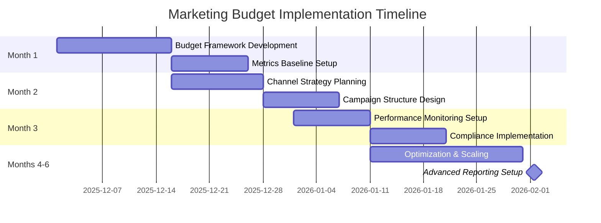

# Financial Marketing Playbook

**Document ID:** MPG-005-FINANCIAL-MKTG · **Version:** 1.0 · **Effective Date:** 2025-12-09
**Owner:** Finance Department & Marketing Team
**Applies To:** All marketing campaigns, sales activities, and budget allocations

---

## Purpose & Scope

This playbook provides comprehensive financial guidance for marketing and sales operations in the Kenyan market. It covers budgeting frameworks, expenditure categories, ROI measurement, and compliance requirements. The document serves as the authoritative reference for financial planning, budget allocation, and performance measurement across all marketing activities.

The playbook ensures that:

- Marketing budgets are strategically allocated and cost-effective
- ROI is measurable and optimized across all campaigns
- Financial compliance follows Kenyan regulatory requirements
- Performance metrics drive data-based decision making
- Resource allocation supports business growth objectives

---

## Outcome Summary

| Dimension                   | Target Outcome                                                                             |
| --------------------------- | ------------------------------------------------------------------------------------------ |
| **Budget Efficiency**       | Marketing spend delivers maximum ROI with clear attribution and measurement.               |
| **Financial Compliance**    | All marketing activities comply with Kenyan advertising and consumer protection laws.      |
| **Performance Measurement** | Key metrics (CAC, LTV, ROAS) are tracked and optimized for sustainable growth.             |
| **Resource Allocation**     | Budget distribution across channels maximizes market penetration and customer acquisition. |
| **Risk Mitigation**         | Financial exposure is managed through contingency planning and performance thresholds.     |
| **Strategic Alignment**     | Marketing investments directly support business objectives and revenue targets.            |

---

## Implementation Timeline Overview

Marketing budget implementation typically spans **3-6 months** for comprehensive setup:

1. **Month 1:** Budget framework development, baseline metrics establishment
2. **Month 2:** Channel strategy and campaign planning
3. **Month 3:** Performance monitoring setup, compliance implementation
4. **Months 4-6:** Optimization, scaling, and reporting refinement

_Figure 1. Marketing budget implementation timeline with key milestones._

---

## Detailed Workflow & Procedures

### 1. Budget Planning & Allocation

**Objective:** Develop comprehensive marketing budget aligned with business objectives and market conditions.

**Steps:**

1. **Revenue Forecasting**: Project annual revenue and determine marketing budget as percentage (typically 5-15% for B2B SaaS).
2. **Market Analysis**: Assess competitive landscape, target market size, and customer acquisition costs in Kenyan market.
3. **Channel Planning**: Identify optimal mix of digital, traditional, and experiential marketing channels.
4. **Budget Allocation**: Distribute funds across categories based on business goals and historical performance.
5. **Contingency Planning**: Reserve 10-15% for performance optimization and market opportunities.
6. **Approval Process**: Secure executive approval with clear ROI projections and success metrics.

**Evidence Requirements:** Revenue projections, competitive analysis, channel performance data, budget templates, approval documentation.

### 2. Campaign Execution & Monitoring

**Objective:** Execute campaigns efficiently while maintaining financial controls and performance tracking.

**Steps:**

1. **Campaign Setup**: Establish campaign parameters, targeting criteria, and budget limits.
2. **Performance Tracking**: Implement real-time monitoring of key metrics (CPC, CTR, conversion rates).
3. **Budget Optimization**: Adjust spend allocation based on performance data and ROI analysis.
4. **Compliance Monitoring**: Ensure all campaigns comply with Kenyan advertising regulations.
5. **Reporting**: Generate weekly performance reports with variance analysis and recommendations.
6. **Optimization**: Reallocate budget from underperforming to high-ROI campaigns.

**Evidence Requirements:** Campaign briefs, performance dashboards, compliance checklists, optimization reports.

### 3. ROI Measurement & Analysis

**Objective:** Quantify marketing effectiveness and demonstrate financial impact on business growth.

**Steps:**

1. **Attribution Setup**: Implement multi-touch attribution models for accurate ROI calculation.
2. **Customer Journey Mapping**: Track complete customer paths from awareness to conversion.
3. **Lifetime Value Calculation**: Measure LTV for different customer segments and acquisition channels.
4. **Cost Analysis**: Calculate CAC, ROAS, and other efficiency metrics by channel and campaign.
5. **Trend Analysis**: Compare performance across time periods and identify optimization opportunities.
6. **Business Impact Reporting**: Connect marketing metrics to revenue growth and business objectives.

**Evidence Requirements:** Attribution reports, LTV analysis, cost breakdowns, trend analysis, business impact assessments.

### 4. Compliance & Risk Management

**Objective:** Ensure all marketing activities comply with Kenyan laws and mitigate financial risks.

**Steps:**

1. **Regulatory Review**: Assess campaigns against Data Protection Act, Consumer Protection Act, and advertising standards.
2. **Contract Compliance**: Verify vendor contracts include performance guarantees and termination clauses.
3. **Budget Controls**: Implement approval workflows for budget increases and campaign expansions.
4. **Risk Assessment**: Identify financial risks (fraud, over-spend, poor performance) and mitigation strategies.
5. **Audit Preparation**: Maintain detailed records for internal and external audits.
6. **Training**: Ensure marketing team understands compliance requirements and financial controls.

**Evidence Requirements:** Compliance checklists, contract reviews, risk assessments, audit trails, training records.

## Key Expenditure Categories

### Digital Marketing Strategy

**Budget Range:** 40-60% of total marketing budget

- **PPC Advertising**: Google Ads, Facebook/Instagram Ads, LinkedIn Ads for targeted campaigns
- **SEO Tools**: Ahrefs, SEMrush, Moz for keyword research and competitor analysis
- **Social Media**: Organic content creation, paid boosting, influencer partnerships
- **Email Marketing**: Campaign tools, list building, automation platforms
- **Analytics**: Google Analytics, marketing attribution tools, conversion tracking

### Content Production

**Budget Range:** 15-25% of total marketing budget

- **Content Creation**: Copywriters, designers, video producers for blogs, whitepapers, case studies
- **Content Distribution**: Social media scheduling, PR distribution services
- **Multimedia Production**: Video editing, podcast production, infographic design
- **Content Management**: CMS platforms, content optimization tools

### Public Relations (PR) & Brand

**Budget Range:** 10-20% of total marketing budget

- **PR Agencies**: Media relations, press release distribution, thought leadership
- **Brand Development**: Logo design, brand guidelines, visual identity systems
- **Media Monitoring**: PR tracking tools, media database access
- **Crisis Communications**: Reputation management and response planning

### Events & Field Marketing

**Budget Range:** 5-15% of total marketing budget

- **Conference Sponsorship**: Booth fees, speaking opportunities, networking events
- **Webinars & Virtual Events**: Hosting platforms, registration systems, promotion
- **Trade Shows**: Exhibition space, travel, accommodation for team members
- **Experiential Marketing**: Pop-up events, product demos, community engagement

### Sales Enablement

**Budget Range:** 5-15% of total marketing budget

- **CRM Platforms**: Salesforce, HubSpot for lead management and sales tracking
- **Lead Enrichment**: ZoomInfo, Clearbit for prospect data enhancement
- **Sales Training**: Workshops, coaching programs, certification courses
- **Sales Collateral**: Presentation decks, product brochures, demo environments

---

## Implementation Checklist

### Planning Phase

- [ ] Revenue projections completed and marketing budget percentage determined
- [ ] Historical performance data analyzed for baseline metrics
- [ ] Target market and competitive landscape assessed
- [ ] Channel mix and budget allocation strategy defined
- [ ] Success metrics and KPIs established

### Setup Phase

- [ ] Marketing technology stack selected and implemented
- [ ] Attribution and tracking systems configured
- [ ] Campaign management processes documented
- [ ] Budget approval workflows established
- [ ] Compliance checklists prepared

### Execution Phase

- [ ] Campaign calendars developed and resource allocation completed
- [ ] Performance dashboards and reporting systems operational
- [ ] Team training on budget management and compliance completed
- [ ] Vendor contracts and SLAs negotiated
- [ ] Risk mitigation strategies implemented

### Optimization Phase

- [ ] Performance monitoring and alerting systems active
- [ ] A/B testing frameworks established for campaign optimization
- [ ] Budget reallocation procedures documented
- [ ] ROI analysis and reporting automation in place
- [ ] Continuous improvement processes implemented

---

## Tools & References

### Marketing Technology Stack

- **Analytics & Attribution**: Google Analytics 4, Adobe Analytics, marketing attribution platforms
- **Advertising Platforms**: Google Ads, Meta Ads Manager, LinkedIn Campaign Manager
- **CRM & Sales**: Salesforce, HubSpot, Pipedrive for lead management
- **Content & Social**: Hootsuite, Buffer, Later for social media management

### Financial Management Tools

- **Budget Tracking**: QuickBooks, Xero, custom Excel dashboards
- **ROI Calculation**: Tableau, Power BI, Google Data Studio
- **Expense Management**: Expensify, Zoho Expense, custom approval workflows
- **Reporting**: Google Sheets automation, Zapier for data integration

### Compliance & Legal Tools

- **Contract Management**: DocuSign, HelloSign for vendor agreements
- **Compliance Monitoring**: Custom checklists, legal review workflows
- **Advertising Standards**: CAK guidelines, local advertising association resources

### Recommended Templates

- Marketing Budget Template (Excel/Sheets)
- Campaign Brief Template
- Performance Dashboard Template
- ROI Analysis Framework
- Compliance Checklist Template

---

## Appendices

### Appendix A: Budget Calculation Frameworks

- Revenue-based budgeting methodology
- CAC and LTV calculation formulas
- Channel-specific budget allocation models
- Seasonal adjustment factors

### Appendix B: Performance Metrics Dashboard

- Key performance indicators by channel
- Attribution model configurations
- Benchmarking against industry standards
- Trend analysis frameworks

### Appendix C: Compliance Requirements

- Data Protection Act 2019 marketing implications
- Consumer Protection Act advertising guidelines
- Communications Authority of Kenya regulations
- Fair Competition Act considerations

### Appendix D: Vendor Management Framework

- Vendor evaluation criteria
- Contract templates and SLAs
- Performance monitoring procedures
- Termination and transition protocols

---

_This playbook should be reviewed quarterly and adjusted based on market conditions, campaign performance, and business objectives. All marketing activities must demonstrate clear ROI and compliance with Kenyan regulations._
