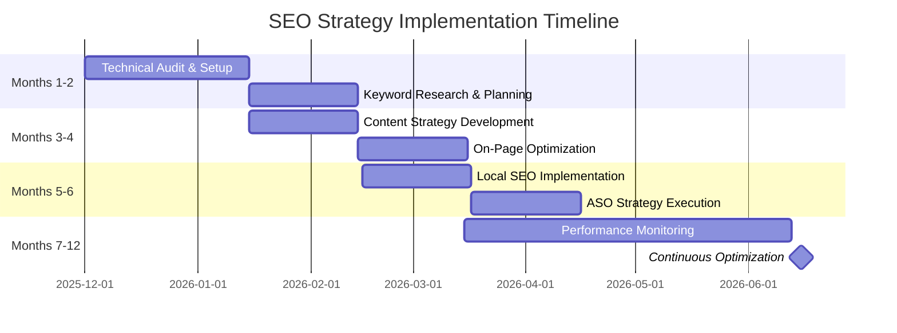

# Growth, SEO & ASO Strategy

**Document ID:** MPG-006-GROWTH-SEO · **Version:** 1.0 · **Effective Date:** 2025-12-09
**Owner:** Marketing Team & Development Team
**Applies To:** All web properties, mobile applications, and organic growth initiatives

---

## Purpose & Scope

This strategy document provides comprehensive guidance for implementing search engine optimization (SEO) and app store optimization (ASO) in the Kenyan market. It covers technical implementation, content strategy, local SEO tactics, and performance monitoring. The document serves as the authoritative reference for organic growth initiatives across web and mobile platforms.

The strategy ensures that:

- Technical SEO foundations support optimal search engine crawling and indexing
- Content strategy aligns with user intent and search behavior in Kenya
- Local SEO leverages Kenyan market opportunities and geographic targeting
- ASO maximizes mobile app visibility in Kenyan app stores
- Performance is continuously monitored and optimized for sustainable growth

---

## Outcome Summary

| Dimension                 | Target Outcome                                                                                             |
| ------------------------- | ---------------------------------------------------------------------------------------------------------- |
| **Technical Performance** | Website achieves optimal Core Web Vitals and technical SEO standards for fast, accessible user experience. |
| **Search Visibility**     | Organic search rankings improve for target keywords, driving qualified traffic and conversions.            |
| **Content Authority**     | Content establishes thought leadership and E-E-A-T signals in target markets and industries.               |
| **Local Presence**        | Local search visibility optimized for Kenyan cities and business locations.                                |
| **Mobile Growth**         | App store rankings and downloads increase through optimized ASO implementation.                            |
| **Sustainability**        | SEO efforts deliver long-term organic growth with continuous performance monitoring and optimization.      |

---

## Implementation Timeline Overview

SEO strategy implementation typically spans **6-12 months** for comprehensive optimization:

1. **Months 1-2:** Technical audit, foundation setup, keyword research
2. **Months 3-4:** Content strategy development, on-page optimization
3. **Months 5-6:** Local SEO implementation, ASO optimization
4. **Months 7-12:** Performance monitoring, continuous optimization

_Figure 1. SEO strategy implementation timeline with key milestones and optimization phases._

---

## Detailed Workflow & Procedures

### 1. Technical SEO Foundation & Core Web Vitals Optimization

**Objective:** Establish technically sound foundation achieving optimal Core Web Vitals scores and search engine crawling efficiency.

**Steps:**

1. **Comprehensive Performance Audit**: Use Google Lighthouse, WebPageTest, and GTmetrix to benchmark current LCP (<2.5s), CLS (<0.1), and INP (<200ms) scores. Document baseline metrics and identify optimization opportunities.
2. **Server-Side Rendering Implementation**: For React/Next.js applications, implement SSR/SSG to ensure Google bots can crawl JavaScript-rendered content. Configure build settings for static generation where appropriate.
3. **XML Sitemap Generation & Submission**: Auto-generate sitemaps using `next-sitemap` plugin, include all public pages, submit to Google Search Console and Bing Webmaster Tools. Update sitemaps weekly.
4. **Robots.txt Optimization**: Configure robots.txt to allow crawling of all public content while disallowing admin panels, API routes, and development environments. Include sitemap reference.
5. **Canonical URL Implementation**: Implement `<link rel="canonical">` tags on all pages to prevent duplicate content issues from URL parameters, www/non-www variants, and trailing slashes.
6. **Schema Markup Implementation**: Add JSON-LD structured data for Organization, Product, Article, FAQPage, and BreadcrumbList schemas. Validate using Google's Rich Results Test tool.
7. **Mobile-First Optimization**: Ensure responsive design with proper viewport meta tags, touch-friendly navigation, and mobile-optimized images. Test on real devices using BrowserStack.
8. **Image Optimization Pipeline**: Implement automatic image compression, WebP format conversion, and lazy loading. Use tools like `next/image` or Cloudinary for optimization.
9. **CDN Configuration**: Set up global CDN (Cloudflare/Vercel) for static assets and implement proper caching headers to reduce server response times.
10. **Google Search Console Setup**: Verify site ownership, submit sitemaps, monitor indexing status, and set up performance alerts for crawl errors.

**Evidence Requirements:** Lighthouse performance reports (before/after), Search Console verification screenshots, schema markup validation results, Core Web Vitals tracking dashboard, mobile usability test reports.

### 2. Keyword Research & Content Strategy Development

**Objective:** Develop data-driven keyword strategy and content pillars that align with user intent and search demand.

**Steps:**

1. **Seed Keyword Identification**: Brainstorm 50-100 primary keywords based on business offerings, competitor analysis, and customer pain points in Kenyan market.
2. **Competitor Keyword Analysis**: Use Ahrefs/SEMrush to analyze top 10 competitors' keyword profiles, identifying content gaps and ranking opportunities.
3. **Search Volume & Difficulty Assessment**: Filter keywords by search volume (>100 monthly searches) and keyword difficulty score (<40 for initial targeting).
4. **User Intent Classification**: Categorize keywords by intent: Informational (blog content), Navigational (brand pages), Transactional (product/service pages), Commercial (comparison content).
5. **Long-Tail Keyword Expansion**: For each primary keyword, identify 5-10 long-tail variations (3-5 word phrases) with lower competition and higher conversion potential.
6. **Topic Cluster Development**: Create pillar pages (comprehensive guides) and cluster content (specific subtopics) linking back to pillar pages for internal link equity distribution.
7. **Content Calendar Creation**: Map keywords to content types and publishing schedule. Allocate 60% informational, 30% commercial, 10% transactional content.
8. **E-E-A-T Optimization Framework**: Develop author bio templates, citation strategies, and expertise demonstration tactics for content credibility.
9. **Content Audit & Gap Analysis**: Review existing content inventory, identify optimization opportunities, and plan content refreshes for underperforming pages.
10. **SERP Feature Targeting**: Identify Featured Snippet, People Also Ask, and Local Pack opportunities for high-intent keywords.

**Evidence Requirements:** Keyword research spreadsheets with volume/difficulty metrics, competitor analysis reports, topic cluster mapping documents, content calendar with keyword assignments, E-E-A-T implementation checklist.

### 3. On-Page SEO Optimization & Technical Implementation

**Objective:** Optimize all on-page elements for maximum search engine understanding and user experience.

**Steps:**

1. **Title Tag Optimization**: Craft compelling titles under 60 characters incorporating primary keywords, power words, and brand terms. Ensure uniqueness across all pages.
2. **Meta Description Enhancement**: Write persuasive descriptions under 160 characters with call-to-action, primary keyword, and compelling value proposition.
3. **Heading Hierarchy Structure**: Implement proper H1-H6 structure with keyword-rich headings that create logical content flow and improve readability.
4. **Content Optimization**: Ensure 1-2% keyword density, natural language usage, and comprehensive coverage of user intent. Include related keywords and semantic variations.
5. **Internal Linking Strategy**: Create contextual internal links using descriptive anchor text, distribute link equity from high-authority to low-authority pages.
6. **URL Structure Optimization**: Implement clean, descriptive URLs with primary keywords, avoid parameters, and ensure mobile-friendly length.
7. **Image SEO Implementation**: Use descriptive filenames, alt text with keywords, proper dimensions, and next-gen formats (WebP/AVIF).
8. **Page Speed Optimization**: Implement code splitting, bundle optimization, critical CSS inlining, and eliminate render-blocking resources.
9. **HTTPS & Security Headers**: Ensure SSL certificate implementation with proper security headers (HSTS, CSP, X-Frame-Options).
10. **Breadcrumb Navigation**: Implement structured breadcrumb navigation with schema markup for improved user experience and crawlability.

**Evidence Requirements:** Before/after page audits using Screaming Frog, title/meta description spreadsheets, internal linking analysis reports, page speed test results, security header validation.

### 4. Local SEO & Google Business Profile Optimization

**Objective:** Dominate local search results in Kenyan markets through comprehensive local SEO implementation.

**Steps:**

1. **Google Business Profile Claim & Verification**: Claim GMB listing using business email/domain, verify ownership through postcard or phone verification.
2. **Business Information Optimization**: Complete all profile sections with accurate NAP (Name, Address, Phone), business hours, website, and service areas.
3. **Category & Attribute Selection**: Choose most relevant primary/secondary categories and business attributes that match customer search intent.
4. **Photo & Video Upload**: Upload high-quality business photos (exterior, interior, team, products), 360° views, and promotional videos.
5. **Services & Products Addition**: List all services with detailed descriptions, pricing information, and booking links where applicable.
6. **Review Management System**: Implement automated review monitoring, respond to all reviews within 24 hours, encourage satisfied customers to leave reviews.
7. **Local Content Strategy**: Create location-specific landing pages for major Kenyan cities (Nairobi, Mombasa, Kisumu) with local keywords and contact information.
8. **Citation Building Campaign**: Identify and claim listings on 50+ local directories (Yellow Pages, local business associations, industry-specific sites).
9. **Local Schema Markup**: Implement LocalBusiness, Organization, and ContactPoint schemas with accurate location data and business hours.
10. **Local Link Building**: Partner with local businesses, participate in community events, and earn mentions from local media outlets.

**Evidence Requirements:** GMB verification confirmation, complete profile screenshots, citation audit spreadsheet, local keyword ranking reports, review response tracking.

### 5. Link Building & Off-Page SEO Strategy

**Objective:** Build high-quality backlink profile through ethical, sustainable link acquisition tactics.

**Steps:**

1. **Content-Based Link Acquisition**: Create link-worthy assets (infographics, research reports, tools, comprehensive guides) that naturally attract backlinks.
2. **Guest Posting Campaign**: Identify authoritative blogs/websites in target niches, create high-quality guest posts with contextual backlinks to relevant pages.
3. **Resource Page Link Building**: Find resource pages in industry directories and submit business/website for inclusion with descriptive anchor text.
4. **Broken Link Building**: Use tools like Ahrefs to find broken links on relevant sites, reach out with content suggestions that replace broken links.
5. **Testimonial & Partnership Links**: Build relationships with complementary businesses for natural testimonial and partnership page links.
6. **Local Business Networking**: Join local business associations, chambers of commerce, and industry groups for directory and partnership links.
7. **Social Media Authority Building**: Grow social media following and engagement to increase social signals and potential link opportunities.
8. **Influencer Outreach**: Identify micro-influencers in target niches and collaborate on content that includes natural backlinks.
9. **Brand Mention Monitoring**: Use tools like Google Alerts and Mention to find unlinked brand mentions and request link additions.
10. **Link Quality Audit**: Regularly audit backlink profile using tools like Ahrefs, disavow spammy links, and monitor link velocity for unnatural patterns.

**Evidence Requirements:** Link building campaign tracker, new backlink acquisition reports, anchor text analysis, domain authority growth metrics, toxic link audit reports.

### 6. App Store Optimization (ASO) Implementation

**Objective:** Maximize app visibility and downloads through comprehensive ASO strategy execution.

**Steps:**

1. **App Store Keyword Research**: Use tools like App Annie and Sensor Tower to identify high-volume, low-competition keywords in Kenyan app store searches.
2. **App Title Optimization**: Craft compelling titles under 30 characters incorporating primary keywords while maintaining brand recognition.
3. **Subtitle & Description Enhancement**: Write persuasive subtitles and descriptions with secondary keywords, feature benefits, and clear value propositions.
4. **Keyword Field Optimization (iOS)**: Utilize all 100 characters with comma-separated keywords, focusing on high-intent search terms.
5. **App Icon & Screenshots Design**: Create visually appealing icons and screenshots that immediately communicate app value and include text overlays for additional keywords.
6. **Preview Video Production**: Develop 15-30 second videos showcasing key features, user benefits, and social proof to improve conversion rates.
7. **Rating & Review Optimization**: Implement in-app review prompts after positive user actions, monitor feedback, and release regular updates addressing user concerns.
8. **Competitor ASO Analysis**: Monitor top competitors' ASO strategies, keyword targeting, and update frequencies to identify improvement opportunities.
9. **A/B Testing Framework**: Test different metadata variations, visual assets, and descriptions to identify highest-converting combinations.
10. **ASO Performance Monitoring**: Track keyword rankings, impression shares, and conversion rates using app store analytics and third-party tools.

**Evidence Requirements:** ASO keyword research reports, app store analytics dashboards, A/B test results, competitor analysis reports, download/conversion tracking.

### 7. Performance Monitoring, Analytics & Reporting

**Objective:** Establish comprehensive monitoring framework for data-driven SEO optimization and reporting.

**Steps:**

1. **Google Analytics 4 Setup**: Configure GA4 with proper goal tracking, conversion funnels, and custom events for SEO performance measurement.
2. **Search Console Integration**: Set up automated daily/weekly reports for impressions, clicks, CTR, and average position data.
3. **Rank Tracking Implementation**: Use tools like STAT or AccuRanker to monitor keyword rankings across desktop/mobile and local search results.
4. **Core Web Vitals Monitoring**: Set up automated alerts for Core Web Vitals regressions and performance degradation.
5. **Competitor Performance Tracking**: Monitor competitor ranking changes, new content launches, and backlink acquisition.
6. **Conversion Tracking Setup**: Implement proper conversion tracking for organic search traffic, lead generation, and e-commerce transactions.
7. **Monthly Reporting Dashboard**: Create automated dashboards showing SEO KPIs, trend analysis, and actionable insights.
8. **Algorithm Update Monitoring**: Set up alerts for Google algorithm updates and analyze impact on organic performance.
9. **ROI Calculation Framework**: Develop methodology for calculating SEO ROI based on attributed conversions and customer lifetime value.
10. **Monthly Optimization Reviews**: Conduct structured reviews of performance data, identify optimization opportunities, and plan implementation priorities.

**Evidence Requirements:** GA4 configuration screenshots, Search Console property setup, rank tracking tool implementation, automated dashboard screenshots, monthly performance reports.

## Implementation Checklist

### Phase 1: Technical Foundation & Audit (Week 1-2)

- [ ] Run comprehensive site audit using Screaming Frog (crawl all pages, identify technical issues)
- [ ] Execute Core Web Vitals assessment using Google Lighthouse and PageSpeed Insights
- [ ] Analyze current site architecture and identify SSR/SSG implementation requirements
- [ ] Review robots.txt and XML sitemap for completeness and accuracy
- [ ] Audit existing schema markup and identify implementation gaps
- [ ] Verify Google Search Console and Google Analytics 4 setup and configuration
- [ ] Check mobile responsiveness across all device types and screen sizes
- [ ] Document all technical SEO issues with priority levels (Critical, High, Medium, Low)
- [ ] Create technical SEO roadmap with specific timelines and responsible parties
- [ ] Establish baseline performance metrics for tracking improvement

### Phase 2: Keyword Research & Strategy Development (Week 3-4)

- [ ] Define primary business objectives and target audience personas for Kenya market
- [ ] Brainstorm 100+ seed keywords based on products/services and customer pain points
- [ ] Set up Ahrefs/SEMrush accounts and configure project dashboards
- [ ] Conduct competitor keyword analysis for top 10 competitors in target niches
- [ ] Filter keywords by search volume (>100 monthly), difficulty score (<40 for initial targeting)
- [ ] Categorize keywords by user intent (informational, navigational, transactional, commercial)
- [ ] Identify long-tail keyword opportunities (3-5 word phrases with lower competition)
- [ ] Map keywords to existing content and identify content gaps
- [ ] Create topic cluster framework with pillar pages and supporting cluster content
- [ ] Develop 3-month content calendar with keyword assignments and publishing schedule
- [ ] Set up Google Alerts for target keywords and brand mentions

### Phase 3: On-Page SEO Optimization (Week 5-8)

- [ ] Audit all existing page titles for length, keyword inclusion, and uniqueness
- [ ] Review and optimize meta descriptions for all important pages
- [ ] Implement proper heading hierarchy (H1-H6) across all content pages
- [ ] Optimize content for target keywords with natural 1-2% keyword density
- [ ] Clean up URL structures to be descriptive and keyword-rich
- [ ] Add alt text to all images with relevant keywords and descriptions
- [ ] Implement internal linking strategy with contextual anchor text
- [ ] Add schema markup to product pages, blog posts, and key landing pages
- [ ] Optimize page load speed by compressing images and minifying code
- [ ] Test and fix any broken links or 404 errors identified during audit

### Phase 4: Local SEO & GMB Optimization (Week 9-10)

- [ ] Claim and verify Google Business Profile using business domain/email
- [ ] Complete all GMB profile sections with accurate business information
- [ ] Upload high-quality photos (exterior, interior, team, products, services)
- [ ] Select most relevant business categories and attributes
- [ ] Add detailed service descriptions with pricing information where appropriate
- [ ] Implement review monitoring and response system for all customer feedback
- [ ] Create location-specific landing pages for major Kenyan cities
- [ ] Build local citations on 50+ directories (Yellow Pages, local associations)
- [ ] Add LocalBusiness schema markup to website location pages
- [ ] Set up Google My Business Insights tracking and performance monitoring

### Phase 5: Content Creation & Link Building (Week 11-16)

- [ ] Develop content style guide with E-E-A-T optimization principles
- [ ] Create 10 pillar pages covering main business topics and keywords
- [ ] Produce 50+ cluster content pieces linking back to pillar pages
- [ ] Set up content promotion workflow (social media, email, partnerships)
- [ ] Launch guest posting campaign targeting authoritative sites in niche
- [ ] Implement resource page link building strategy
- [ ] Create shareable assets (infographics, checklists, tools) for link attraction
- [ ] Build relationships with industry influencers and micro-influencers
- [ ] Participate in local business networking events for citation opportunities
- [ ] Monitor brand mentions and request link additions where appropriate

### Phase 6: ASO Implementation (Week 17-20)

- [ ] Research app store keywords using App Annie, Sensor Tower, and Mobile Action
- [ ] Analyze competitor ASO strategies and identify keyword opportunities
- [ ] Optimize app title with primary keywords while maintaining brand identity
- [ ] Rewrite app descriptions with persuasive copy and secondary keywords
- [ ] Design new app icons and screenshots with text overlays for additional keywords
- [ ] Create compelling preview videos showcasing key features and benefits
- [ ] Implement in-app review prompts after positive user interactions
- [ ] Set up ASO performance tracking with automated reporting
- [ ] A/B test different metadata combinations for optimal performance
- [ ] Monitor app store rankings and adjust strategy based on data insights

### Phase 7: Analytics Setup & Performance Monitoring (Week 21-24)

- [ ] Configure Google Analytics 4 with enhanced e-commerce tracking
- [ ] Set up conversion goals and custom events for SEO performance measurement
- [ ] Implement Google Search Console property with sitemap submission
- [ ] Configure rank tracking tools (STAT, AccuRanker) for target keywords
- [ ] Set up automated daily/weekly performance reports
- [ ] Create SEO dashboard with KPIs: organic traffic, rankings, conversions
- [ ] Implement Core Web Vitals monitoring and alerting system
- [ ] Set up competitor tracking for ranking and content changes
- [ ] Configure Google Alerts for algorithm updates and industry news
- [ ] Establish monthly reporting cadence with stakeholder communication plan

### Phase 8: Optimization & Continuous Improvement (Ongoing)

- [ ] Conduct weekly performance reviews and identify optimization opportunities
- [ ] Implement A/B testing framework for titles, content, and page layouts
- [ ] Monitor algorithm updates and adapt strategies accordingly
- [ ] Refresh underperforming content with updated information and keywords
- [ ] Scale successful tactics and discontinue low-ROI activities
- [ ] Track seasonal trends and adjust content strategy accordingly
- [ ] Monitor competitor strategies and adapt to market changes
- [ ] Implement user feedback and search query data into optimization efforts
- [ ] Maintain fresh content calendar with regular publishing schedule
- [ ] Track ROI by calculating customer acquisition cost and lifetime value attribution

---

## Tools & References

### Technical SEO Tools

- **Auditing & Monitoring**: Google Search Console, Screaming Frog, GTmetrix
- **Performance Analysis**: Google Lighthouse, WebPageTest, Core Web Vitals tracker
- **Schema Validation**: Google's Rich Results Test, Schema Markup Validator
- **Mobile Testing**: Google Mobile-Friendly Test, BrowserStack

### Content & Keyword Research Tools

- **Keyword Research**: Ahrefs, SEMrush, Moz, Google Keyword Planner
- **Content Optimization**: Clearscope, SurferSEO, Yoast SEO
- **Competitor Analysis**: SpyFu, SimilarWeb, Alexa
- **Content Planning**: Google Trends, Answer The Public

### Local SEO Tools

- **Business Listings**: Google My Business, Bing Places, Apple Maps Connect
- **Citation Management**: BrightLocal, WhitePages, Yext
- **Review Management**: Podium, BirdEye, Reputation.com
- **Local Search Tracking**: LocalFalcon, BrightLocal

### ASO Tools & Platforms

- **Keyword Research**: App Annie, Sensor Tower, AppTweak
- **ASO Optimization**: App Radar, StoreMaven, The Tool
- **Review Analysis**: AppFollow, Appbot, ReviewTrackers
- **Competitor Tracking**: App Annie Intelligence, 42matters

### Analytics & Reporting Tools

- **Web Analytics**: Google Analytics 4, Adobe Analytics, Matomo
- **SEO Tracking**: STAT, SEOmonitor, AccuRanker
- **Reporting**: Tableau, Power BI, Google Data Studio
- **Alert Systems**: Google Alerts, Mention, Brandwatch

### Recommended Templates

- SEO Audit Checklist Template
- Content Strategy Framework
- Local SEO Implementation Guide
- ASO Keyword Research Template
- Performance Dashboard Template

---

## Appendices

### Appendix A: SEO Audit Framework

- Technical SEO checklist (crawling, indexing, performance)
- On-page optimization audit template
- Content quality assessment criteria
- Local SEO evaluation framework
- Mobile optimization checklist

### Appendix B: Content Strategy Templates

- Keyword research and mapping template
- Topic cluster development framework
- Content calendar template
- E-E-A-T optimization guidelines
- Internal linking strategy template

### Appendix C: Local SEO Implementation Guide

- Google Business Profile optimization checklist
- Citation building strategy template
- Local keyword targeting framework
- Review management procedures
- Local schema markup examples

### Appendix D: ASO Optimization Framework

- App store keyword research methodology
- Metadata optimization templates
- Visual asset design guidelines
- Rating and review improvement strategies
- ASO performance tracking dashboard

### Appendix E: Performance Monitoring Setup

- KPI definition and measurement framework
- Reporting automation templates
- Competitor analysis methodology
- Algorithm update response procedures
- Monthly optimization checklist

---

_This strategy should be reviewed monthly with performance data and adjusted based on algorithm updates, market changes, and competitive landscape. All SEO and ASO activities must align with Kenyan market conditions and user behavior patterns._
