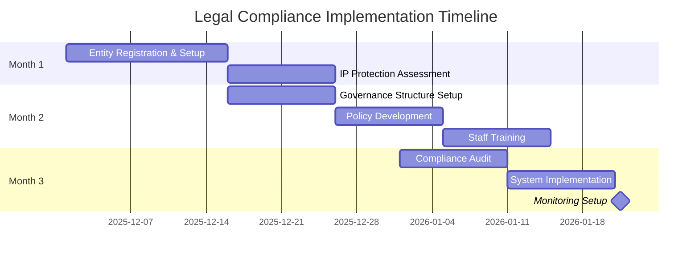

# Legal Governance Handbook

**Document ID:** MPG-004-LEGAL-GOV · **Version:** 1.0 · **Effective Date:** 2025-12-09
**Owner:** Legal Department & Compliance Officer
**Applies To:** All company operations, software development projects, and business activities in Kenya

---

## Purpose & Scope

This handbook provides comprehensive guidance for establishing and maintaining legal compliance in Kenyan business operations. It covers corporate structure, intellectual property protection, governance requirements, data privacy, employment law, and regulatory compliance. The document serves as the authoritative reference for legal compliance, risk mitigation, and governance implementation across all business activities.

The handbook ensures that:

- All business activities comply with Kenyan laws and regulations
- Intellectual property is adequately protected and managed
- Corporate governance follows statutory requirements
- Data protection and privacy laws are fully implemented
- Employment relationships comply with labor laws
- Regulatory filings and reporting obligations are met

---

## Outcome Summary

| Dimension                | Target Outcome                                                                                                 |
| ------------------------ | -------------------------------------------------------------------------------------------------------------- |
| **Legal Compliance**     | All business activities maintain full compliance with Kenyan laws, regulations, and statutory requirements.    |
| **IP Protection**        | Intellectual property assets are identified, protected, and managed according to Kenyan IP laws.               |
| **Corporate Governance** | Board and management structures follow statutory requirements and best practices.                              |
| **Data Protection**      | Personal data processing complies with Data Protection Act 2019 and international standards.                   |
| **Risk Mitigation**      | Legal and regulatory risks are identified, assessed, and mitigated through appropriate controls and insurance. |
| **Documentation**        | All statutory registers, filings, and legal documents are maintained and up-to-date.                           |

---

## Implementation Timeline Overview

Legal compliance implementation typically spans **1-3 months** depending on business complexity and existing structure:

1. **Month 1:** Entity registration, basic compliance setup, IP assessment
2. **Month 2:** Governance structure establishment, policy development, staff training
3. **Month 3:** Full compliance audit, system implementation, monitoring setup

_Figure 1. Legal compliance implementation timeline with key milestones._

---

## Detailed Workflow & Procedures

### 1. Corporate Structure & Foundation

**Objective:** Establish legally compliant corporate entity and registration requirements.

**Steps:**

1. **Entity Selection**: Choose appropriate legal structure (Private Ltd, PLC, LLP) based on business needs and requirements.
2. **Name Reservation**: Reserve company name with Companies Registry and conduct availability search.
3. **Document Preparation**: Prepare Memorandum and Articles of Association, share subscription agreements.
4. **Registration Filing**: Submit incorporation documents to Companies Registry within 60 days of name reservation.
5. **Post-Incorporation**: Obtain PIN from KRA, register for VAT if applicable, secure registered office address.
6. **Business Licensing**: Register with relevant County Government and obtain Single Business Permit.

**Evidence Requirements:** Certificate of Incorporation, PIN certificate, business license, registered office agreement.

### 2. Intellectual Property Protection

**Objective:** Identify, protect, and manage intellectual property assets according to Kenyan law.

**Steps:**

1. **IP Audit**: Conduct comprehensive audit of existing IP assets (software, brands, content, designs).
2. **Trademark Registration**: File trademark applications with KIPI for company name, logos, and product names.
3. **Copyright Registration**: Register software, content, and creative works (automatic protection under Copyright Act).
4. **Patent Assessment**: Evaluate technical innovations for patent filing with KIPI.
5. **IP Agreements**: Implement IP assignment agreements for all employees and contractors.
6. **Monitoring**: Set up trademark watch services and domain monitoring.

**Evidence Requirements:** IP assignment agreements, trademark certificates, copyright registrations, patent applications.

### 3. Board Governance & Compliance

**Objective:** Establish compliant board structure and governance processes.

**Steps:**

1. **Board Composition**: Appoint minimum required directors (2 for private companies, 3 for public).
2. **Director Qualifications**: Ensure directors meet fit and proper criteria under regulatory requirements.
3. **Board Meetings**: Establish regular meeting schedule and maintain statutory minute books.
4. **Decision Rights**: Define board and management decision-making authorities.
5. **Annual Filings**: Prepare and file annual returns, financial statements with Companies Registry.
6. **Board Policies**: Develop conflict of interest, related party transaction, and code of conduct policies.

**Evidence Requirements:** Board minutes, director registers, annual returns, policy documents.

### 4. Data Protection Compliance

**Objective:** Implement comprehensive data protection framework under Kenyan and international laws.

**Steps:**

1. **Data Mapping**: Identify all personal data processing activities and data flows.
2. **ODPC Registration**: Register as Data Controller/Processor with Office of the Data Protection Commissioner.
3. **Privacy Policies**: Develop and publish privacy notices, cookie policies, and consent mechanisms.
4. **Data Security**: Implement technical and organizational security measures (encryption, access controls).
5. **Subject Rights**: Establish processes for data subject access, rectification, erasure, and portability requests.
6. **Breach Procedures**: Develop incident response plan and breach notification procedures.
7. **Vendor Assessment**: Review third-party vendors for data protection compliance.

**Evidence Requirements:** ODPC registration certificate, privacy policies, security assessments, breach logs.

### 5. Employment & Labor Compliance

**Objective:** Ensure compliant employment relationships and workplace practices.

**Steps:**

1. **Employment Contracts**: Develop standard employment contracts compliant with Employment Act 2007.
2. **Work Permits**: Obtain work permits for non-Kenyan employees through Department of Immigration.
3. **Statutory Registrations**: Register with KRA for PAYE, NSSF, NHIF, and Work Injury Benefits Act.
4. **Minimum Standards**: Implement minimum wage (KES 16,587/month), paid leave, and working hours.
5. **Workplace Policies**: Develop anti-discrimination, harassment, and grievance procedures.
6. **Termination Procedures**: Establish fair dismissal procedures and severance calculations.
7. **Worker Classification**: Properly classify employees vs. contractors to avoid penalties.

**Evidence Requirements:** Employment contracts, statutory registrations, workplace policies, termination records.

### 6. Risk Management & Insurance

**Objective:** Identify, assess, and mitigate legal and operational risks.

**Steps:**

1. **Risk Assessment**: Conduct comprehensive legal risk assessment covering all business operations.
2. **Insurance Coverage**: Obtain required insurance (Professional Indemnity, Cyber Liability, D&O, General Liability).
3. **Compliance Monitoring**: Establish regular compliance audits and monitoring procedures.
4. **Incident Response**: Develop procedures for handling legal disputes, regulatory investigations.
5. **Contract Reviews**: Implement systematic review of all contracts and agreements.
6. **Training Programs**: Conduct regular legal compliance training for staff.

**Evidence Requirements:** Risk assessments, insurance policies, audit reports, training records.

### Founder & Equity Agreements

- **Memorandum & Articles of Association**: File with Companies Registry as required by Companies Act 2015.
- **Shareholder Agreements**: Define ownership percentages, transfer restrictions, pre-emption rights, and exit provisions.
- **Share Register**: Maintain statutory share register and notify Companies Registry of changes.
- **Director Service Agreements**: Formalize founder roles, compensation, and termination provisions.

## 2. Intellectual Property (IP) Protection

For a tech company, IP is the primary asset.

### Protection Strategy

- **Proprietary Information**: Identify trade secrets and protect under Kenyan common law and Anti-Counterfeit Act.
- **Trademarks**: Register with Kenya Industrial Property Institute (KIPI) for company name and product logos.
- **Patents**: File patent applications with KIPI for technical innovations (12-month priority period from first filing).
- **Copyright**: Automatic protection under Copyright Act 2001 for software, content, and designs.

### Assignment Agreements (Crucial)

- **IP Assignment Agreements**: **Every** employee and contractor MUST sign IP assignment agreements under Kenyan Copyright Act 2001. Include work-for-hire provisions.
  - _Risk_: Without this, developers could legally claim ownership of code they write, leading to costly litigation.

### Confidentiality

- **NDAs (Non-Disclosure Agreements)**: Use mutual or one-way NDAs when sharing sensitive info with partners, vendors, or potential hires.

## 3. Board of Directors & Governance

### Composition & Roles

- **Fiduciary Duties**: Directors owe duty of care and skill under Kenyan Companies Act 2015.
- **Board Structure**: Minimum 2 directors for private companies, 3 for public companies. Include independent directors where appropriate.
- **Director Qualifications**: Ensure directors meet fit and proper criteria under Capital Markets Authority regulations.

### Board Meetings

- **Frequency**: Hold Annual General Meetings (AGM) annually, plus extraordinary meetings as needed.
- **Minutes**: Maintain statutory minute books and file returns with Companies Registry within 30 days.
- **Quorum**: Ensure minimum quorum requirements are met for valid decisions.
- **Written Resolutions**: Use written resolutions for routine matters without formal meetings.

## 4. Compliance Checklist

### Data Privacy & Security

- **Data Protection Act 2019 (Kenya)**:
  - Register as Data Controller/Processor with Office of the Data Protection Commissioner.
  - Implement lawful basis for data processing (consent, legitimate interest, contract).
  - Provide data subject rights: access, rectification, erasure, portability.
- **International Standards (GDPR, CCPA)**: Comply if processing EU/US data.
- **Security Standards**: Achieve **ISO 27001** certification. Encrypt data at rest and in transit.
- **Data Breach Notification**: Report breaches to ODPC within 72 hours.

### Employment & HR

- **Employment Act 2007**: Provide written contracts, minimum wage (KES 16,587/month), paid leave, and termination procedures.
- **Worker Classification**: Distinguish employees from contractors to avoid NSSF, NHIF, and PAYE liabilities.
- **Anti-Discrimination**: Comply with Employment Act provisions against discrimination based on gender, race, religion.
- **Work Permits**: Obtain work permits for non-Kenyan employees through Department of Immigration.
- **Statutory Deductions**: Register with KRA for PAYE, NSSF, and NHIF compliance.

### Risk Management

- **Insurance Requirements**:
  - **Professional Indemnity**: Mandatory for tech/service companies under Insurance Act.
  - **Cyber Liability**: Essential for data handling businesses.
  - **Directors & Officers**: Protects board members from personal liability claims.
- **Regulatory Compliance**: File annual returns with relevant authorities (Companies Registry, KRA, ODPC).
- **Annual Audits**: Statutory audit by certified public accountant under Companies Act.
- **Business Continuity**: Maintain disaster recovery and business continuity plans.

## 5. Document Management

- **Statutory Registers**: Maintain share register, director register, and minute books as required by law.
- **Filing Requirements**: File annual returns, financial statements, and other documents with Companies Registry and KRA.
- **Document Retention**: Keep records for minimum periods specified by respective laws (typically 7-10 years).

---

## Implementation Checklist

### Pre-Setup Phase

- [ ] Legal entity type selected and justified
- [ ] Company name reserved with Companies Registry
- [ ] Registered office address secured
- [ ] Initial IP audit conducted
- [ ] Board composition requirements reviewed

### Setup Phase

- [ ] Company incorporation documents filed
- [ ] KRA PIN and tax registrations obtained
- [ ] Business licenses and permits secured
- [ ] IP protection measures implemented
- [ ] Data protection registration completed
- [ ] Employment contracts prepared

### Operational Phase

- [ ] Board governance structure operational
- [ ] Compliance monitoring systems in place
- [ ] Staff legal compliance training completed
- [ ] Insurance coverage verified
- [ ] Regular compliance audits scheduled
- [ ] Document retention procedures established

---

## Tools & References

### Legal Service Providers

- **Law Firms**: Specialized corporate, IP, and employment law firms in Kenya
- **Consultants**: Compliance consultants and regulatory advisors
- **Notaries**: Public notaries for document authentication

### Government Agencies

- **Companies Registry**: Company registration and filings
- **Kenya Revenue Authority (KRA)**: Tax registration and compliance
- **Kenya Industrial Property Institute (KIPI)**: IP registration and protection
- **Office of the Data Protection Commissioner (ODPC)**: Data protection compliance

### Compliance Tools

- **Contract Management**: DocuSign, Ironclad for agreement tracking
- **Compliance Software**: NAVEX, OneTrust for compliance management
- **Document Management**: SharePoint, Google Drive for statutory records
- **Training Platforms**: LinkedIn Learning, local compliance training providers

### Recommended Templates

- Company Incorporation Checklist
- IP Assignment Agreement Template
- Data Processing Agreement Template
- Employment Contract Template
- Board Meeting Minute Template

---

## Appendices

### Appendix A: Regulatory Compliance Checklist

- Companies Act 2015 compliance requirements
- Data Protection Act 2019 implementation guide
- Employment Act 2007 checklist
- Tax compliance obligations
- IP protection procedures

### Appendix B: Legal Document Templates

- Memorandum and Articles of Association template
- IP assignment agreement template
- Employment contract template
- Data processing agreement template
- Board resolution template

### Appendix C: Contact Information

- Government agencies contact details
- Legal service providers directory
- Regulatory authority hotlines
- Emergency legal contacts

### Appendix D: Compliance Calendar

- Monthly compliance activities
- Quarterly reporting requirements
- Annual filing deadlines
- Regulatory audit schedules

---

_This handbook should be reviewed quarterly and updated when new regulations, business changes, or legal requirements occur. All business activities must maintain compliance with the requirements outlined in this document._
