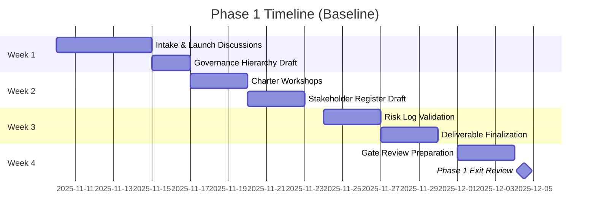
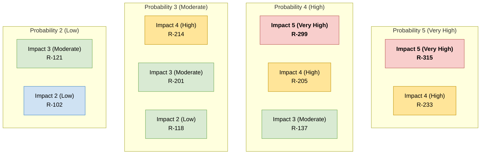
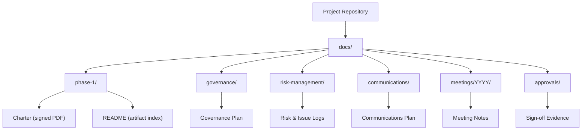

# Phase 1 Playbook: Project Initiation & Governance Stand-Up

**Document ID:** MPG-002-P1-INCEPTION · **Version:** 1.0 · **Effective Date:** 2025-11-07
**Owner:** Project Management Office (PMO)
**Applies To:** All software, data, and systems engineering projects governed under MPG-002

---

## Purpose & Scope

This playbook provides the exhaustive, step-by-step guidance required to successfully complete Phase 1 (Project Initiation & Governance Stand-Up) of the MPG-002 standard. It is intended for Project Managers, Executive Sponsors, Steering Committee members, Technical Leads, Business Analysts, and supporting teams who must establish a compliant governance foundation before project execution. The document expands into detailed procedures, deliverable specifications, templates, review cadences, and evidence requirements. It should be treated as the authoritative reference for Phase 1 activities, gate criteria, and documentation.

Phase 1 concludes only when:

- Governance hierarchy and decision rights are defined, documented, and approved.
- The project charter is baselined and endorsed by the Executive Sponsor.
- All mandatory Phase 1 deliverables are produced, reviewed, version-controlled, and stored in the designated knowledge repository (Git or approved document management system).
- Entry conditions for Phase 2 (Planning & Requirements Elaboration) are met and verified via the Phase 1 exit checklist included in this guide.

---

## Outcome Summary

| Dimension                  | Target Outcome                                                                                                                                              |
| -------------------------- | ----------------------------------------------------------------------------------------------------------------------------------------------------------- |
| **Strategic Alignment**    | The project’s business case, strategic objectives, and success measures are formally approved and traceable.                                                |
| **Governance Structure**   | Executive Sponsor, Steering Committee, Project Manager, and key leads are appointed with documented roles, escalation paths, and decision-making authority. |
| **Stakeholder Engagement** | Stakeholders are identified, categorized, and assigned engagement tactics aligned to the communications plan.                                               |
| **Risk Visibility**        | Initial project risks, constraints, issues, and assumptions are captured with owners and mitigation strategies.                                             |
| **Baseline Documentation** | Core artifacts (charter, governance plan, stakeholder register, risk register, communications plan) are version controlled and follow naming standards.     |

---

## Phase 1 Timeline Overview

Phase 1 activities typically span **2–4 weeks** and may overlap if the governance body consents. The following timeline assumes a medium-complexity initiative:

1. **Week 1:** Launch discussions, stakeholder interviews, draft charter outline, draft governance hierarchy.
2. **Week 2:** Facilitate charter workshops, confirm governance roster, draft stakeholder register, draft communications strategy.
3. **Week 3:** Validate risk log, finalize deliverables, circulate for review, collect sign-offs.
4. **Week 4:** Perform Phase 1 exit review, file documentation, and seek approval to enter Phase 2.

Adjust the cadence based on project urgency, availability of executives, and organizational scheduling norms. However, **all deliverables and approvals remain mandatory** unless a formally approved waiver is granted by the PMO.



_Figure 1. Baseline Gantt chart illustrating recommended sequencing of Phase 1 activities._

---

## Detailed Workflow & Procedures

### 1. Initiation Trigger & Intake

**Objective:** Capture the project request, confirm sponsorship, and assign a provisional Project Manager.

**Steps:**

1. Intake the project request via the PMO intake form or portfolio management tool.
2. Verify funding source, strategic alignment documents, and executive sponsorship commitment.
3. Assign a provisional Project Manager (PM) and notify the Executive Sponsor.
4. Create the initial project space (Git repository, SharePoint site, or Confluence space) using approved naming conventions (e.g., `ProjectAlpha` → repository `project-alpha`, docs directory `ProjectAlpha_Docs`).
5. Log the project in the portfolio tracker with status “Initiation”.

**Evidence Requirements:** Intake form, Sponsor confirmation email, PM assignment memo.

### 2. Governance Chartering Workshop

**Objective:** Align leadership on project intent, authority structure, and expected outcomes.

**Steps:**

1. Schedule a governance chartering workshop with the Sponsor, PM, PMO lead, and proposed Steering Committee members.
2. Prepare a briefing deck covering business case, strategic goals, initial scope boundaries, and success metrics (pull from intake documentation).
3. Facilitate the workshop, capturing decisions about:
   - Governance hierarchy (Sponsor, Steering Committee, PM, technical/functional leads).
   - Decision rights and escalation thresholds (e.g., budget variance >5% → Steering Committee).
   - Meeting cadence (monthly Steering Committee, weekly PM/Sponsor check-ins).
   - Required Phase 1 deliverables and review timeline.
4. Record action items (e.g., confirm budget envelope, identify legal advisor, nominate BA).
5. Distribute workshop summary within 24 hours and archive it under `/docs/meetings/2025/2025-11-07_governance-workshop-notes.md` (adjust for date and naming conventions).

**Evidence Requirements:** Workshop deck, attendance roster, decision log, action item tracker.

### 3. Project Charter Development

**Objective:** Produce a comprehensive charter that defines the project foundation.

**Steps:**

1. Follow the charter template provided in Appendix A.
2. Conduct stakeholder interviews (Sponsor, business owner, technical lead, operations, compliance, security).
3. Populate the charter sections:
   - Executive summary.
   - Strategic alignment and value statement.
   - Goals, objectives, success metrics (KPIs).
   - Scope definition (in scope / out of scope).
   - High-level timeline and major milestones.
   - Financial summary (budget, funding authorization).
   - Assumptions, constraints, dependencies.
   - Initial risk profile and mitigation approach.
   - Governance summary (who approves what).
4. Circulate draft charter to stakeholders for inline comments.
5. Incorporate feedback, version increment (e.g., `ProjectAlpha_Charter_v20251107.docx`), and store in the Git repository under `docs/phase-1/`.
6. Obtain formal approval:
   - Project Manager signs as preparer.
   - Executive Sponsor signs for authorization.
   - Optional: Steering Committee co-sign if required by governance policy.

**Evidence Requirements:** Approved charter (PDF and editable source), comment log, version history.

### 4. Governance Plan & Hierarchy Documentation

**Objective:** Define and document the governance model, decision thresholds, and escalation paths.

**Steps:**

1. Use the governance plan template (Appendix B) to capture hierarchy details.
2. Draft the governance diagram highlighting levels (Sponsor → Steering Committee → PM → Technical/Functional Leads → Project Team).

   ```mermaid
   graph TD
     ES[Executive Sponsor]
     SC[Steering Committee]
     PM[Project Manager]
     TL[Technical / Functional Leads]
     DT[Delivery Teams]

     ES --> SC
     SC --> PM
     PM --> TL
     TL --> DT

     ES ---|Escalation Path| PM
     SC ---|Advisory & Approvals| TL
   ```

   _Figure 2. Governance hierarchy illustrating formal authority cascades and escalation paths._

3. Document decision categories with accountable roles (e.g., “Budget increase >$250k → Sponsor”).
4. Detail escalation protocol (timeframes, contact methods, documentation requirements).
5. Define governance forums (meeting frequency, agenda, required reports, quorum rules).
6. Review with the Sponsor and PMO for compliance against MPG-002.
7. Store final plan as `ProjectAlpha_GovernancePlan_v20251107.md` in `docs/governance/`.

**Evidence Requirements:** Governance diagram (SVG/PDF), decision table, escalation matrix, approvals.

### 5. Stakeholder Identification & Analysis

**Objective:** Capture all stakeholders, their influence/interest, and engagement strategies.

**Steps:**

1. Brainstorm stakeholders across business units, technology, operations, compliance, security, vendors, and customers.
2. Populate the stakeholder register template (Appendix C) with:

   - Contact information.
   - Role/department.
   - Influence level (High/Medium/Low).
   - Interest level (High/Medium/Low).
   - Engagement strategy (Manage Closely, Keep Satisfied, Keep Informed, Monitor).
   - Preferred communication channels and cadence.

3. Validate with Sponsor and BA/Product Owner.
4. Map stakeholders to governance forums (e.g., Steering Committee, Working Groups).
5. Version control the register (`ProjectAlpha_StakeholderRegister_v20251107.xlsx` or `.md`).

   ```mermaid
   flowchart LR
     subgraph HI["High Interest (>0.5)"]
       HI_HI["High Influence (>0.5)\nManage Closely — Alex Kim"]
       HI_LI["Low Influence (≤0.5)\nKeep Informed — Finance Ops"]
     end
     subgraph LI["Low Interest (≤0.5)"]
       LI_HI["High Influence (>0.5)\nKeep Satisfied — Security"]
       LI_LI["Low Influence (≤0.5)\nMonitor — Customer Service"]
     end

     classDef manage fill:#ffe599,stroke:#bf9000,color:#000,font-weight:bold;
     classDef satisfy fill:#d9ead3,stroke:#6aa84f,color:#000;
     classDef inform fill:#cfe2f3,stroke:#3d85c6,color:#000;
     classDef monitor fill:#f3f3f3,stroke:#999999,color:#000;

     class HI_HI manage;
     class LI_HI satisfy;
     class HI_LI inform;
     class LI_LI monitor;
   ```

   _Figure 3. Influence/interest grid guiding stakeholder engagement strategies._

**Evidence Requirements:** Stakeholder register, validation notes, version history.

### 6. Communications Planning

**Objective:** Establish structured communication protocols aligning to stakeholder needs.

**Steps:**

1. Translate stakeholder engagement strategies into a communications matrix (Appendix D).
2. Define communication vehicles (status reports, dashboards, town halls, newsletters, standups).
3. Specify content owners, distribution lists, frequency, and delivery methods.
4. Include governance reporting requirements:
   - Monthly Steering Committee packets.
   - Quarterly Sponsor briefings.
   - Risk/issue escalations within 24 hours.
5. Align the plan with organizational communications policies (branding, confidentiality).
6. Secure PM and Sponsor approval.
7. Publish the plan as `ProjectAlpha_CommunicationsPlan_v20251107.md`.

**Evidence Requirements:** Communications plan, stakeholder communications map, approval record.

### 7. Initial Risk & Issue Management Setup

**Objective:** Seed the risk and issue management framework with Phase 1 findings.

**Steps:**

1. Create a risk register using the template (Appendix E) with the following mandatory fields:
   - Risk ID, description, category, probability, impact, exposure score.
   - Owner, mitigation strategy, contingency plan, trigger conditions.
   - Status (Open, Monitoring, Mitigated).
2. Capture initial risks identified during intake, charter workshops, and stakeholder conversations.
3. Establish issue log for known current problems requiring immediate action.
4. Define escalation thresholds (e.g., risks with exposure > 12 require Steering Committee visibility).
5. Store logs under `docs/risk-management/` and link from the governance plan.
6. Schedule recurring risk review meetings (biweekly minimum during initiation).



_Figure 4. Sample probability–impact visual showing which risks (IDs from the register draft) trigger Steering Committee escalation._

**Evidence Requirements:** Risk register, issue log, risk review meeting invite, action items.

### 8. Repository & Document Control Setup

**Objective:** Enforce configuration management standards from day one.

**Steps:**

1. Create a dedicated repository (if new) following naming conventions; apply branch protections.
2. Add baseline directories:
   - `docs/phase-1/`
   - `docs/governance/`
   - `docs/risk-management/`
   - `docs/communications/`
   - `docs/meetings/YYYY/`
3. Create a `README.md` summarizing Phase 1 documents and approval status.
4. Configure access controls per stakeholder roles (read-only vs. maintainers).
5. Implement document naming policy (see Appendix F) and ensure all files include version suffixes.
6. Commit the initial documentation skeleton to Git with meaningful commit messages (e.g., `feat(initiation): add governance documentation scaffolding`).

**Evidence Requirements:** Git commit history, README, access control logs.



_Figure 5. Recommended document control structure reinforcing consistent storage and access controls._

### 9. Phase 1 Gate Review

**Objective:** Verify readiness to transition to Phase 2.

**Steps:**

1. Complete the Phase 1 exit checklist (Section “Checklists & Gate Reviews”).
2. Assemble gate review packet containing:
   - Signed charter.
   - Governance plan and hierarchy diagram.
   - Stakeholder register.
   - Communications plan.
   - Risk and issue logs.
   - Meeting cadence calendar.
   - Evidence of repository setup.
3. Schedule gate review with Sponsor, PMO, and relevant leads.
4. Conduct review, capture decisions, and record conditional approvals (e.g., “Proceed to Phase 2 pending finalization of vendor contract”).
5. Document the outcome in the decision log and update portfolio tracker status to “Planning”.

**Evidence Requirements:** Completed checklist, gate review minutes, approval emails.

---

## Deliverable Specifications

The table below provides detailed requirements for each mandatory Phase 1 artifact. All deliverables must be stored in the project repository, with metadata capturing author, version, approval date, and location.

| Deliverable                  | Purpose                                                    | Required Contents                                                                                               | Format & Naming                                                                                      | Approval                                                                 |
| ---------------------------- | ---------------------------------------------------------- | --------------------------------------------------------------------------------------------------------------- | ---------------------------------------------------------------------------------------------------- | ------------------------------------------------------------------------ |
| **Project Charter**          | Authorizes the project, defines scope, budget, objectives. | Executive summary, business case, scope in/out, KPIs, timeline, budget, risks, governance summary.              | Primary format:`.docx` or `.md`; signed PDF copy. Naming: `ProjectName_Charter_vYYYYMMDD.ext`.       | Prepared: PM; Approved: Executive Sponsor; Notified: Steering Committee. |
| **Governance Plan**          | Documents hierarchy, decision rights, escalation protocol. | Governance diagram, decision matrices, meeting cadence, escalation process, RACI summary.                       | `.md` or `.pptx` + exported PDF. Naming: `ProjectName_GovernancePlan_vYYYYMMDD.md`.                  | Prepared: PM; Approved: Executive Sponsor; Reviewed: PMO.                |
| **Stakeholder Register**     | Identifies stakeholders and engagement strategies.         | Name, role, influence, interest, engagement approach, contact details, communication cadence.                   | `.xlsx` or `.csv`; optional `.md` summary. Naming: `ProjectName_StakeholderRegister_vYYYYMMDD.xlsx`. | Prepared: BA/Product Owner; Approved: PM; Reviewed: Sponsor.             |
| **Communications Plan**      | Defines communication methods and schedule.                | Communication objectives, audience segmentation, content owners, channels, frequency, artifacts, feedback loop. | `.md` or `.pptx` + PDF. Naming: `ProjectName_CommunicationsPlan_vYYYYMMDD.md`.                       | Prepared: PM; Approved: Sponsor.                                         |
| **Risk Register**            | Captures initial risks with mitigation strategies.         | Risk ID, description, category, probability, impact, exposure, owner, mitigation, contingency, status.          | `.xlsx` or `.csv`; optional `.md` export. Naming: `ProjectName_RiskRegister_vYYYYMMDD.xlsx`.         | Prepared: PM; Reviewed: Steering Committee; Monitored: PMO.              |
| **Issue Log**                | Tracks active issues requiring resolution.                 | Issue ID, description, impact, owner, due date, status, resolution.                                             | `.xlsx` or `.md`. Naming: `ProjectName_IssueLog_vYYYYMMDD.xlsx`.                                     | Prepared: PM; Reviewed: Sponsor.                                         |
| **Meeting Cadence Calendar** | Establishes governance forum schedule.                     | Calendar of recurring meetings (Steering Committee, Sponsor sync, PMO checkpoint), participants, agendas.       | `.ics` export + `.md` summary. Naming: `ProjectName_GovernanceCalendar_vYYYYMMDD.md`.                | Prepared: PM; Approved: Sponsor.                                         |
| **Decision Log**             | Records key decisions with context and approvals.          | Decision ID, description, date, decision maker, rationale, follow-up actions.                                   | `.md` or `.xlsx`. Naming: `ProjectName_DecisionLog_vYYYYMMDD.md`.                                    | Prepared: PM; Reviewed: Steering Committee.                              |
| **Repository README**        | Provides navigation to Phase 1 artifacts and status.       | Summary, artifact list with links, approval status, next steps.                                                 | `README.md` located under `docs/phase-1/`.                                                           | Prepared: PM or Documentation Lead; Reviewed: PMO.                       |

**Document Control Notes:**

- All deliverables must include a document control table (version, author, reviewer, approval date, change summary).
- Maintain both editable source format and signed/locked format.
- Store approvals (e-signatures, email confirmations) in the `/docs/approvals/` folder, linking to primary artifacts.

### Artifact Completion Tracker

| Artifact                  | Owner | Status (Draft / In Review / Approved) | Repository Path | Version | Approval Evidence Stored? | Next Action / Due Date |
| ------------------------- | ----- | ------------------------------------- | --------------- | ------- | ------------------------- | ---------------------- |
| Charter                   |       |                                       |                 |         |                           |                        |
| Governance Plan           |       |                                       |                 |         |                           |                        |
| Stakeholder Register      |       |                                       |                 |         |                           |                        |
| Communications Plan       |       |                                       |                 |         |                           |                        |
| Risk Register             |       |                                       |                 |         |                           |                        |
| Issue Log                 |       |                                       |                 |         |                           |                        |
| Decision Log              |       |                                       |                 |         |                           |                        |
| Repository README         |       |                                       |                 |         |                           |                        |
| Meeting Cadence Calendar  |       |                                       |                 |         |                           |                        |
| Approvals Evidence Packet |       |                                       |                 |         |                           |                        |

Update this table at the close of each week and prior to the gate review. “Approval Evidence Stored?” should reference the exact file in `/docs/approvals/` (e.g., `ProjectAtlas_Charter_Approval_20251107.pdf`).

### Approval Evidence Requirements

- **E-signature Certificates:** Export completion receipts (DocuSign, Adobe Sign) as PDF and store in `/docs/approvals/esign/`.
- **Email Approvals:** Save emails as PDF or `.eml`, append to `/docs/approvals/email/`, and record the message ID in the decision log.
- **Meeting Minutes:** When approvals happen in meetings, ensure minutes capture decision details, attendees, and conditions; cross-reference decision log entries.
- **Portfolio Tool Screenshots:** Capture screenshots of portfolio approvals, tag with version numbers, and store them alongside the relevant artifacts.

### Execution Checklist by Workstream

| Workstream             | Activity                                           | Evidence Location                   | Responsible Role | Status |
| ---------------------- | -------------------------------------------------- | ----------------------------------- | ---------------- | ------ |
| Governance             | Sponsor confirmation memo logged.                  | `/docs/approvals/`                  | PM               |        |
| Governance             | Steering Committee charter ratified.               | `docs/governance/...`               | Sponsor          |        |
| Documentation          | Charter v1.0 published and signed.                 | `docs/phase-1/...`                  | PM               |        |
| Documentation          | Governance plan diagram updated with final roster. | `docs/governance/...`               | PM               |        |
| Stakeholder Management | Register validated with Sponsor & BA.              | `docs/phase-1/...`                  | BA               |        |
| Communications         | Communications plan tailored and approved.         | `docs/communications/...`           | PM               |        |
| Risk                   | Initial risk register seeded (≥10 items).          | `docs/risk-management/...`          | PM               |        |
| Tooling                | Repository structure committed with CODEOWNERS.    | Git commit hash                     | DevOps           |        |
| Access Control         | Permissions reviewed (read/write).                 | Access report in `/docs/approvals/` | PMO              |        |
| Gate Preparation       | Phase 1 exit deck & checklist compiled.            | `docs/phase-1/gate-review/`         | PM               |        |

Flag any activity that remains “In Progress” for more than one week and escalate via the Sponsor sync per the communications plan.

### Deliverable Deep-Dive Guides

**Project Charter**

- Use Appendix A structure; ensure success metrics are SMART and tied to organizational OKRs.
- Include baseline budget spreadsheet in appendix and reference funding authority.
- Track review comments using version history; respond to each before final approval.
- Capture cross-functional sign-offs (Security, Legal, Compliance) where mandated.

**Governance Plan**

- Customize the hierarchy diagram (Figure 2) with actual names and titles.
- Provide a decision matrix mapping categories (scope, budget, technology, vendor) to accountable roles with thresholds.
- Document escalation response times and communication channels; validate with Sponsor and PMO.
- Attach meeting charter for Steering Committee outlining quorum and voting rules.

**Stakeholder Register**

- Populate fields from Appendix C with real data; include stakeholder personas if needed.
- Link each stakeholder to communication tactics defined in the communications plan.
- Schedule and document stakeholder interviews; archive notes under `/docs/meetings/YYYY/`.
- Review and update at least monthly during initiation and prior to each gate review.

**Communications Plan**

- Attach sample artefacts (status report, newsletter, town hall deck). Use Appendix K for structure.
- Specify communication owners and backups; define escalation communications process.
- Align with corporate branding and confidentiality requirements; obtain PMO Communications sign-off.
- Include metrics for measuring communication effectiveness (survey cadence, open rates).

**Risk & Issue Registers**

- Use Appendix E columns; assign likelihood/impact scores using enterprise risk taxonomy.
- Capture mitigation and contingency tasks in the project schedule; link ticket IDs.
- Review registers during risk standups; update “Status” column after each meeting.
- Flag high exposure items for Steering Committee and document escalations in decision log.

**Decision Log**

- Follow Appendix I; ensure each entry references supporting evidence and resulting actions.
- Track conditions and due dates; create follow-up tasks in project management tool.
- At gate review, summarize key Phase 1 decisions in the deck (Appendix L).

**Repository README & Structure**

- Mirror Figure 5 structure in Git; include relative links to each artifact and approval evidence.
- Add a status table (Appendix H) and update after approvals.
- Configure CODEOWNERS and branch protection so PMO reviews documentation changes.

**Meeting Cadence Calendar**

- Create calendar invites for all governance meetings (Sponsor sync, PMO checkpoint, risk standup, gate review).
- Attach agendas (Appendix J) to invites, and archive meeting recordings/minutes in `/docs/meetings/YYYY/`.
- Verify acceptance from all required attendees; document declines and substitutes.

### Team Management, Workflow & Naming Standards

- **Leadership Structure:** Apply the Phase 1 RACI matrix and governance hierarchy to assign decision rights and day-to-day task ownership. Document team roles (Sponsor, PM, BA, Technical Lead, QA, DevOps) in the charter and stakeholder register so onboarding stakeholders understand responsibilities.
- **Workflow Orchestration:** Establish sprint/iteration cadence or waterfall stage plan during planning; align with governance checkpoints (Steering Committee, Sponsor sync, PMO review). Use the communications plan to schedule touchpoints (standups, demos, retrospectives) backed by agendas and minutes stored in `/docs/meetings/YYYY/`.
- **Task Allocation:** Maintain a master activity tracker (e.g., story/task board or WBS assignments) mapping deliverables to responsible owners. Integrate with risk log and change log so owners are accountable for mitigation actions and approvals.
- **Escalation Paths:** Record escalation thresholds (schedule variance, budget overrun, risk exposure) in the governance plan and reiterate during kickoff. Ensure runbooks include who to contact for urgent approvals.
- **Naming Conventions:** In addition to `Standards.md`, publish a concise reference within Phase 1 deliverables (README, naming cheat sheet). Use `ProjectIdentifier_DocumentType_vYYYYMMDD.ext` for all artifacts, `snake_case` or `kebab-case` for directories, `PascalCase` for high-level folders, and `camelCase` / `UPPER_SNAKE_CASE` for code identifiers (as applicable). Embed a naming rubric in the configuration management plan and require compliance checks during PMO reviews.
- **Knowledge Sharing:** Create a central collaboration space (e.g., `/docs/wiki`) that lists owners, working agreements, and quick links to artifacts, enabling team continuity when membership changes.
- **Onboarding & Offboarding:** Define onboarding checklists covering access provisioning, walkthrough of governance artifacts, and naming standards. Establish offboarding steps (revoke access, transfer ownership) with maximum 24-hour SLA documented in the governance plan.
- **Responsiveness SLAs:** Document response expectations for leadership roles (e.g., Sponsor escalations ≤48 hours, Steering Committee decisions within 5 business days). Track adherence during status meetings and escalate chronic delays via PMO.
- **Collaboration Etiquette:** Mandate use of centralized tools (e.g., work management, document repository) rather than personal storage. Enforce comment resolution and version control practices before final approvals.

---

## Roles, Responsibilities & RACI (Phase 1 Focus)

| Activity                          | Executive Sponsor | Steering Committee | Project Manager | BA / Product Owner | Technical Lead | PMO Representative | Legal / Compliance |
| --------------------------------- | ----------------- | ------------------ | --------------- | ------------------ | -------------- | ------------------ | ------------------ |
| Confirm project mandate & funding | **A**             | C                  | R               | I                  | I              | C                  | I                  |
| Appoint governance body           | **A**             | R                  | C               | I                  | I              | C                  | C                  |
| Develop and approve charter       | **A**             | C                  | **R**           | C                  | C              | C                  | C                  |
| Draft governance plan             | C                 | C                  | **R**           | I                  | C              | **A**              | I                  |
| Validate stakeholder register     | I                 | I                  | **A**           | **R**              | C              | C                  | I                  |
| Approve communications plan       | **A**             | C                  | **R**           | C                  | I              | C                  | I                  |
| Seed risk & issue logs            | I                 | C                  | **R/A**         | C                  | C              | C                  | C                  |
| Set meeting cadence               | **A**             | C                  | **R**           | I                  | I              | C                  | I                  |
| Conduct gate review               | **A**             | **R**              | **R**           | C                  | C              | C                  | C                  |

**Key:** R = Responsible; A = Accountable; C = Consulted; I = Informed. Accountable is uniquely assigned per activity to enforce clear ownership.

---

## Meeting & Communication Cadence (Phase 1)

| Meeting                            | Purpose                                               | Participants                                                   | Frequency              | Inputs                              | Outputs                                               |
| ---------------------------------- | ----------------------------------------------------- | -------------------------------------------------------------- | ---------------------- | ----------------------------------- | ----------------------------------------------------- |
| **Governance Chartering Workshop** | Define governance structure and expectations.         | Sponsor, PM, PMO, proposed Steering Committee, Technical Lead. | Once (early Phase 1).  | Intake request, business case deck. | Decisions on hierarchy, action items, workshop notes. |
| **Sponsor Sync**                   | Confirm charter progress, remove blockers.            | Sponsor, PM.                                                   | Weekly (30 min).       | Charter draft, risk highlights.     | Sponsor guidance, approvals, escalations.             |
| **PMO Checkpoint**                 | Ensure compliance with MPG-002, review documentation. | PM, PMO representative.                                        | Weekly (45 min).       | Draft artifacts, risk log.          | Feedback memo, compliance action list.                |
| **Stakeholder Interviews**         | Gather requirements context, risks, support needs.    | PM or BA, individual stakeholders.                             | As scheduled (60 min). | Interview guide.                    | Interview notes, stakeholder register updates.        |
| **Risk Review Standup**            | Monitor early risks and issues.                       | PM, Technical Lead, BA, PMO.                                   | Biweekly (30 min).     | Risk/issue log.                     | Updated risk log, mitigation actions.                 |
| **Phase Gate Review**              | Decide readiness for Phase 2.                         | Sponsor, Steering Committee, PM, PMO, Leads.                   | Once (end of Phase 1). | Gate packet, exit checklist.        | Gate decision, conditions, approval minutes.          |

All meetings must have documented agendas sent at least 24 hours in advance and meeting minutes archived within 2 business days.

---

## Risk & Control Considerations

**Common Initiation Risks:**

1. **Undefined Sponsor Authority:** Mitigate by documenting sponsor responsibilities and escalation paths in the governance plan and obtaining explicit acceptance.
2. **Scope Ambiguity:** Ensure charter includes clear in-scope/out-of-scope statements; flag unresolved areas as risks with owners.
3. **Stakeholder Gaps:** Conduct thorough cross-functional stakeholder mapping; validate with PMO to catch omissions.
4. **Delayed Approvals:** Establish approval timelines in communications plan; schedule review sessions before artifacts are finalized to accelerate feedback.
5. **Insufficient Documentation Controls:** Implement repository structure and naming standards before drafting deliverables; conduct PMO audit to spot noncompliance.

**Control Activities:**

- Weekly PMO compliance review to verify document presence, version control, and approvals.
- Sponsor sign-off checklist requiring confirmation of strategic alignment and funding availability.
- Risk log includes “Phase 1 risk coverage” metric to ensure minimum number of high-priority risks identified (e.g., ≥5 for enterprise initiatives).
- Gate review uses scoring rubric (Appendix G) to objectively assess readiness.

---

## Tooling & Configuration Requirements

| Tool / Platform                                    | Configuration Action                                                                  | Owner       | Evidence                                                     |
| -------------------------------------------------- | ------------------------------------------------------------------------------------- | ----------- | ------------------------------------------------------------ |
| **Git (Version Control)**                          | Create repository, enable branch protection on `main`, add CODEOWNERS for PMO review. | DevOps / PM | Repository URL, screenshot of settings, initial commit hash. |
| **Document Repository (SharePoint/Confluence)**    | Create Phase 1 space with permissions by role.                                        | PMO         | Access control report, folder structure screenshot.          |
| **Portfolio Tracker (e.g., Jira Align, Airtable)** | Add project entry, set status to “Initiation”, link charter.                          | PM          | Tracker ID, link to charter.                                 |
| **Meeting Management (Outlook/Google Calendar)**   | Publish governance calendar (.ics) with invites.                                      | PM          | Calendar export, list of invites sent.                       |
| **Risk Management Tool (if applicable)**           | Configure new project workspace, import risk template.                                | PM          | Risk workspace link, export of initial risks.                |
| **Electronic Signature Platform (DocuSign)**       | Route charter and governance plan for signature.                                      | PM          | Audit trail log, completed envelope ID.                      |

**Note:** If corporate policy mandates a single source repository for documentation, store Git references in the secondary system via hyperlinks, ensuring both locations stay synchronized.

---

## Checklists & Gate Reviews

### A. Pre-Initiation Checklist (Before Phase 1 Kickoff)

- [ ] Project request logged and assigned portfolio ID.
- [ ] Executive Sponsor confirmed via written communication.
- [ ] Provisional PM assigned and notified.
- [ ] Initial funding authorization documented.
- [ ] Repository and document space created with baseline structure.

### B. In-Phase Quality Checklist (Run Weekly)

- [ ] Charter draft updated with latest feedback.
- [ ] Governance plan reflects current decisions; version control maintained.
- [ ] Stakeholder register reviewed and expanded as new stakeholders emerge.
- [ ] Communications plan includes cadence for high-influence stakeholders.
- [ ] Risk register updated with probability/impact scores and owners.
- [ ] Meeting minutes captured for all governance forums convened.
- [ ] All files adhere to naming convention (`ProjectName_DocumentType_vYYYYMMDD.ext`).

### C. Phase 1 Exit / Gate Checklist

- [ ] Project Charter approved and archived with signatures.
- [ ] Governance Plan approved; hierarchy diagram stored in repository.
- [ ] Stakeholder Register validated by Sponsor and PM.
- [ ] Communications Plan approved by Sponsor.
- [ ] Risk Register includes at least top 10 risks with mitigation plans.
- [ ] Issue Log established for known blockers (even if empty, document as `No open issues`).
- [ ] Decision Log captures all major initiation decisions.
- [ ] Governance calendar invites sent and accepted by participants.
- [ ] Repository README updated with artifact status table (see Appendix H).
- [ ] Phase 1 gate review conducted; decision recorded and archived.

Only when all checklist items are marked “Complete” can the PM request formal approval to proceed to Phase 2.

---

## Templates & Samples

### Appendix A: Project Charter Template (Excerpt)

**Document Control**

| Field          | Details                        |
| -------------- | ------------------------------ |
| Version        | _v1.0 (initial release)_       |
| Date           | _YYYY-MM-DD_                   |
| Author         | _Project Manager_              |
| Reviewer       | _PMO Director_                 |
| Approver       | _Executive Sponsor_            |
| Change Summary | _Brief description of updates_ |

**Charter Outline**

1. **Executive Summary** – Provide a concise overview of the project impetus, problem statement, and desired outcomes.
2. **Strategic Alignment** – List strategic objectives supported; reference corporate OKRs.
3. **Business Case & Value Statement** – Quantify expected ROI, cost avoidance, regulatory compliance drivers.
4. **Objectives & Key Results (OKRs)**
   - Objective 1: _…_
   - KR 1.1: _…_
5. **Scope Definition**
   - In Scope: _…_
   - Out of Scope: _…_
6. **Milestone Timeline**
   - Milestone 1: Phase 1 Completion – Target Date: _…_
   - Milestone 2: _…_
7. **Budget Summary**
   - Estimated Capital Expenditure: _…_
   - Operating Expenditure: _…_
8. **Risks, Constraints, Dependencies** – Capture top initiation risks (e.g., Risk R1) with owners.
9. **Governance Summary**
   - Sponsor: Name, title, responsibilities.
   - Steering Committee: Members, meeting frequency.
10. **Approval Signatures**
    - Sponsor Name / Date
    - PM Name / Date

### Appendix B: Governance Plan Template (Excerpt)

1. **Governance Overview** – Purpose of governance, guiding principles (accountability, transparency, agility).
2. **Governance Hierarchy Diagram** – Include visual linking Sponsor → Steering Committee → PM → Leads.
3. **Decision Matrix** – Table mapping decision categories to accountable roles.
4. **Escalation Process** – Step-by-step escalation tree with response SLA (e.g., Sponsor response within 48 hours).
5. **Governance Forums** – Detail forum name, purpose, chair, attendees, frequency, inputs, and outputs.
6. **Compliance Alignment** – Reference MPG-002 requirements and relevant regulatory obligations.
7. **Document Control** – Define versioning rules, storage locations, approval workflow.

### Appendix C: Stakeholder Register Fields

| Field               | Description                                                | Example                                 |
| ------------------- | ---------------------------------------------------------- | --------------------------------------- |
| Stakeholder ID      | Unique identifier (STK-###).                               | STK-001                                 |
| Name                | Full name.                                                 | Alex Kim                                |
| Role / Title        | Organizational role.                                       | VP, Product Strategy                    |
| Department          | Business unit.                                             | Product Management                      |
| Influence           | High / Medium / Low.                                       | High                                    |
| Interest            | High / Medium / Low.                                       | High                                    |
| Engagement Strategy | Manage Closely / Keep Satisfied / Keep Informed / Monitor. | Manage Closely                          |
| Preferred Channel   | Email / Slack / Weekly sync.                               | Weekly 30-min sync                      |
| Cadence             | Frequency of touchpoints.                                  | Weekly                                  |
| Notes               | Key concerns, priorities, dependencies.                    | Requires regulatory compliance updates. |

### Appendix D: Communications Matrix Example

| Audience              | Information Need               | Channel                | Format                 | Frequency | Owner     | Feedback Loop   |
| --------------------- | ------------------------------ | ---------------------- | ---------------------- | --------- | --------- | --------------- |
| Executive Sponsor     | Overall status, risks, budget  | Email + Sponsor Sync   | PDF summary            | Weekly    | PM        | Live discussion |
| Steering Committee    | Milestone progress, decisions  | Monthly Review Meeting | Slide deck             | Monthly   | PM        | Meeting Q&A     |
| Project Team          | Task assignments, blockers     | Daily Standup          | Verbal / digital board | Daily     | PM        | Standup board   |
| Extended Stakeholders | Key milestones, change impacts | Newsletter             | HTML email             | Monthly   | PMO Comms | Survey          |

### Appendix E: Risk Register Template (Excerpt)

| ID  | Description | Category | Probability (1–5) | Impact (1–5) | Exposure (P×I) | Owner | Mitigation | Contingency | Status | Review Date |
| --- | ----------- | -------- | ----------------- | ------------ | -------------- | ----- | ---------- | ----------- | ------ | ----------- |

### Appendix F: Naming Convention Quick Reference

- **Documents:** `ProjectName_DocumentType_vYYYYMMDD.ext` (e.g., `ProjectAtlas_Charter_v20251107.docx`).
- **Spreadsheets:** same as documents; avoid spaces; use underscores or PascalCase.
- **Diagrams:** `ProjectName_DiagramType_vYYYYMMDD.drawio` and export to PDF/PNG.
- **Meeting Notes:** `YYYY-MM-DD_meeting-name-notes.md` under `docs/meetings/YYYY/`.
- **Risk IDs:** `RISK-###`; Issue IDs: `ISS-###`.
- **Decision IDs:** `DEC-YYYY-###` (year + sequential number).

### Appendix G: Phase 1 Gate Scoring Rubric (Example)

| Criterion                         | Weight | Score (1–5) | Weighted Score | Notes                                             |
| --------------------------------- | ------ | ----------- | -------------- | ------------------------------------------------- |
| Charter completeness & approvals  | 20%    | 5           | 1.0            | Fully signed, baseline budget documented.         |
| Governance documentation adequacy | 20%    | 4           | 0.8            | Escalation SLA pending Sponsor confirmation.      |
| Stakeholder coverage              | 15%    | 4           | 0.6            | Need to add compliance liaison.                   |
| Communications readiness          | 15%    | 5           | 0.75           | Plan includes templates and schedule.             |
| Risk & issue visibility           | 15%    | 3           | 0.45           | Additional vendor risks expected.                 |
| Repository & document control     | 15%    | 5           | 0.75           | Repo structure complete, naming standard adopted. |
| **Total**                         | 100%   |             | **4.35 / 5**   |                                                   |

Scoring ≥4.0 indicates readiness to proceed; <4.0 requires remediation actions before proceeding.

### Appendix H: Phase 1 Artifact Status Table (Embed in README)

| Artifact             | Owner | Location                                                            | Version   | Approval Status | Last Updated |
| -------------------- | ----- | ------------------------------------------------------------------- | --------- | --------------- | ------------ |
| Charter              | PM    | `/docs/phase-1/ProjectAtlas_Charter_v20251107.pdf`                  | v20251107 | Approved        | 2025-11-07   |
| Governance Plan      | PM    | `/docs/governance/ProjectAtlas_GovernancePlan_v20251107.md`         | v20251107 | Approved        | 2025-11-07   |
| Stakeholder Register | BA    | `/docs/phase-1/ProjectAtlas_StakeholderRegister_v20251107.xlsx`     | v20251107 | Approved        | 2025-11-06   |
| Communications Plan  | PM    | `/docs/communications/ProjectAtlas_CommunicationsPlan_v20251107.md` | v20251107 | Approved        | 2025-11-07   |
| Risk Register        | PM    | `/docs/risk-management/ProjectAtlas_RiskRegister_v20251107.xlsx`    | v20251107 | In Review       | 2025-11-07   |
| Issue Log            | PM    | `/docs/risk-management/ProjectAtlas_IssueLog_v20251107.xlsx`        | v20251107 | N/A             | 2025-11-07   |
| Decision Log         | PM    | `/docs/governance/ProjectAtlas_DecisionLog_v20251107.md`            | v20251107 | Active          | 2025-11-07   |

---

### Appendix I: Decision Log Template (Detailed)

| Field              | Description                                     | Example                                                                                  |
| ------------------ | ----------------------------------------------- | ---------------------------------------------------------------------------------------- |
| Decision ID        | Sequential identifier using `DEC-YYYY-###`.     | DEC-2025-003                                                                             |
| Date               | Decision date (YYYY-MM-DD).                     | 2025-11-14                                                                               |
| Topic              | Brief summary of the decision subject.          | Confirm governance meeting cadence                                                       |
| Description        | Expanded detail capturing context and options.  | Steering Committee to meet monthly; additional ad-hoc meetings for critical escalations. |
| Decision Maker     | Name/title of the accountable approver.         | Maria Lopez, Executive Sponsor                                                           |
| Consulted Parties  | Stakeholders consulted prior to decision.       | Steering Committee, PMO Director                                                         |
| Outcome            | Approved / Rejected / Deferred plus conditions. | Approved with condition to revisit after Q1                                              |
| Follow-up Actions  | Tasks needed to operationalize the decision.    | PM to publish updated governance calendar by 2025-11-18                                  |
| Evidence Reference | Link to meeting minutes, email, or DocuSign ID. | `/docs/approvals/DEC-2025-003_minutes.pdf`                                               |

### Appendix J: Meeting Agenda Template (Governance Chartering Workshop)

**Meeting Header**

| Field           | Details                                         |
| --------------- | ----------------------------------------------- |
| Meeting Title   | Project `[Name]` Governance Chartering Workshop |
| Date / Time     | `[YYYY-MM-DD]` · `[HH:MM]` `[Time Zone]`        |
| Location / Link | `[Conference room or video link]`               |
| Facilitator     | Project Manager                                 |

**Agenda**

| #   | Topic                                   | Duration |
| --- | --------------------------------------- | -------- |
| 1   | Welcome & Objectives                    | 5 min    |
| 2   | Project Overview & Strategic Alignment  | 10 min   |
| 3   | Governance Hierarchy Proposal           | 15 min   |
| 4   | Decision Rights & Escalation Paths      | 20 min   |
| 5   | Phase 1 Deliverables & Timeline         | 15 min   |
| 6   | Stakeholder Identification Brainstorm   | 20 min   |
| 7   | Next Steps, Action Items, and Approvals | 10 min   |

**Required Pre-Reads**

- Project intake request summary
- Draft charter outline
- Proposed governance diagram

**Expected Outcomes**

- Confirmed Sponsor and Steering Committee membership
- Agreement on decision thresholds and escalation SLAs
- Action item list with owners and due dates

### Appendix K: Communications Plan Excerpt (Status Report Template)

| Section           | Content                                                                               | Owner           | Notes                                 |
| ----------------- | ------------------------------------------------------------------------------------- | --------------- | ------------------------------------- |
| Executive Summary | One-paragraph overview highlighting accomplishments, upcoming milestones, and alerts. | PM              | Keep ≤150 words.                      |
| Schedule Status   | RAG status with major milestone update table.                                         | PMO Analyst     | Provide baseline vs. actual/forecast. |
| Budget Status     | Spend to date, forecast, variance, and commentary.                                    | Finance Partner | Include variance drivers.             |
| Risks & Issues    | Top 5 risks/issues with owners and mitigation status.                                 | PM              | Reference risk/issue registers.       |
| Decisions Needed  | Approvals or guidance required from leadership.                                       | PM              | Include due date and impact of delay. |
| Upcoming Events   | Governance meetings, workshops, deployments.                                          | PMO Comms       | Highlight next 2–3 weeks.             |

Include this table in weekly or biweekly Sponsor reports and archive each issued status report in `/docs/communications/status-reports/`.

### Appendix L: Gate Review Deck Outline

1. **Title Slide:** Project name, date, attendees, phase gate being reviewed.
2. **Executive Summary:** Phase 1 objectives and readiness statement.
3. **Governance Overview:** Final hierarchy diagram, decision rights summary, escalation flow.
4. **Deliverable Status Snapshot:** Populate using the Artifact Completion Tracker (color-coded statuses).
5. **Risk & Issue Highlights:** Top risks/issues, mitigation status, heat map snippet.
6. **Stakeholder Engagement:** Influence/interest chart and engagement plan summary.
7. **Communications Readiness:** Channels, cadences, sample status report cadence.
8. **Tooling Compliance:** Repository setup evidence, CI/CD baseline status, access control verification.
9. **Approvals Summary:** Table of Phase 1 documents with approval dates and evidence links.
10. **Exit Criteria & Conditions:** Checklist results, outstanding actions, proposed Phase 2 start date.
11. **Decision Slide:** Go / Go with Conditions / Hold recommendation and signatures.

Store the final deck (PPTX and PDF) under `docs/phase-1/gate-review/` with versioning consistent with naming conventions.

### Appendix M: Documentation Style Guide (Phase 1–6)

| Element            | Guideline                                                                                                                          |
| ------------------ | ---------------------------------------------------------------------------------------------------------------------------------- |
| Document Structure | Use headings hierarchy (##, ###) with concise titles; include Purpose, Scope, Responsibilities, Procedures, Evidence Requirements. |
| Tables             | Use tables for deliverable specs, RACI matrices, status trackers; avoid merged cells to keep diff-friendly.                        |
| Naming             | Apply `ProjectIdentifier_Artifact_vYYYYMMDD.ext`; reference naming cheat sheet in Phase 1 configuration plan.                      |
| Versioning         | Increment version on substantive changes; update document history table with author, reviewer, approver, summary.                  |
| References         | Include numbered list of policies/standards at end of each phase document.                                                         |
| Cross-Links        | Link to related artifacts using relative paths (e.g., `/docs/phase-2/...`).                                                        |
| Accessibility      | Provide meaningful link text, avoid images without alt text, ensure color contrast in diagrams.                                    |
| Privacy & Security | Redact sensitive data, reference classification level, and place controlled artifacts inside secured directories.                  |
| Review Cadence     | PMO to review artifacts quarterly (or per phase gate) for compliance; record review outcomes in documentation review log.          |

---

## Glossary of Phase 1 Terms

- **Executive Sponsor:** Senior executive accountable for strategic alignment, funding, and ultimate project success.
- **Steering Committee:** Governance body providing oversight, resolving escalated issues, and endorsing major changes.
- **Project Manager (PM):** Individual responsible for day-to-day leadership, documentation, and coordination of initiation activities.
- **PMO (Project Management Office):** Organizational unit ensuring adherence to standards, providing templates, and auditing compliance.
- **Phase Gate:** Formal review point validating readiness to move to the next SDLC phase.
- **Risk Register:** Living document listing uncertainties that may impact objectives, with mitigation strategies.
- **Issue Log:** Tracker for current problems requiring resolution during initiation.
- **Decision Log:** Record of key decisions, rationale, and approvers to maintain institutional memory.
- **RACI Matrix:** Tool assigning responsibility, accountability, consultation, and information roles to tasks.
- **Version Control:** Systematic management of document revisions using naming conventions and repository tools.

---

## Acronyms and Abbreviations

- **ADR:** Architecture Decision Record - Document capturing design choices and rationale
- **ARB:** Architecture Review Board - Governance body approving architecture/design decisions
- **BA:** Business Analyst - Role responsible for requirements gathering and analysis
- **CAB:** Change Advisory Board - Governance body approving significant changes
- **CCB:** Change Control Board - Group responsible for approving/rejecting change requests
- **CI/CD:** Continuous Integration/Continuous Delivery - Automated pipeline for build, test, and deployment
- **DoD:** Definition of Done - Agreed criteria for work completion
- **DRY:** Don't Repeat Yourself - Software development principle emphasizing code reuse
- **GDPR:** General Data Protection Regulation - European Union data protection and privacy regulation
- **HIPAA:** Health Insurance Portability and Accountability Act - U.S. healthcare data protection regulation
- **INVEST:** Acronym for crafting good user stories (Independent, Negotiable, Valuable, Estimable, Small, Testable)
- **ISO 20000:** International standard for IT service management
- **ISO 27001:** International standard for information security management systems
- **ISO 31000:** International standard for risk management
- **ITIL:** Information Technology Infrastructure Library - Framework for IT service management
- **KPI:** Key Performance Indicator - Measurable value demonstrating effectiveness
- **MoSCoW:** Prioritization technique (Must, Should, Could, Won't)
- **MPG-002:** Master Project Governance standard document identifier
- **NIST CSF:** National Institute of Standards and Technology Cybersecurity Framework - U.S. cybersecurity framework
- **OKR:** Objectives and Key Results - Goal-setting framework
- **OWASP:** Open Web Application Security Project - Non-profit organization focused on web application security
- **PCI DSS:** Payment Card Industry Data Security Standard - Security standard for payment card data
- **PM:** Project Manager - Role responsible for project coordination and delivery
- **PMO:** Project Management Office - Organizational unit ensuring adherence to standards and methodologies
- **RACI:** Responsible, Accountable, Consulted, Informed - Matrix defining roles and responsibilities
- **RMF-01:** Risk Management Framework document identifier
- **RTM:** Requirements Traceability Matrix - Document linking requirements to design, tests, and deployment
- **SAST/DAST:** Static Application Security Testing / Dynamic Application Security Testing - Security testing methodologies
- **SDLC:** Software Development Life Cycle - Process for planning, creating, testing, and deploying software
- **SLA:** Service Level Agreement - Contractual commitment to service performance levels
- **SLO:** Service Level Objective - Target metric for service performance
- **SME:** Subject Matter Expert - Individual with specialized knowledge in a particular domain
- **SOC/SOC 2:** System and Organization Controls - Framework for security, availability, and confidentiality controls
- **SOLID:** Software design principles (Single Responsibility, Open/Closed, Liskov Substitution, Interface Segregation, Dependency Inversion)
- **SOX 404:** Sarbanes-Oxley Act Section 404 - U.S. financial reporting and internal controls regulation
- **SRB:** Service Review Board - Quarterly governance meeting overseeing operations
- **SRE:** Site Reliability Engineering - Discipline combining software engineering and operations
- **TRR:** Test Readiness Review - Meeting confirming prerequisites for formal testing
- **UAT:** User Acceptance Testing - Testing performed by end users to validate business requirements
- **WBS:** Work Breakdown Structure - Hierarchical decomposition of project scope into manageable components
- **WCAG 2.1:** Web Content Accessibility Guidelines 2.1 - International standard for web accessibility

---

## References

1. MPG-002 Standard (`Standards.md`) – Master Project Governance & SDLC.
2. Organization-specific Portfolio Management Playbook (latest revision).
3. Corporate Communications Policy Guide (2025 edition).
4. Risk Management Framework (RMF-01) – Enterprise Risk Office.
5. Data Handling & Compliance Checklist (if applicable to project domain).

---

**Document History**

| Version | Date       | Author                 | Reviewer     | Approver          | Notes                                 |
| ------- | ---------- | ---------------------- | ------------ | ----------------- | ------------------------------------- |
| 1.0     | 2025-11-07 | PMO Documentation Lead | PMO Director | Executive Sponsor | Initial release for Phase 1 guidance. |
