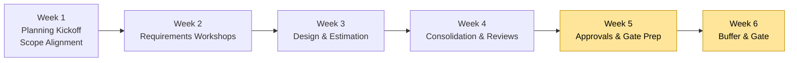
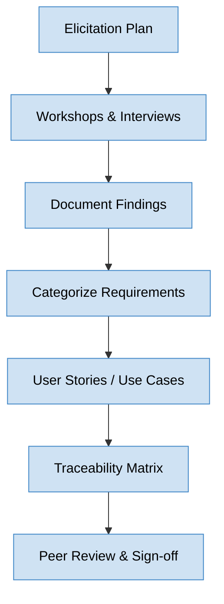

# Phase 2 Playbook: Planning & Requirements Elaboration

**Document ID:** MPG-002-P2-PLAN · **Version:** 1.0 · **Effective Date:** 2025-11-07  
**Owner:** Project Management Office (PMO)  
**Applies To:** All projects executing Phase 2 under MPG-002 (Planning & Requirements)

---

## Purpose & Scope

Phase 2 transforms the initiation vision into an executable plan with validated requirements, delivery roadmaps, estimation baselines, and governance approvals to commence build activities. This playbook expands on `Standards.md` by outlining mandatory procedures, artifacts, review cadences, and quality gates needed to complete the Planning & Requirements phase. All project teams must apply this guidance unless a documented waiver is approved by the PMO.

Phase 2 concludes when:

- Comprehensive requirements (business, functional, non-functional) are elicited, documented, traced, and approved.
- Delivery plans (scope baseline, schedule baseline, resource plan, budget baseline) are created and endorsed by governance bodies.
- Solution architecture has detailed design packages ready for development teams, including integration contracts and data models.
- Testing strategy, quality metrics, and acceptance criteria are defined and aligned with stakeholders.
- Phase 2 gate review confirms readiness to transition into execution (Phase 3: Design & Build) with no material gaps.

---

## Outcome Summary

| Dimension                   | Target Outcome                                                                                                                                                               |
| --------------------------- | ---------------------------------------------------------------------------------------------------------------------------------------------------------------------------- |
| **Requirements Readiness**  | A baselined requirements set (including user stories / specifications) approved by business and technical stakeholders, with traceability to objectives and success metrics. |
| **Delivery Planning**       | An integrated project plan covering scope, schedule, cost, resources, procurement, and communications with baselines stored in configuration control.                        |
| **Solution Definition**     | Detailed architecture, data, and interface specifications aligned with enterprise standards and validated via walkthroughs.                                                  |
| **Quality & Test Planning** | Documented QA strategy, acceptance criteria, test scenarios, and metrics to govern build and verification activities.                                                        |
| **Risk & Change Control**   | Updated risk register, change management plan, and contingency strategies reflecting expanded understanding of project delivery.                                             |

---

## Phase 2 Timeline Overview

Planning & Requirements typically spans **4–6 weeks** depending on complexity. Activities can iteratively overlap, but milestones must be met prior to the Phase 2 gate.

1. **Week 1:** Kick off planning, confirm scope baseline, schedule collaborative requirements workshops.
2. **Week 2:** Elicit detailed requirements, perform stakeholder interviews, draft initial backlog/specifications.
3. **Week 3:** Conduct design sessions, prototype critical components, refine solution architecture and estimation.
4. **Week 4:** Consolidate documents (requirements, WBS, budgets), run peer reviews and quality checks.
5. **Week 5:** Finalize baselines, secure approvals, prepare Phase 2 gate packet.
6. **Week 6 (buffer):** Address outstanding actions, integrate change requests, confirm readiness for execution.

_Figure 1. Recommended Phase 2 flow with emphasis on approval and buffer windows._

---

## Detailed Workflow & Procedures

### 1. Phase 2 Planning Kickoff

**Objective:** Align the project team on Phase 2 goals, deliverables, and collaboration practices.

**Steps:**

1. Review Phase 1 gate outcomes, outstanding actions, and decision log conditions.
2. Present Phase 2 objectives, deliverable list, and timeline to the core team.
3. Confirm working agreements (meeting cadence, collaboration tools, documentation standards).
4. Validate resourcing (core team availability, SMEs, vendor participation) against staffing plan.
5. Distribute Phase 2 responsibility matrix (see RACI) and update stakeholder register.

**Evidence Requirements:** Kickoff agenda & minutes, updated stakeholder register, resource confirmation emails.

### 2. Scope Baseline Confirmation & Change Control Setup

**Objective:** Ensure the scope baseline is clear, controlled, and traceable to strategic objectives.

**Steps:**

1. Revisit Phase 1 charter scope statements and refine to include measurable deliverables.
2. Develop the Work Breakdown Structure (WBS) at least to Level 3, ensuring alignment with requirements categories.
3. Establish scope management plan (change thresholds, approval matrix, documentation process).
4. Configure change request intake channels (e.g., Jira project, SharePoint form) and assign change control board (CCB) members.
5. Update the decision log with scope baseline confirmation and change governance decisions.

**Evidence Requirements:** WBS document, scope management plan, CCB roster, change control workflow diagram.

### 3. Requirements Elicitation & Analysis

**Objective:** Gather detailed requirements using structured techniques and validate with stakeholders.

**Steps:**

1. Create a requirements elicitation plan covering workshops, interviews, surveys, and document analysis.
2. Facilitate workshops (business process mapping, journey mapping, storyboarding) and document outcomes in standardized templates.
3. Use requirement statement guidelines (Appendix B) to ensure clarity (atomic, testable, prioritized).
4. Classify requirements into categories: Business Requirements (BR), Functional Requirements (FR), Non-Functional Requirements (NFR), Data Requirements (DR), Regulatory/Compliance Requirements (CR).
5. Capture user stories or use cases with acceptance criteria (Appendix C) and link to BR/FR IDs.
6. Establish a requirements traceability matrix (RTM) connecting requirements to objectives, design elements, test cases.
7. Conduct peer reviews for completeness, consistency, ambiguity, and feasibility; log feedback and resolution.

_Figure 2. Requirements lifecycle within Phase 2._

**Evidence Requirements:** Elicitation plan, workshop notes, requirements backlog/specification, RTM, review sign-offs.

### 4. Solution Architecture & Design Elaboration

**Objective:** Translate requirements into technical designs ready for build teams.

**Steps:**

1. Elaborate solution architecture leveraging enterprise patterns; update architecture diagrams (context, component, sequence, deployment).
2. Define data models (ERDs, canonical data definitions), integration contracts (API specs, message schemas), and interface designs.
3. Conduct design reviews with Architecture Review Board (ARB) or equivalent governance, capturing decisions and actions.
4. Align infrastructure needs with DevOps (environments, tooling, security controls) and document in environment readiness plan.
5. Produce technical backlog items (epics, features, technical stories) linked to requirements and architecture components.

**Evidence Requirements:** Architecture package, data models, API/interface specs, ARB minutes, environment readiness plan.

### 5. Estimation, Scheduling, and Resource Planning

**Objective:** Create reliable effort, duration, and cost baselines aligned to resource availability.

**Steps:**

1. Select estimation techniques appropriate for project methodology (story points, function points, analogous, parametric).
2. Build estimation workbook (Appendix D) capturing assumptions, productivity rates, contingency, and confidence levels.
3. Develop detailed schedule using WBS (Gantt chart or sprint plan) with dependencies, critical path analysis, and milestone definitions.
4. Produce resource plan (roles, FTEs, vendor support, subject matter experts) mapped to schedule and budget.
5. Collaborate with Finance to update cost baseline (CAPEX/OPEX), including contingency reserves and funding release plan.

**Evidence Requirements:** Estimation workbook, schedule baseline (MS Project, Primavera, or agile backlog plan), resource plan, cost baseline approval.

### 6. Risk, Dependency, and Issue Refinement

**Objective:** Update risk and issue logs with deeper insights and define mitigation strategies for planning assumptions.

**Steps:**

1. Identify risks introduced by new requirements, design decisions, vendor reliance, regulatory changes, or technology constraints.
2. Quantify probability/impact with updated scoring; compute exposure and categorize (schedule, cost, quality, security).
3. Define mitigation actions with owners and due dates; add triggers and contingency plans (Appendix E).
4. Update dependency register (upstream/downstream projects, third-party deliverables) and align with integrated schedule.
5. Present top risks and dependencies to Steering Committee; document escalations and support needed.

**Evidence Requirements:** Updated risk/issue register, dependency log, mitigation action tracker, Steering Committee briefing deck.

### 7. Quality & Test Strategy Definition

**Objective:** Establish quality goals, testing approach, and acceptance criteria ahead of build.

**Steps:**

1. Define quality objectives (defect thresholds, performance targets, compliance requirements) aligned with business expectations.
2. Document test strategy covering unit, integration, system, performance, security, UAT, and regression testing (Appendix F).
3. Align test environment needs with DevOps for provisioning and data management.
4. Develop high-level test scenarios linked to requirements IDs and acceptance criteria.
5. Define entry/exit criteria for each test phase and integrate with project schedule.

**Evidence Requirements:** Test strategy document, QA metrics dashboard plan, test scenario catalog, environment provisioning plan.

### 8. Communications & Stakeholder Engagement Plan Finalization

**Objective:** Tailor communications to Phase 2 needs and ensure all stakeholders understand timeline, dependencies, and decisions.

**Steps:**

1. Update communications matrix (Appendix G) to include design workshops, requirement sign-offs, change board sessions.
2. Create stakeholder engagement calendar showing workshops, walkthroughs, and review sessions.
3. Prepare communication artifacts (status reports, dashboards, newsletters) with Phase 2 content.
4. Coordinate with change management / training teams for early user readiness initiatives.
5. Measure engagement effectiveness (attendance, feedback, survey results) and adjust plan accordingly.

**Evidence Requirements:** Updated communications plan, engagement calendar, sample communications, feedback summaries.

### 9. Compliance, Security, and Privacy Assessments

**Objective:** Validate that planned solution adheres to regulatory, security, and privacy requirements before build begins.

**Steps:**

1. Perform security threat modeling and privacy impact assessment using corporate templates.
2. Document compliance requirements (SOX, GDPR, HIPAA, PCI, etc.) and map to controls in requirements/design.
3. Coordinate with InfoSec, Legal, and Compliance teams for review and approval.
4. Plan penetration testing, vulnerability scanning, and audit checkpoints for later phases.
5. Update risk register with security/privacy-related risks and mitigation actions.

**Evidence Requirements:** Threat model, privacy impact assessment, compliance checklist, approvals from Legal/Infosec.

### 10. Phase 2 Gate Preparation & Review

**Objective:** Confirm readiness to proceed into design/build with formally baselined artifacts and approvals.

**Steps:**

1. Complete Phase 2 exit checklist (Section "Checklists & Gate Reviews").
2. Assemble gate packet including requirements baseline, schedule/cost baselines, architecture package, risk/quality updates.
3. Conduct dry run with PMO to ensure completeness and compliance (minimum 3 business days before gate meeting).
4. Facilitate Phase 2 gate review with Sponsor, Steering Committee, PMO, QA lead, Technical Lead; capture decisions and conditions.
5. Update decision log, change log, and artifact tracker with gate outcomes and any remediation actions.

**Evidence Requirements:** Gate packet, exit checklist, gate review minutes, approval signatures, updated baselines stored in repo.

---

## Deliverable Specifications

| Deliverable                                           | Purpose                                          | Required Contents                                                                                                                     | Format & Naming                                                                                      | Approval                                                                         |
| ----------------------------------------------------- | ------------------------------------------------ | ------------------------------------------------------------------------------------------------------------------------------------- | ---------------------------------------------------------------------------------------------------- | -------------------------------------------------------------------------------- |
| **Requirements Specification / Backlog**              | Captures agreed requirements and user stories.   | Requirements statements (BR, FR, NFR, data, security), user stories/use cases, acceptance criteria, prioritization, traceability IDs. | `.md`, `.docx`, or backlog tool export. Naming: `ProjectName_RequirementsBaseline_vYYYYMMDD.ext`.    | Prepared: BA/Product Owner; Approved: Sponsor & Technical Lead; Reviewed: PMO.   |
| **Requirements Traceability Matrix (RTM)**            | Links requirements to objectives, design, tests. | Requirement IDs, source, priority, design component, test case, deployment artifact.                                                  | `.xlsx`. Naming: `ProjectName_RTM_vYYYYMMDD.xlsx`.                                                   | Prepared: BA; Approved: QA Lead; Reviewed: PM.                                   |
| **Solution Architecture Package**                     | Documents detailed design decisions.             | Context/component diagrams, data models, interface specs, infrastructure topology, design rationale.                                  | `.pptx` + PDF; diagrams in `.drawio`/`.png`. Naming: `ProjectName_Architecture_vYYYYMMDD.pptx`.      | Prepared: Technical Lead; Approved: Architecture Board; Reviewed: PM.            |
| **Work Breakdown Structure (WBS)**                    | Breaks scope into manageable components.         | Hierarchical task list, coding structure, deliverable descriptions, mapping to schedule line items.                                   | `.xlsx` or project tool export. Naming: `ProjectName_WBS_vYYYYMMDD.xlsx`.                            | Prepared: PM; Approved: Sponsor; Reviewed: PMO.                                  |
| **Schedule Baseline**                                 | Defines timeline and dependencies.               | Gantt chart or sprint plan, milestones, dependencies, resource assignments, critical path.                                            | Project scheduling tool export (PDF + native). Naming: `ProjectName_ScheduleBaseline_vYYYYMMDD.ext`. | Prepared: PM; Approved: Sponsor; Reviewed: PMO.                                  |
| **Cost & Resource Plan**                              | Establishes budget and staffing plan.            | Cost breakdown (CAPEX/OPEX), funding phases, resource allocations, vendor contracts, contingency reserves.                            | `.xlsx` or financial tool export. Naming: `ProjectName_CostPlan_vYYYYMMDD.xlsx`.                     | Prepared: PM & Finance Partner; Approved: Sponsor; Reviewed: Finance Controller. |
| **Risk / Dependency Register**                        | Updates risk, issue, and dependency records.     | Risk IDs, probability/impact, mitigation, contingency, dependency descriptions, owners.                                               | `.xlsx`. Naming: `ProjectName_RiskRegister_vYYYYMMDD.xlsx`.                                          | Prepared: PM; Reviewed: Steering Committee; Monitored: PMO.                      |
| **Test Strategy & QA Plan**                           | Defines quality approach and test phases.        | Quality objectives, test levels, environment needs, roles/responsibilities, entry/exit criteria, metrics.                             | `.docx` or `.md`. Naming: `ProjectName_TestStrategy_vYYYYMMDD.ext`.                                  | Prepared: QA Lead; Approved: Sponsor; Reviewed: PM.                              |
| **Communications & Engagement Plan (Phase 2 Update)** | Tailors communications for planning.             | Updated matrix, calendar, artifacts, feedback mechanisms, change management coordination.                                             | `.md` or `.pptx`. Naming: `ProjectName_CommsPlan_vYYYYMMDD.md`.                                      | Prepared: PM; Approved: Sponsor; Reviewed: PMO Comms.                            |
| **Security & Compliance Assessments**                 | Validates adherence to regulatory requirements.  | Threat model, privacy impact assessment, compliance checklist, remediation actions.                                                   | `.pdf` or `.docx`. Naming: `ProjectName_SecurityAssessment_vYYYYMMDD.pdf`.                           | Prepared: Security Lead; Approved: CISO/Legal; Reviewed: PM.                     |
| **Phase 2 Gate Packet**                               | Summarizes readiness for execution.              | Executive summary, deliverable status table, risk/quality highlights, decision requests, action tracker.                              | `.pptx` + PDF. Naming: `ProjectName_Phase2GatePacket_vYYYYMMDD.pptx`.                                | Prepared: PM; Approved: Sponsor & Steering Committee.                            |

**Document Control Notes:**

- All deliverables must include document control tables and version history. Where tools auto-track history, export version notes.
- Baseline artifacts must be stored in `/docs/phase-2/` with links from the README. Approval evidence belongs under `/docs/approvals/phase-2/`.
- Any change post-baseline requires formal change request approval with updates to RTM, schedule, cost baseline, and risk register.

### Artifact Completion Tracker

| Artifact                          | Owner | Status (Draft / In Review / Approved) | Repository Path | Version | Approval Evidence Stored? | Next Action / Due Date |
| --------------------------------- | ----- | ------------------------------------- | --------------- | ------- | ------------------------- | ---------------------- |
| Requirements Baseline             |       |                                       |                 |         |                           |                        |
| RTM                               |       |                                       |                 |         |                           |                        |
| Architecture Package              |       |                                       |                 |         |                           |                        |
| WBS                               |       |                                       |                 |         |                           |                        |
| Schedule Baseline                 |       |                                       |                 |         |                           |                        |
| Cost & Resource Plan              |       |                                       |                 |         |                           |                        |
| Risk/Dependency Register          |       |                                       |                 |         |                           |                        |
| Test Strategy                     |       |                                       |                 |         |                           |                        |
| Communications Plan Update        |       |                                       |                 |         |                           |                        |
| Security & Compliance Assessments |       |                                       |                 |         |                           |                        |
| Phase 2 Gate Packet               |       |                                       |                 |         |                           |                        |

Update weekly and prior to the gate review. Reference approval evidence paths in `/docs/approvals/phase-2/`.

### Approval Evidence Requirements

- **E-Signature Certificates:** Store under `/docs/approvals/phase-2/esign/` with naming `ProjectName_Artifact_Approval_YYYYMMDD.pdf`.
- **Meeting Minutes & Recordings:** Archive in `/docs/meetings/YYYY/phase-2/` and cross-reference in the decision log.
- **Portfolio Tool Snapshots:** Export approvals from portfolio software and link them in the artifact tracker.
- **Change Requests:** Maintain a separate `Phase2_ChangeLog_vYYYYMMDD.xlsx` documenting submissions, decisions, and impacts.

### Execution Checklist by Workstream

| Workstream        | Activity                                               | Evidence Location                       | Responsible Role | Status |
| ----------------- | ------------------------------------------------------ | --------------------------------------- | ---------------- | ------ |
| Requirements      | Workshops completed and minutes filed.                 | `/docs/phase-2/requirements/workshops/` | BA               |        |
| Requirements      | Requirements baseline reviewed by QA & Tech Lead.      | `docs/phase-2/requirements/`            | BA               |        |
| Planning          | WBS and schedule baselines updated in scheduling tool. | Scheduling tool export                  | PM               |        |
| Planning          | Cost/resource plan approved by Finance & Sponsor.      | `/docs/phase-2/planning/`               | PM & Finance     |        |
| Architecture      | Architecture package approved by ARB.                  | `/docs/phase-2/architecture/`           | Technical Lead   |        |
| QA                | Test strategy finalized with acceptance criteria.      | `/docs/phase-2/quality/`                | QA Lead          |        |
| Risk & Dependency | Risk/issue register refreshed with Phase 2 insights.   | `/docs/risk-management/`                | PM               |        |
| Communications    | Engagement calendar issued to stakeholders.            | `/docs/communications/`                 | PM               |        |
| Compliance        | Security & privacy assessments signed off.             | `/docs/phase-2/compliance/`             | Security Lead    |        |
| Gate Prep         | Phase 2 gate packet drafted and reviewed with PMO.     | `/docs/phase-2/gate-review/`            | PM               |        |

Escalate any item pending more than 5 business days past target via Sponsor/Steering Committee updates.

### Deliverable Deep-Dive Guides

**Requirements Baseline**

- Use standardized requirement statements (Appendix B) emphasizing clarity, priority, and testability.
- Group requirements into modules/domains; include context diagrams and business process flows.
- For agile teams, ensure user stories include INVEST criteria and acceptance criteria with Given/When/Then format.
- Capture assumption and constraint logs for each requirement cluster.
- Conduct sign-off sessions with business owners; record approvals and update RTM.

**RTM**

- Map each requirement to objectives, design components, test cases, and deployment artifacts.
- Include columns for status (Draft/In Review/Baselined) and change history references.
- Use RTM to assess impact of change requests rapidly by filtering linked elements.

**Architecture Package**

- Provide layered diagrams (logical, physical) and include integration points with external systems.
- Document technical decisions with rationale (e.g., ADRs) and residual risks.
- Ensure security, scalability, and availability requirements are explicitly addressed.

**Schedule & Cost Baselines**

- Reflect dependencies identified in requirements and architecture sections; highlight critical path.
- Include contingency allowances and management reserve per corporate policy.
- Publish baseline schedule to collaboration tools (e.g., shared calendars, dashboards).

**Test Strategy**

- Align with quality objectives; define defect severity matrix, metrics dashboard, and reporting cadence.
- Link test phases with requirements IDs and acceptance criteria; identify automation candidates.

**Security/Compliance Assessments**

- Document control mappings, data classification, encryption standards, user access requirements.
- Align with regulatory frameworks and include remediation plan for non-compliant areas.

### Engineering Workflow & Naming Consistency

- **Workflow Continuity:** Carry forward Phase 1 governance by aligning iteration/sprint cadence, design reviews, and requirements workshops with the communications plan. Track action items in the RACI/meeting logs so responsibilities remain clear across planning teams.
- **Task Allocation:** Use the WBS and backlog to assign ownership for requirements, design packages, estimation tasks, and risk mitigation. Each backlog item should reference its responsible role and approval checkpoints.
- **Naming Standards:** Apply the corporate conventions directly in Phase 2 artifacts. Requirements, design documents, and spreadsheets should follow `ProjectIdentifier_Artifact_vYYYYMMDD.ext`. Within specifications, use `camelCase` for field names, `PascalCase` for models/components, and `UPPER_SNAKE_CASE` for constants. Include a naming reference in the configuration management plan and enforce via peer reviews.
- **Documentation Hygiene:** Ensure Confluence/SharePoint spaces mirror repository structure (`docs/phase-2/...`) so teams can quickly locate requirements, RTM, and design assets. Require PMO spot checks for naming and storage compliance before the Phase 2 gate review.
- **Documentation Style Guide:** Adopt a consistent structure for requirements (purpose, acceptance criteria, traceability, non-functional considerations). Use tables for traceability, enumerated acceptance criteria, and include test references for each requirement. Peer reviews should confirm clarity (no TBDs), readability, and inclusion of privacy/accessibility requirements.
- **Privacy & Accessibility Planning:** During requirements definition, capture privacy-by-design considerations (data minimization, consent, retention) and accessibility expectations (WCAG 2.1 AA). Add dedicated sections in the requirements baseline and RTM to track these items and ensure they flow into design/test artifacts.
- **Review Cadence:** Schedule recurring requirement/design reviews (at least biweekly) to validate changes, maintain DRY principles in specifications, and confirm naming/documentation adherence. Record decisions in the decision log with links to updated artifacts.

---

## Roles, Responsibilities & RACI (Phase 2 Focus)

| Activity                                | Executive Sponsor | Steering Committee | Project Manager | BA / Product Owner | Technical Lead | QA Lead | PMO Representative | Finance Partner | Security/Compliance | Change Control Board |
| --------------------------------------- | ----------------- | ------------------ | --------------- | ------------------ | -------------- | ------- | ------------------ | --------------- | ------------------- | -------------------- |
| Approve Phase 2 plan kickoff            | **A**             | C                  | R               | I                  | I              | I       | C                  | I               | I                   | I                    |
| Confirm scope baseline & change control | **A**             | C                  | **R**           | C                  | C              | I       | C                  | I               | I                   | **R**                |
| Elicit & validate requirements          | C                 | I                  | C               | **R/A**            | C              | C       | C                  | I               | I                   | I                    |
| Approve requirements baseline           | **A**             | C                  | **R**           | **R**              | **R**          | **R**   | C                  | I               | C                   | C                    |
| Approve architecture package            | C                 | C                  | C               | I                  | **R/A**        | C       | C                  | I               | C                   | I                    |
| Establish schedule & cost baselines     | **A**             | C                  | **R**           | C                  | C              | I       | C                  | **R**           | I                   | I                    |
| Update risk/issue/dependency registers  | I                 | C                  | **R**           | C                  | C              | C       | C                  | I               | C                   | I                    |
| Approve test strategy                   | C                 | I                  | C               | C                  | C              | **R/A** | C                  | I               | I                   | I                    |
| Endorse communications plan update      | **A**             | C                  | **R**           | C                  | I              | I       | C                  | I               | I                   | I                    |
| Security/compliance sign-off            | C                 | I                  | C               | C                  | C              | C       | C                  | I               | **R/A**             | I                    |
| Phase 2 gate decision                   | **A**             | **R**              | **R**           | C                  | C              | C       | C                  | C               | C                   | C                    |

**Key:** R = Responsible; A = Accountable; C = Consulted; I = Informed.

---

## Meeting & Collaboration Cadence (Phase 2)

| Meeting                      | Purpose                                                  | Participants                                        | Frequency           | Inputs                                   | Outputs                                |
| ---------------------------- | -------------------------------------------------------- | --------------------------------------------------- | ------------------- | ---------------------------------------- | -------------------------------------- |
| Phase 2 Planning Kickoff     | Align team on objectives, deliverables, timelines.       | PM, BA, Technical Lead, QA Lead, PMO, Sponsor       | Once (week 1)       | Phase 1 gate outcomes, Phase 2 plan      | Kickoff minutes, action items          |
| Requirements Workshops       | Gather detailed requirements per domain/process.         | BA, SMEs, PM, Technical Lead, QA                    | Multiple sessions   | Elicitation agenda, current process docs | Workshop notes, requirement drafts     |
| Architecture Working Session | Elaborate design decisions, resolve technical questions. | Technical Lead, Architects, DevOps, PM, QA          | Weekly or as needed | Requirements set, architecture drafts    | Updated diagrams, decision log entries |
| Estimation Review            | Validate estimation assumptions and outputs.             | PM, Technical Lead, Finance, SMEs                   | Weekly (weeks 3-4)  | Estimation workbook, WBS                 | Approved estimates, risk adjustments   |
| Risk & Dependency Standup    | Monitor risk mitigation, dependencies, issues.           | PM, Technical Lead, QA, PMO, Sponsor (as needed)    | Biweekly            | Risk register, dependency log            | Updated register, escalations          |
| Stakeholder Review Sessions  | Present requirements/design for sign-off.                | Sponsor, Steering Committee, Business Owners, PM    | At major milestones | Requirements/architecture packages       | Approval decisions, feedback log       |
| QA/Test Planning Workshop    | Define QA scope, acceptance criteria, test prep.         | QA Lead, BA, Technical Lead, PM                     | Once (week 4)       | Draft test strategy, requirements IDs    | Finalized QA strategy                  |
| Phase 2 Gate Review          | Approve transition to execution.                         | Sponsor, Steering Committee, PM, PMO, Tech/QA leads | End of Phase 2      | Gate packet, exit checklist              | Gate decision, conditions              |

All meetings require agendas sent 48 hours ahead (or 24 hours for working sessions) and minutes archived within 2 business days.

---

## Risk & Control Considerations

**Common Phase 2 Risks:**

1. **Incomplete Requirements Coverage:** Mitigate with thorough workshops, RTM, and peer reviews.
2. **Gold-Plating or Scope Creep:** Enforce change control and priority frameworks (e.g., MoSCoW).
3. **Underestimated Effort:** Use multiple estimation techniques and include contingency; validate with historical data.
4. **Design Decisions Misaligned with Enterprise Standards:** Engage architecture governance early and document variances.
5. **Stakeholder Fatigue:** Schedule engagement touchpoints thoughtfully and provide concise summaries with clear asks.
6. **Security/Compliance Gaps:** Involve security/privacy teams in requirements and design reviews; maintain evidence for audits.

**Control Activities:**

- Weekly PMO compliance checks covering documentation, traceability, and approvals.
- Change Control Board meetings to review scope changes and baselines impacts.
- Requirements quality audits using checklist (Appendix B) with pass/fail criteria.
- Architecture review approvals captured in decision log with action follow-ups.
- Baseline variance tracking (schedule/cost) with thresholds for Sponsor escalation (>10% variance).

---

## Tooling & Configuration Requirements

| Tool / Platform                                               | Configuration Action                                                                              | Owner               | Evidence                                               |
| ------------------------------------------------------------- | ------------------------------------------------------------------------------------------------- | ------------------- | ------------------------------------------------------ |
| Requirements Management (e.g., Jira, Azure DevOps, Jama)      | Create project, define workflow states (Draft, In Review, Approved, Baselined), set up templates. | BA / PMO            | Screenshot of workflow, template configuration export. |
| Collaboration Suite (Confluence, SharePoint)                  | Create Phase 2 documentation space with permissions mirroring Phase 1 plus design teams.          | PM                  | Space URL, access control export.                      |
| Scheduling Tool (MS Project, Clarity, Jira Advanced Roadmaps) | Load WBS, dependencies, resource assignments; configure baseline.                                 | PM                  | Baseline snapshot, schedule export.                    |
| Estimation Tool (Spreadsheet, specialized software)           | Upload estimation model, calibrate with organizational metrics, version control workbook.         | PM / Technical Lead | Estimation workbook stored in repo with version notes. |
| Modeling Tools (draw.io, Lucidchart, Enterprise Architect)    | Store architecture diagrams in shared workspace; enable version history and review comments.      | Technical Lead      | Diagram repository link, review log.                   |
| RTM Repository (Excel, Jama, DOORS)                           | Build RTM template with validation rules and traceability macros.                                 | BA                  | RTM template stored in `docs/phase-2/rtm/`.            |
| Test Management Tool (qTest, TestRail, Zephyr)                | Create project structure, tie test cases to requirement IDs, configure reporting.                 | QA Lead             | Tool configuration export, sample report.              |

---

## Checklists & Gate Reviews

### A. Weekly Phase 2 Quality Checklist

- [ ] Requirements backlog updated and reviewed with stakeholders.
- [ ] New risks/dependencies logged with mitigation actions assigned.
- [ ] Architecture diagrams reflect latest decisions and pass ARB review.
- [ ] Schedule and cost variance < defined threshold; variances explained.
- [ ] Communications and engagement activities executed as planned.
- [ ] Change requests reviewed by CCB; decisions documented.
- [ ] Documentation repository organized; naming conventions followed.

### B. Requirements Quality Checklist (per section/module)

- [ ] Requirement statements are clear, unambiguous, and testable.
- [ ] Acceptance criteria defined for each user story/use case.
- [ ] Business value or objective linkage documented.
- [ ] Dependencies and assumptions identified.
- [ ] Security, privacy, accessibility considerations addressed.
- [ ] Regulatory requirements mapped to controls.
- [ ] Stakeholder sign-off captured.

### C. Phase 2 Exit / Gate Checklist

- [ ] Requirements baseline approved by Sponsor, Technical Lead, QA Lead.
- [ ] RTM complete with links to design components and test cases.
- [ ] Schedule and cost baselines approved; variances documented.
- [ ] Architecture package approved by ARB/Architecture governance.
- [ ] Test strategy finalized with acceptance criteria.
- [ ] Risk/issue/dependency registers updated and top items addressed.
- [ ] Security/compliance assessments approved by respective authorities.
- [ ] Communications plan updated with execution cadence.
- [ ] Phase 2 gate packet prepared with all evidence links.
- [ ] Gate review conducted; decision recorded in decision log.

Only when all items are "Complete" may the project transition to Phase 3.

---

## Templates & Samples

### Appendix A: Phase 2 Deliverable Inventory Template

| Deliverable           | Owner | Draft Date | Review Date | Approval Date | Version | Storage Location | Approval Evidence |
| --------------------- | ----- | ---------- | ----------- | ------------- | ------- | ---------------- | ----------------- |
| Requirements Baseline |       |            |             |               |         |                  |                   |
| RTM                   |       |            |             |               |         |                  |                   |
| Architecture Package  |       |            |             |               |         |                  |                   |
| Schedule Baseline     |       |            |             |               |         |                  |                   |
| Cost Plan             |       |            |             |               |         |                  |                   |
| Risk Register         |       |            |             |               |         |                  |                   |
| Test Strategy         |       |            |             |               |         |                  |                   |
| Security Assessment   |       |            |             |               |         |                  |                   |
| Gate Packet           |       |            |             |               |         |                  |                   |

### Appendix B: Requirement Quality Checklist

| Criterion             | Description                                                                       | Pass/Fail | Comments |
| --------------------- | --------------------------------------------------------------------------------- | --------- | -------- |
| Clear & Unambiguous   | Statement is atomic, avoids compound requirements, and uses unambiguous language. |           |          |
| Testable              | Acceptance criteria or measurable outcomes defined.                               |           |          |
| Traceable             | Linked to business objective, design element, and test case.                      |           |          |
| Feasible              | Technically achievable within constraints.                                        |           |          |
| Prioritized           | Categorized (Must/Should/Could/Won't) or equivalent priority rating.              |           |          |
| Security & Compliance | Addresses relevant controls and regulatory needs.                                 |           |          |
| Approved              | Stakeholders have reviewed and accepted the requirement.                          |           |          |

### Appendix C: User Story Template (INVEST)

| Field               | Description                                                                   |
| ------------------- | ----------------------------------------------------------------------------- |
| Story ID            | `US-###`                                                                      |
| Title               | One-line description following "As a [role], I want [goal] so that [reason]." |
| Description         | Detailed context and rationale.                                               |
| Acceptance Criteria | Bullet list or Given/When/Then scenarios.                                     |
| Priority            | Must/Should/Could/Won't (or backlog ranking).                                 |
| Business Value      | Qualitative or quantitative value statement.                                  |
| Dependencies        | Linked requirement or external factor.                                        |
| Notes               | Additional information, references, or design links.                          |

### Appendix D: Estimation Workbook Structure

| Tab            | Purpose                                                     | Sample Content                                            |
| -------------- | ----------------------------------------------------------- | --------------------------------------------------------- |
| Overview       | Summary of estimation scope, assumptions, confidence level. | Project overview, team composition, velocity assumptions. |
| Work Items     | Detailed list of tasks/stories with size estimates.         | WBS ID, description, estimate, resource, dependencies.    |
| Resource Rates | Hourly or daily rates for roles/vendors.                    | Role, blended rate, overtime policy.                      |
| Contingency    | Calculation of contingency and management reserve.          | % applied, rationale, approval authority.                 |
| Sensitivity    | Scenario analysis for best/base/worst cases.                | Effort multipliers, schedule impacts.                     |

### Appendix E: Risk Mitigation Plan Template

| Risk ID | Description | Exposure | Mitigation Actions | Owner | Trigger | Contingency Plan | Status |
| ------- | ----------- | -------- | ------------------ | ----- | ------- | ---------------- | ------ |

### Appendix F: Test Strategy Outline

1. **Quality Objectives**
2. **Test Scope & Levels** (unit, integration, system, performance, security, UAT)
3. **Test Environment Plan** (environments, data management, tools)
4. **Roles & Responsibilities**
5. **Test Schedule & Milestones**
6. **Metrics & Reporting** (defect KPIs, coverage, automation rate)
7. **Entry/Exit Criteria**
8. **Risk-based Testing Approach**

### Appendix G: Communications Matrix (Phase 2)

| Audience          | Information Need                              | Channel                     | Format         | Frequency    | Owner            | Feedback Loop     |
| ----------------- | --------------------------------------------- | --------------------------- | -------------- | ------------ | ---------------- | ----------------- |
| Executive Sponsor | Status, risks, decisions required.            | Email + Executive Dashboard | PDF summary    | Weekly       | PM               | Sponsor sync      |
| Business Owners   | Requirements progress, sign-off requests.     | Workshops, review sessions  | Slide deck     | Biweekly     | BA               | Session feedback  |
| Technical Teams   | Design updates, technical decisions, backlog. | Standups, technical forums  | Wiki updates   | Twice weekly | Technical Lead   | Engineering retro |
| QA Team           | Test planning, acceptance criteria updates.   | QA planning meeting         | Minutes/boards | Weekly       | QA Lead          | QA retrospective  |
| End Users         | Change impacts, training roadmap.             | Newsletter / intranet       | HTML           | Monthly      | Change Mgmt Lead | Feedback surveys  |

### Appendix H: Requirements Review Log

| Requirement ID | Review Date | Reviewer | Defect/Comment Summary | Resolution | Closure Date |
| -------------- | ----------- | -------- | ---------------------- | ---------- | ------------ |

### Appendix I: Phase 2 Gate Deck Agenda

| Section                   | Content                                                           |
| ------------------------- | ----------------------------------------------------------------- |
| Executive Summary         | Phase 2 accomplishments, readiness statement, decision requested. |
| Requirements Overview     | Highlights, outstanding items, change requests.                   |
| Design & Architecture     | Key diagrams, decisions, technical risks.                         |
| Schedule & Cost Baselines | Variances, confidence level, resource alignment.                  |
| Quality & Test Readiness  | Strategy summary, metrics, acceptance criteria.                   |
| Risk & Issues             | Top risks, mitigations, dependencies, support needs.              |
| Security/Compliance       | Assessment results, outstanding actions.                          |
| Communications & Change   | Engagement effectiveness, upcoming activities.                    |
| Gate Decision             | Go / Conditional / Hold, next steps and actions.                  |

---

## Glossary of Phase 2 Terms

- **Requirements Baseline:** Approved set of requirements serving as scope foundation for design/build.
- **RTM (Requirements Traceability Matrix):** Artifact linking requirements to downstream deliverables.
- **WBS (Work Breakdown Structure):** Hierarchical decomposition of project scope.
- **ARB (Architecture Review Board):** Governance body approving architecture/design decisions.
- **CCB (Change Control Board):** Group responsible for approving/rejecting change requests.
- **INVEST:** Acronym for crafting good user stories (Independent, Negotiable, Valuable, Estimable, Small, Testable).
- **MoSCoW:** Prioritization technique (Must, Should, Could, Won't).
- **Baseline:** Approved snapshot of scope, schedule, or cost used for performance measurement.
- **Traceability:** Ability to link requirements through design, build, test, and deployment artifacts.
- **Gate Review:** Formal checkpoint assessing readiness to proceed to next phase.

## Acronyms and Abbreviations

- **ADR:** Architecture Decision Record - Document capturing design choices and rationale
- **API:** Application Programming Interface - Set of protocols for building software applications
- **ARB:** Architecture Review Board - Governance body approving architecture/design decisions
- **BA:** Business Analyst - Role responsible for requirements gathering and analysis
- **BR:** Business Requirements - High-level business needs and objectives
- **CAB:** Change Advisory Board - Governance body approving significant changes
- **CAPEX:** Capital Expenditure - Funds used to acquire or upgrade physical assets
- **CCB:** Change Control Board - Group responsible for approving/rejecting change requests
- **CI/CD:** Continuous Integration/Continuous Delivery - Automated pipeline for build, test, and deployment
- **CR:** Compliance/Regulatory Requirements - Mandatory requirements from regulations or standards
- **DR:** Data Requirements - Specifications for data structures, storage, and management
- **ERD:** Entity Relationship Diagram - Visual representation of data relationships
- **EST-101:** Organization Estimation Guidelines document identifier
- **FR:** Functional Requirements - Specific behaviors and functions the system must perform
- **FTE:** Full-Time Equivalent - Unit measuring employee workload
- **GDPR:** General Data Protection Regulation - European Union data protection and privacy regulation
- **HIPAA:** Health Insurance Portability and Accountability Act - U.S. healthcare data protection regulation
- **INVEST:** Acronym for crafting good user stories (Independent, Negotiable, Valuable, Estimable, Small, Testable)
- **ISO 20000:** International standard for IT service management
- **ISO 27001:** International standard for information security management systems
- **ISO 27034:** International standard for application security
- **ISO 31000:** International standard for risk management
- **ISO 9001:** International standard for quality management systems
- **ITIL:** Information Technology Infrastructure Library - Framework for IT service management
- **KPI:** Key Performance Indicator - Measurable value demonstrating effectiveness
- **MoSCoW:** Prioritization technique (Must, Should, Could, Won't)
- **MPG-002:** Master Project Governance standard document identifier
- **NFR:** Non-Functional Requirements - Quality attributes such as performance, security, usability
- **NIST CSF:** National Institute of Standards and Technology Cybersecurity Framework - U.S. cybersecurity framework
- **OPEX:** Operating Expenditure - Ongoing costs for running a business or system
- **OWASP:** Open Web Application Security Project - Non-profit organization focused on web application security
- **PCM-030:** Portfolio & Change Management Handbook document identifier
- **PCI DSS:** Payment Card Industry Data Security Standard - Security standard for payment card data
- **PM:** Project Manager - Role responsible for project coordination and delivery
- **PMO:** Project Management Office - Organizational unit ensuring adherence to standards and methodologies
- **QA:** Quality Assurance - Process ensuring products meet quality standards
- **QMP-004:** Quality Management Policy document identifier
- **RACI:** Responsible, Accountable, Consulted, Informed - Matrix defining roles and responsibilities
- **ROI:** Return on Investment - Measure of profitability or efficiency
- **RTM:** Requirements Traceability Matrix - Document linking requirements to design, tests, and deployment
- **SAST/DAST:** Static Application Security Testing / Dynamic Application Security Testing - Security testing methodologies
- **SDLC:** Software Development Life Cycle - Process for planning, creating, testing, and deploying software
- **SEC-020:** Security & Privacy Assessment Procedures document identifier
- **SLA:** Service Level Agreement - Contractual commitment to service performance levels
- **SME:** Subject Matter Expert - Individual with specialized knowledge in a particular domain
- **SOC/SOC 2:** System and Organization Controls - Framework for security, availability, and confidentiality controls
- **SOX 404:** Sarbanes-Oxley Act Section 404 - U.S. financial reporting and internal controls regulation
- **UAT:** User Acceptance Testing - Testing performed by end users to validate business requirements
- **WBS:** Work Breakdown Structure - Hierarchical decomposition of project scope into manageable components
- **WCAG 2.1:** Web Content Accessibility Guidelines 2.1 - International standard for web accessibility

---

## References

1. MPG-002 Standard (`Standards.md`) – Master Project Governance & SDLC.
2. Organization Estimation Guidelines (EST-101).
3. Architecture Review Board Charter (ARB-001).
4. Quality Management Policy (QMP-004).
5. Security & Privacy Assessment Procedures (SEC-020).
6. Portfolio & Change Management Handbook (PCM-030).

---

**Document History**

| Version | Date       | Author                 | Reviewer     | Approver          | Notes                                 |
| ------- | ---------- | ---------------------- | ------------ | ----------------- | ------------------------------------- |
| 1.0     | 2025-11-07 | PMO Documentation Lead | PMO Director | Executive Sponsor | Initial release for Phase 2 guidance. |
