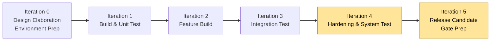
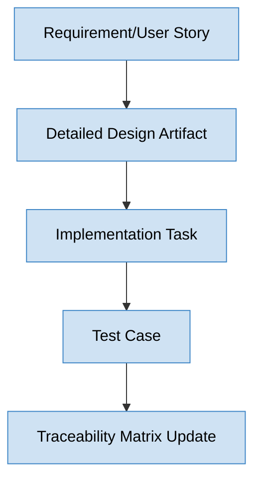

# Phase 3 Playbook: Design, Build & Verification Execution

**Document ID:** MPG-002-P3-EXEC · **Version:** 1.0 · **Effective Date:** 2025-11-07  
**Owner:** Project Management Office (PMO)  
**Applies To:** All projects executing Phase 3 under MPG-002 (Design, Build, Verification)

---

## Purpose & Scope

Phase 3 converts baselined plans and requirements into working solution increments through iterative design elaboration, development, and verification. This playbook provides end-to-end guidance for managing build activities, enforcing quality controls, and preparing releases for formal testing and deployment. It extends `Standards.md` by detailing mandatory processes, deliverables, metrics, and governance checkpoints required to keep execution compliant, predictable, and auditable.

Phase 3 ends when:

- Solution increments meeting acceptance criteria are developed, code-reviewed, and integrated into a stable baseline.
- Verification activities (unit, integration, system, security) demonstrate readiness for user acceptance and release.
- Operational documentation, runbooks, and deployment plans are updated based on actual build outcomes.
- Change and risk registers reflect build-stage findings with mitigations in progress.
- Phase 3 gate review confirms readiness to enter Phase 4 (Testing/Release & Transition).

---

## Outcome Summary

| Dimension                      | Target Outcome                                                                                                                                             |
| ------------------------------ | ---------------------------------------------------------------------------------------------------------------------------------------------------------- |
| **Solution Evolution**         | Developed code/configuration that aligns with baselined requirements, architecture, and coding standards, merged into mainline branches with traceability. |
| **Quality Assurance**          | Verified increments with unit/integration/regression tests achieving defined coverage, defect thresholds, and performance/security targets.                |
| **Operational Readiness**      | Updated runbooks, deployment scripts, monitoring configurations, and rollback plans reflecting actual build design.                                        |
| **Change & Risk Governance**   | Active management of scope changes, technical debt, risks, and dependencies discovered during execution, with timely escalation and approvals.             |
| **Team Performance & Metrics** | Real-time visibility into velocity, burn-down/burn-up metrics, defect trends, and adherence to schedule/budget baselines for steering decisions.           |

---

## Phase 3 Timeline Overview

Execution cadence varies by delivery methodology. Typical design/build spans **6–10 weeks** with iterative cycles (sprints or stage gates). A recommended structure:

_Figure 1. Sample sprint-based execution flow culminating in release readiness._

Adjust timeline based on project complexity, regulatory checkpoints, and release windows. Ensure each iteration delivers measurable value and updated metrics.

---

## Detailed Workflow & Procedures

### 1. Iteration / Sprint Planning & Backlog Refinement

**Objective:** Translate baselined requirements into prioritized build increments with clear acceptance criteria and effort commitments.

**Steps:**

1. Conduct iteration planning with Product Owner/BA, Technical Lead, QA Lead, and development team.
2. Refine user stories/requirements: confirm acceptance criteria, dependencies, definition of done (DoD), and estimation.
3. Validate capacity vs. planned workload; account for technical debt, refactoring, and risk mitigation tasks.
4. Update sprint/iteration backlog in the management tool and link to RTM.
5. Document commitments and iteration goals; communicate to stakeholders.

**Evidence Requirements:** Sprint plan, capacity worksheet, updated backlog with links to requirements and tests, iteration goal summary.

### 2. Detailed Design & Technical Specification Updates

**Objective:** Elaborate component-level designs to guide developers and ensure alignment with architecture.

**Steps:**

1. Identify stories requiring detailed technical design; create or update design docs (sequence diagrams, class diagrams, configuration specs).
2. Conduct walkthroughs involving Technical Lead, architects, QA, and DevOps to validate feasibility and compliance.
3. Document key decisions in Architecture Decision Records (ADRs) referencing requirement and risk IDs.
4. Update data models, API contracts, and configuration baselines as needed; ensure version control.
5. Publish design updates in repository and notify impacted stakeholders.

_Figure 2. Traceability flow during design elaboration._

**Evidence Requirements:** Technical design docs, ADR log, updated RTM, design review minutes.

### 3. Development Execution & Coding Standards Compliance

**Objective:** Build, integrate, and merge code/configuration following standards and DoD.

**Steps:**

1. Developers implement features using approved design artifacts and coding standards.
2. Enforce peer code reviews or pair programming prior to merging; ensure static analysis and linting pass.
3. Maintain branch strategy (feature branches → pull requests → mainline). Ensure feature toggles or configuration flags are documented.
4. Update unit tests alongside code; ensure minimum coverage thresholds (e.g., 80%) defined in quality plan.
5. Record progress in backlog and update development metrics (velocity, burn-down charts).

**Evidence Requirements:** Code commits with reviews, static analysis reports, unit test results, coverage metrics dashboard, burn-down chart exports.

### 4. Continuous Integration & Environment Management

**Objective:** Automate build/test pipelines ensuring rapid feedback and consistent deployments.

**Steps:**

1. Configure CI pipelines to run on each commit/merge: build, unit tests, static analysis, security scans.
2. Implement branch policies requiring successful pipeline results before merge.
3. Manage build artifacts (Docker images, packages) with versioning tied to iteration numbers.
4. Coordinate with DevOps to ensure development, integration, and test environments mirror baseline configurations; manage secrets securely.
5. Monitor pipeline performance; document failures and corrective actions.

**Evidence Requirements:** CI pipeline configuration, build logs, artifact repository listing, environment change log, incident tickets for failed builds.

### 5. Integration, System, and Regression Testing

**Objective:** Verify solution increments collectively function as intended and regressions are minimized.

**Steps:**

1. Define iteration test plan referencing Phase 2 test strategy; schedule test execution windows.
2. Execute integration/system tests using automated suites where possible; capture results in test management tool.
3. Track defects by severity; ensure high/critical defects resolved or mitigated before iteration close.
4. Update regression suite with new test cases; automate where feasible.
5. Validate non-functional requirements (performance, security, accessibility) per agreed cadence.

**Evidence Requirements:** Test execution reports, defect logs, non-functional test results, updated regression suite coverage.

### 6. Security, Compliance, and Quality Gates

**Objective:** Maintain control over security, privacy, and compliance throughout build.

**Steps:**

1. Run automated security scans (SAST, DAST, dependency scanning) per pipeline policy; remediate findings within defined SLA.
2. Perform manual security reviews for sensitive components; log approvals from security team.
3. Confirm data handling complies with privacy requirements (masking, encryption, retention) using audit checklists.
4. Update compliance matrix with evidence for auditors (control owner, test results, sign-offs).
5. Escalate unresolved high-risk findings to CISO/Compliance for risk acceptance decisions.

**Evidence Requirements:** Security scan reports, vulnerability remediation log, privacy assessment updates, compliance matrix entries, risk acceptance forms.

### 7. Change Control & Technical Debt Management

**Objective:** Govern change requests and maintain visibility into technical debt introduced during execution.

**Steps:**

1. Capture change requests via CCB process; evaluate impact on scope, schedule, cost, and quality.
2. Update change log with decision outcomes; adjust baselines with Sponsor approval when required.
3. Track technical debt items (code cleanup, refactors) in backlog with prioritization.
4. Review technical debt and change trends during steering meetings; escalate if thresholds exceeded.
5. Align documentation (requirements, design, tests) to reflect approved changes.

**Evidence Requirements:** Change log, CCB minutes, updated baselines, technical debt register, documentation revisions.

### 8. Metrics, Reporting, and Stakeholder Communication

**Objective:** Provide transparent progress, quality trends, and risk posture to governance bodies.

**Steps:**

1. Maintain dashboards for velocity, burn-up/down, defect trends, build stability, test coverage.
2. Issue status reports highlighting accomplishments, upcoming work, blockers, and decision needs (template in Appendix J).
3. Conduct demos/showcases to business stakeholders at end of iterations; gather feedback and record in decision log.
4. Update communication plan with release notes, training updates, and change impacts.
5. Ensure PMO compliance checklists are completed weekly; remedy any gaps.

**Evidence Requirements:** Dashboards/screenshots, status reports, demo recordings, feedback logs, PMO compliance checklist results.

### 9. Operational Documentation & Release Preparation

**Objective:** Prepare operations teams and end users for upcoming releases based on build outcomes.

**Steps:**

1. Draft/update runbooks, deployment guides, rollback procedures, monitoring dashboards, and alerting thresholds.
2. Validate infrastructure capacity/performance results with Ops/DevOps teams.
3. Create release notes summarizing features, fixes, known issues, and deployment prerequisites.
4. Coordinate training materials and support plans with change management teams.
5. Perform readiness review covering environment health, data migration scripts, and support staffing.

**Evidence Requirements:** Runbooks, deployment plans, monitoring configurations, training materials, readiness review minutes.

### 10. Phase 3 Gate Preparation & Review

**Objective:** Confirm readiness to proceed to Phase 4 (Testing/UAT/Deployment) with stable release candidate.

**Steps:**

1. Complete Phase 3 exit checklist (see "Checklists & Gate Reviews").
2. Assemble gate packet with metrics dashboard, defect summary, release notes, deployment plan, risk/issue updates.
3. Conduct internal dry-run with PMO and QA to validate evidence and identify gaps.
4. Hold Phase 3 gate review with Sponsor, Steering Committee, PMO, Operations, QA, Security; capture decisions/conditions.
5. Update decision log, change log, and artifact tracker with gate outcomes and follow-up actions.

**Evidence Requirements:** Gate packet, exit checklist, gate review minutes, approvals, updated metrics and logs.

---

## Deliverable Specifications

| Deliverable                                   | Purpose                                     | Required Contents                                                                                   | Format & Naming                                                                       | Approval                                                               |
| --------------------------------------------- | ------------------------------------------- | --------------------------------------------------------------------------------------------------- | ------------------------------------------------------------------------------------- | ---------------------------------------------------------------------- |
| **Iteration/Sprint Plans & Burn-down Charts** | Drive execution and measure progress.       | Iteration goals, committed stories/tasks, capacity plan, daily burn-down, retrospective notes.      | Agile tool export or `.xlsx`. Naming: `ProjectName_SprintNN_Plan_vYYYYMMDD.ext`.      | Prepared: PM/Scrum Master; Reviewed: Product Owner; Informed: Sponsor. |
| **Technical Design Updates & ADRs**           | Document design decisions and traceability. | Updated diagrams, specifications, ADR entries with rationale, impacted requirements.                | `.md`, `.drawio`, `.pptx`. Naming: `ProjectName_DesignUpdate_<Module>_vYYYYMMDD.ext`. | Prepared: Technical Lead; Approved: Architecture Board; Reviewed: PM.  |
| **Source Code & Configuration Baseline**      | Capture implementation baseline.            | Tagged release or branch, code review logs, static analysis reports, build artifacts.               | Version control tag `vX.Y.Z` with release notes.                                      | Prepared: Dev Team; Approved: Technical Lead; Reviewed: QA.            |
| **Unit/Integration Test Results**             | Prove code-level quality.                   | Automated test reports, coverage metrics, defect summary.                                           | CI pipeline export (`.html`, `.xml`). Naming: `ProjectName_TestResults_SprintNN.ext`. | Prepared: QA/Dev; Approved: QA Lead; Reviewed: PM.                     |
| **Defect & Technical Debt Register**          | Track quality issues and debt.              | Defect ID, severity, status; debt item, impact, remediation plan.                                   | `.xlsx` or tool export. Naming: `ProjectName_DefectLog_vYYYYMMDD.xlsx`.               | Prepared: QA Lead; Reviewed: Technical Lead; Monitored: PMO.           |
| **Security & Compliance Evidence Pack**       | Demonstrate adherence to controls.          | Scan reports, remediation records, risk acceptances, compliance checklist updates.                  | `.pdf` compilation. Naming: `ProjectName_SecurityEvidence_vYYYYMMDD.pdf`.             | Prepared: Security Lead; Approved: CISO/Compliance; Reviewed: PM.      |
| **Operational Runbooks & Deployment Plan**    | Enable operations handoff.                  | Step-by-step deployment guide, rollback plan, monitoring setup, contact matrix.                     | `.md` or `.docx`. Naming: `ProjectName_Runbook_vYYYYMMDD.docx`.                       | Prepared: DevOps Lead; Approved: Operations Manager; Reviewed: PM.     |
| **Release Notes & Training Artifacts**        | Inform stakeholders of changes.             | Feature summaries, fixes, known issues, impact analysis, training schedule/materials.               | `.md`/`.pdf`. Naming: `ProjectName_ReleaseNotes_vYYYYMMDD.pdf`.                       | Prepared: Product Owner; Approved: Sponsor; Reviewed: PMO Comms.       |
| **Phase 3 Gate Packet**                       | Summarize readiness for Phase 4.            | Executive summary, metrics, defect status, risk/issue deck, readiness checklist, decision requests. | `.pptx` + PDF. Naming: `ProjectName_Phase3GatePacket_vYYYYMMDD.pptx`.                 | Prepared: PM; Approved: Sponsor & Steering Committee.                  |

**Document Control Notes:**

- Store Phase 3 artifacts under `/docs/phase-3/` with subfolders for `design/`, `build/`, `quality/`, `operations/`, `gate-review/`.
- Approval evidence (e-signatures, emails, meeting minutes) must reside in `/docs/approvals/phase-3/` and reference artifact IDs.
- Update repository README with artifact status table (Appendix H) after each sprint.

### Artifact Completion Tracker

| Artifact                      | Owner | Status (Draft / In Review / Approved) | Repository Path | Version | Approval Evidence Stored? | Next Action / Due Date |
| ----------------------------- | ----- | ------------------------------------- | --------------- | ------- | ------------------------- | ---------------------- |
| Sprint Plans & Reports        |       |                                       |                 |         |                           |                        |
| Technical Design Updates      |       |                                       |                 |         |                           |                        |
| ADR Log                       |       |                                       |                 |         |                           |                        |
| Code Baseline Tags            |       |                                       |                 |         |                           |                        |
| Unit/Integration Test Results |       |                                       |                 |         |                           |                        |
| Defect & Debt Register        |       |                                       |                 |         |                           |                        |
| Security Evidence Pack        |       |                                       |                 |         |                           |                        |
| Runbooks & Deployment Plan    |       |                                       |                 |         |                           |                        |
| Release Notes / Training      |       |                                       |                 |         |                           |                        |
| Phase 3 Gate Packet           |       |                                       |                 |         |                           |                        |

Update after each sprint review and before the Phase 3 gate. Include hyperlinks to evidence files.

### Approval Evidence Requirements

- **Code Review Logs:** Export from VCS or code review tool and store with sprint documentation.
- **Pipeline Evidence:** Save pipeline run URLs and logs; maintain screenshot/PDF for key approvals.
- **Demo Sign-offs:** Capture stakeholder acceptance via recorded demo or emailed approval stored under approvals folder.
- **Security Approvals:** Record risk acceptance forms signed by security/compliance leads.

### Execution Checklist by Workstream

| Workstream         | Activity                                            | Evidence Location            | Responsible Role | Status |
| ------------------ | --------------------------------------------------- | ---------------------------- | ---------------- | ------ |
| Iteration Planning | Sprint plan approved and published.                 | `/docs/phase-3/planning/`    | PM/Scrum Master  |        |
| Design Updates     | ADRs and diagrams reviewed by architecture.         | `/docs/phase-3/design/`      | Technical Lead   |        |
| Development        | Code review compliance ≥95%; coverage ≥ target.     | CI dashboard                 | Dev Lead         |        |
| QA                 | Integration/system tests executed; defects tracked. | Test tool export             | QA Lead          |        |
| Security           | Scan findings remediated within SLA.                | `/docs/phase-3/security/`    | Security Lead    |        |
| Operations         | Runbooks updated and reviewed by Ops.               | `/docs/phase-3/operations/`  | DevOps Lead      |        |
| Change Control     | CCB decisions logged and baselines updated.         | Change log                   | PM               |        |
| Communications     | Weekly status & demo recap sent.                    | `/docs/communications/`      | PM               |        |
| Metrics            | Dashboards refreshed and archived weekly.           | Analytics tool export        | PMO Analyst      |        |
| Gate Prep          | Gate packet draft reviewed by PMO.                  | `/docs/phase-3/gate-review/` | PM               |        |

Escalate items remaining "In Progress" beyond one sprint via Steering Committee updates.

### Deliverable Deep-Dive Guides

**Sprint Plan & Reports**

- Include iteration goals, planned stories/tasks, capacity by role, risk watchlist, dependencies.
- During daily standups, update progress and blockers; reflect in burn-down/burn-up charts.
- After iteration, conduct retrospective summarizing improvements and action items (store in `/retrospectives/`).

**Code & Test Baselines**

- Enforce DoD: code reviewed, unit tests written, coverage thresholds met, documentation updated, feature toggles documented.
- Tag builds after successful integration tests; maintain release candidate branches.

**Defect Management**

- Categorize defects by severity/priority; track detection phase (unit, integration, system) for root cause analysis.
- Monitor defect aging; escalate items breaching SLA to QA lead and PM.

**Operational Runbooks**

- Include prerequisites, step-by-step deployment, verification checks, rollback, and contact matrix.
- Validate runbooks through tabletop exercises or dry runs; capture outcomes and update.

**Release Notes**

- Summarize features, enhancements, fixes, technical debt addressed, and known issues.
- Provide user impact, training needs, and support plans; align with communications schedule.

### Engineering Standards & Compliance Alignment

- **DRY & Clean Code Practices:** Enforce “Don’t Repeat Yourself” principles during design breakdown and code reviews. Encourage reusable modules, shared libraries, and centralized configuration to prevent duplication. Document refactoring tasks in the technical debt register when necessary.
- **Coding Conventions:** Apply agreed naming standards across code (`camelCase` variables, `PascalCase` classes/components, `UPPER_SNAKE_CASE` constants) and ensure configuration files, scripts, and documentation follow repository naming policies (`ProjectIdentifier_Component_vYYYYMMDD`). Code review checklists must include convention adherence.
- **Secure Development Compliance (SOC/SOC 2, ISO 27001, etc.):** Map pipeline controls (static analysis, dependency scanning, access governance) to SOC/SOC 2 criteria. Track evidence (scan reports, review approvals) in `/docs/phase-3/security/` so compliance teams can audit development activities.
- **Accessibility & Privacy by Design:** Incorporate WCAG 2.1 AA criteria and data protection requirements (data minimization, encryption in transit/at rest, consent flows) into user stories/design. Tag stories with accessibility/privacy labels and include validation steps in acceptance criteria and test suites.
- **Automation & Traceability:** Maintain trace links from requirements to commits and tests within tooling. Ensure CI/CD pipelines log artifact versions and approvals to support audit frameworks.
- **Knowledge Sharing:** Document engineering guidelines (coding standards, DRY examples, secure coding references) in the repository wiki and revisit during retrospectives to reinforce adoption.

---

## Roles, Responsibilities & RACI (Phase 3 Focus)

| Activity                              | Executive Sponsor | Steering Committee | Project Manager / Scrum Master | Product Owner / BA | Technical Lead | Development Team | QA Lead | DevOps / Operations | Security / Compliance | PMO Representative |
| ------------------------------------- | ----------------- | ------------------ | ------------------------------ | ------------------ | -------------- | ---------------- | ------- | ------------------- | --------------------- | ------------------ |
| Approve iteration objectives          | **A**             | C                  | R                              | **R**              | C              | C                | C       | I                   | I                     | C                  |
| Refine backlog & acceptance criteria  | C                 | I                  | C                              | **R/A**            | C              | C                | C       | I                   | I                     | I                  |
| Validate detailed designs             | I                 | I                  | C                              | C                  | **R/A**        | C                | C       | C                   | C                     | C                  |
| Enforce coding standards & reviews    | I                 | I                  | C                              | I                  | **R**          | **R**            | C       | I                   | I                     | C                  |
| Execute unit/integration tests        | I                 | I                  | C                              | C                  | C              | **R**            | **R/A** | I                   | I                     | C                  |
| Manage build pipelines & environments | I                 | I                  | C                              | I                  | C              | C                | C       | **R/A**             | C                     | C                  |
| Resolve defects & technical debt      | I                 | C                  | C                              | C                  | **R**          | **R**            | **R**   | I                   | I                     | I                  |
| Approve change requests               | **A**             | **R**              | **R**                          | C                  | C              | C                | C       | C                   | C                     | C                  |
| Security/privacy reviews              | C                 | I                  | C                              | C                  | C              | C                | C       | C                   | **R/A**               | I                  |
| Prepare release notes & runbooks      | **A**             | C                  | **R**                          | **R**              | C              | C                | C       | **R/A**             | C                     | C                  |
| Phase 3 gate decision                 | **A**             | **R**              | **R**                          | C                  | C              | C                | C       | C                   | C                     | C                  |

Key: R = Responsible, A = Accountable, C = Consulted, I = Informed.

---

## Meeting & Collaboration Cadence (Phase 3)

| Meeting                       | Purpose                                                | Participants                                            | Frequency             | Inputs                              | Outputs                             |
| ----------------------------- | ------------------------------------------------------ | ------------------------------------------------------- | --------------------- | ----------------------------------- | ----------------------------------- |
| Iteration Planning            | Define iteration goals, commitments, and plan.         | PM/Scrum Master, Product Owner, Dev Team, QA, Tech Lead | Each iteration start  | Prioritized backlog, capacity plan  | Sprint backlog, iteration goals     |
| Daily Standup                 | Synchronize progress, blockers, next steps.            | Dev & QA team, PM                                       | Daily (15 min)        | Sprint board                        | Updated board, impediment log       |
| Backlog Refinement            | Prepare upcoming stories, clarify acceptance criteria. | Product Owner, BA, Dev, QA, Tech Lead                   | Weekly                | Story backlog, feedback             | Refined stories, estimation updates |
| Design Review                 | Validate detailed designs and ADRs.                    | Technical Lead, Architects, QA, DevOps                  | Weekly/Ad-hoc         | Design documents                    | Approved designs, ADR updates       |
| DevOps / Pipeline Review      | Monitor CI/CD health, environment updates.             | DevOps, Technical Lead, QA, PM                          | Weekly                | Pipeline metrics, incident logs     | Action items, resolved issues       |
| Sprint Review / Demo          | Showcase completed work to stakeholders.               | Dev Team, Product Owner, Sponsor, Stakeholders          | End of each iteration | Completed stories, demo script      | Stakeholder feedback, approvals     |
| Retrospective                 | Identify improvements & action items.                  | Dev & QA team, PM/Scrum Master                          | End of each iteration | Sprint data, retrospective template | Improvement actions, accountability |
| Risk & Change Control Meeting | Review risks, issues, change requests.                 | PM, Sponsor/Steering Committee, Tech Lead, QA, Finance  | Biweekly              | Risk register, change log           | Decisions, updated registers        |
| Phase 3 Gate Review           | Approve transition to Phase 4.                         | Sponsor, Steering Committee, PMO, Tech/QA/DevOps leads  | End of Phase 3        | Gate packet, exit checklist         | Gate decision, conditions           |

Deliver agendas 24 hours in advance (except daily standups) and archive minutes within two business days.

---

## Risk & Control Considerations

**Common Phase 3 Risks**

1. **Schedule Slippage / Velocity Variability:** Mitigate by tracking velocity trends, adjusting scope, and enforcing WIP limits.
2. **Quality Regression:** Ensure regression suites run regularly; escalate when defect leakage increases.
3. **Environment Instability:** Maintain IaC scripts, monitor pipeline health, and align with DevOps change management.
4. **Technical Debt Accumulation:** Track debt explicitly, allocate capacity, and prioritize high-impact items.
5. **Security Vulnerabilities:** Run continuous scanning; treat high findings as blockers for release candidate designation.
6. **Stakeholder Misalignment:** Provide frequent demos/reports and capture decisions in log to avoid surprises.

**Control Activities**

- PMO weekly compliance audit covering documentation, metrics, approvals.
- Automated quality gates in CI (coverage %, static analysis thresholds, security severity levels).
- Change Control Board approvals for scope or baseline adjustments.
- Retrospective action tracking with follow-up in subsequent iterations.
- Metrics review by Steering Committee; escalate when thresholds breached (e.g., >10% variance).

---

## Tooling & Configuration Requirements

| Tool / Platform                                     | Configuration Action                                                                              | Owner          | Evidence                                              |
| --------------------------------------------------- | ------------------------------------------------------------------------------------------------- | -------------- | ----------------------------------------------------- |
| Version Control / Branching (Git)                   | Implement branching strategy (main, develop, feature) with protection rules and required reviews. | Dev Lead       | Repository settings screenshot, branching policy doc. |
| CI/CD Platform (GitHub Actions, Jenkins, GitLab CI) | Configure pipelines for build, test, security scans, artifact publish.                            | DevOps         | Pipeline configuration file, run logs.                |
| Test Management (TestRail, qTest, Zephyr)           | Map test cases to requirements IDs and track execution results per sprint.                        | QA Lead        | Tool export, dashboard screenshot.                    |
| Defect Tracking (Jira, Azure Boards)                | Set workflows per severity, SLA notifications, and integration with CI/CD.                        | QA Lead / PM   | Workflow diagram, SLA configuration.                  |
| Monitoring & Logging (Datadog, Splunk, Grafana)     | Create dashboards/alerts for key services; align with runbook details.                            | DevOps         | Dashboard link, alert configuration export.           |
| Code Quality Tools (SonarQube, ESLint, PMD)         | Define quality profiles, coverage thresholds, gate conditions.                                    | Technical Lead | Quality gate report, configuration file.              |
| Security Scanning (Snyk, OWASP ZAP)                 | Integrate SAST/DAST scans in pipeline, configure severity thresholds.                             | Security Lead  | Scan report, pipeline logs.                           |

---

## Checklists & Gate Reviews

### A. Weekly Execution Quality Checklist

- [ ] Sprint backlog updated with current status and remaining hours/story points.
- [ ] Daily standups conducted and impediments tracked/resolved.
- [ ] Code review completion ≥ defined threshold; static analysis gate passed.
- [ ] Unit test coverage meets or exceeds target; coverage report archived.
- [ ] Integration/system tests executed; defects triaged within SLA.
- [ ] CI/CD pipelines successful; failed builds addressed within 1 business day.
- [ ] Security scans completed; high findings resolved or accepted with documented approval.
- [ ] Change requests reviewed by CCB; decisions recorded.
- [ ] Stakeholder communications issued (status report, demo summary).
- [ ] Documentation (design, runbooks) updated with latest changes.

### B. Sprint Close Checklist

- [ ] All committed stories completed or formally deferred with documented reason.
- [ ] Defects resolved or carried over with prioritization and owner.
- [ ] Retrospective conducted; improvement actions assigned with due dates.
- [ ] Metrics (velocity, burn-down, defect counts) captured and archived.
- [ ] RTM updated to reflect completed stories/tests.
- [ ] Backlog refined for next iteration.

### C. Phase 3 Exit / Gate Checklist

- [ ] All planned sprints executed; release candidate stable in pre-production environment.
- [ ] Requirements traceability up-to-date with tests and code modules.
- [ ] Defect thresholds met (no open critical/high severity issues pending acceptance).
- [ ] Performance/security tests passed; risk acceptances documented.
- [ ] Runbooks, deployment plan, and monitoring setup reviewed by operations.
- [ ] Release notes drafted and reviewed by stakeholders.
- [ ] Change log and risk register updated with current disposition.
- [ ] Gate packet prepared with metrics, approvals, readiness checklist.
- [ ] Gate review conducted; go/conditional/hold decision recorded in decision log.

---

## Templates & Samples

### Appendix A: Sprint Planning Template (Excerpt)

| Section              | Content                                                    |
| -------------------- | ---------------------------------------------------------- |
| Sprint Goal          | Clear statement of business value to deliver in iteration. |
| Team Capacity        | Team members, availability, effective hours/FTEs.          |
| Committed Stories    | ID, description, story points, acceptance criteria.        |
| Technical Tasks      | Breakdown of stories into tasks with owners.               |
| Risks & Dependencies | Known blockers, external dependencies.                     |
| Definition of Done   | Checklist of quality criteria for sprint.                  |

### Appendix B: Daily Standup Board Columns

| Column      | Description                                           |
| ----------- | ----------------------------------------------------- |
| To Do       | Work items not yet started.                           |
| In Progress | Work items actively being worked on.                  |
| In Review   | Code awaiting review/testing.                         |
| Blocked     | Items impeded; include blocker description and owner. |
| Done        | Items meeting DoD and accepted.                       |

### Appendix C: Retrospective Template

| Prompt                        | Notes |
| ----------------------------- | ----- |
| What went well?               |       |
| What didn’t go well?          |       |
| Improvement ideas             |       |
| Action items (owner/due date) |       |

### Appendix D: Code Review Checklist

| Criteria                 | Description                                          | Pass/Fail | Comments |
| ------------------------ | ---------------------------------------------------- | --------- | -------- |
| Functional correctness   | Code meets requirement and passes unit tests.        |           |          |
| Coding standards         | Naming, formatting, documentation follow guidelines. |           |          |
| Security considerations  | No hardcoded secrets, input validation handled.      |           |          |
| Performance implications | Efficient algorithms, resource usage appropriate.    |           |          |
| Test updates             | Unit tests added/updated; coverage maintained.       |           |          |
| Dependencies             | Dependencies reviewed for licensing/security.        |           |          |

### Appendix E: Defect Log Fields

| Field             | Description                                                    |
| ----------------- | -------------------------------------------------------------- |
| Defect ID         | Unique identifier (`DEF-YYYY-###`).                            |
| Title             | Brief summary of the defect.                                   |
| Severity/Priority | Impact on system and urgency.                                  |
| Detected In       | Phase (unit, integration, system, UAT).                        |
| Status            | Open, In Progress, Resolved, Closed.                           |
| Owner             | Assigned developer/tester.                                     |
| Root Cause        | Root cause category (requirements, design, code, environment). |
| Resolution        | Fix summary and commit reference.                              |

### Appendix F: Release Readiness Checklist (Excerpt)

- Environment validated and stable (pre-prod).
- Deployment scripted and tested (including rollback).
- Monitoring/alerting configurations deployed.
- Runbook updated and reviewed by operations.
- Release notes approved by Product Owner and Sponsor.
- Training/support handoff completed.
- Incident response contacts confirmed.

### Appendix G: Metrics Dashboard Guidelines

| Metric             | Definition                          | Target / Threshold           |
| ------------------ | ----------------------------------- | ---------------------------- |
| Velocity           | Story points completed per sprint   | Track trend; variance ≤ ±15% |
| Burn-down          | Remaining work vs. time             | Completed by sprint end      |
| Defect Leakage     | Defects escaping to later phases    | <5% critical/high leakage    |
| Test Coverage      | Percentage of code covered by tests | ≥80% (adjust per policy)     |
| Build Success Rate | % of successful CI runs             | ≥95%                         |
| Security Findings  | Open high/critical vulnerabilities  | 0 outstanding >5 days        |

### Appendix H: Phase 3 Artifact Status Table (Embed in README)

| Artifact             | Owner          | Location                                          | Version   | Approval Status | Last Updated |
| -------------------- | -------------- | ------------------------------------------------- | --------- | --------------- | ------------ |
| Sprint Plan (latest) | PM             | `/docs/phase-3/planning/Sprint05_plan.xlsx`       | v20251201 | Approved        | 2025-12-01   |
| ADR Log              | Technical Lead | `/docs/phase-3/design/ADR_log.md`                 | v20251202 | In Review       | 2025-12-02   |
| Code Baseline Tag    | Dev Lead       | Git tag `v2.3.0-rc1`                              | N/A       | Approved        | 2025-12-03   |
| Test Results         | QA Lead        | `/docs/phase-3/quality/Sprint05_tests.html`       | v20251203 | Approved        | 2025-12-03   |
| Defect Register      | QA Lead        | `/docs/phase-3/quality/defect_log.xlsx`           | v20251203 | In Progress     | 2025-12-03   |
| Security Evidence    | Security Lead  | `/docs/phase-3/security/evidence_pack.pdf`        | v20251203 | Approved        | 2025-12-03   |
| Runbook              | DevOps Lead    | `/docs/phase-3/operations/runbook_v20251203.docx` | v20251203 | Approved        | 2025-12-03   |

### Appendix I: Gate Packet Agenda

| Section               | Content                                                         |
| --------------------- | --------------------------------------------------------------- |
| Executive Summary     | Sprint summary, release candidate status, readiness statement.  |
| Metrics Overview      | Velocity, burn-down, defect trends, coverage, security metrics. |
| Defect & Risk Summary | Outstanding issues, mitigation plans, risk rankings.            |
| Release Package       | Runbook, deployment plan, rollback strategy.                    |
| Quality Assurance     | Test results, non-functional testing outcomes.                  |
| Security & Compliance | Scan results, approvals, exceptions.                            |
| Change & Scope        | Approved change requests, technical debt status.                |
| Decision & Next Steps | Go/conditional/hold recommendation, follow-up actions.          |

### Appendix J: Status Report Template (Execution Focus)

| Section                   | Description                                          |
| ------------------------- | ---------------------------------------------------- |
| Summary                   | Highlights, sprint goal status, executive messaging. |
| Progress                  | Completed stories/tasks, metrics snapshot.           |
| Upcoming                  | Planned work next iteration.                         |
| Risks & Issues            | Top items requiring attention.                       |
| Decisions Needed          | Approvals or guidance requested.                     |
| Quality Metrics           | Test coverage, defects, build success rate.          |
| Security & Compliance     | Outstanding findings, approvals pending.             |
| Communications & Training | Upcoming demos, training sessions, change impacts.   |

### Appendix K: Accessibility & Privacy Checklist

| Requirement ID | Accessibility Criteria (WCAG 2.1)                      | Privacy Considerations                                  | Status | Notes |
| -------------- | ------------------------------------------------------ | ------------------------------------------------------- | ------ | ----- |
| REQ-###        | Perceivable / Operable / Understandable / Robust items | Data minimization, consent, retention, encryption needs |        |       |

Use this checklist during design reviews, code reviews, and testing to ensure accessibility and privacy-by-design requirements remain visible and traceable.

### Appendix L: Secure Coding & DRY Review Template

| Review Item                  | Description                                                  | Pass/Fail | Comments |
| ---------------------------- | ------------------------------------------------------------ | --------- | -------- |
| DRY Compliance               | Code reuse, shared utilities, absence of duplicate logic.    |           |          |
| SOLID Principles             | Single responsibility, open/closed, LSP, ISP, DIP adherence. |           |          |
| Input Validation & Encoding  | Prevent injection, enforce validation, sanitize outputs.     |           |          |
| Authentication/Authorization | Proper session management, least privilege.                  |           |          |
| Secrets Management           | No hard-coded secrets; secure vault usage.                   |           |          |
| Logging & Monitoring         | Meaningful logs without sensitive data exposure.             |           |          |
| Error Handling               | Graceful handling, no stack traces to users.                 |           |          |
| Performance Considerations   | Efficient algorithms, caching strategies.                    |           |          |
| Accessibility Hooks          | ARIA roles, keyboard navigation, color contrast met.         |           |          |
| Privacy Controls             | Data minimization, retention tags, consent handling.         |           |          |

Reviewers should attach completed templates to pull request or review records in `/docs/phase-3/reviews/`.

---

## Glossary of Phase 3 Terms

- **Iteration/Sprint:** Time-boxed execution cycle delivering increments.
- **Definition of Done (DoD):** Agreed criteria for work completion (code, tests, documentation).
- **Velocity:** Measure of completed story points per iteration.
- **ADR:** Architecture Decision Record capturing design choices.
- **CI/CD:** Continuous Integration/Continuous Delivery pipeline automating build, test, deployment.
- **SAST/DAST:** Static/Dynamic Application Security Testing.
- **Release Candidate:** Build version believed ready for final testing/deployment.
- **Runbook:** Operational guide for deploying and supporting the solution.
- **Technical Debt:** Deferred work that makes future changes harder if left unresolved.
- **Gate Review:** Governance checkpoint authorizing progression to next SDLC phase.

## Acronyms and Abbreviations

- **ADR:** Architecture Decision Record - Document capturing design choices and rationale
- **API:** Application Programming Interface - Set of protocols for building software applications
- **ARB:** Architecture Review Board - Governance body approving architecture/design decisions
- **BA:** Business Analyst - Role responsible for requirements gathering and analysis
- **CAB:** Change Advisory Board - Governance body approving significant changes
- **CCB:** Change Control Board - Group responsible for approving/rejecting change requests
- **CI/CD:** Continuous Integration/Continuous Delivery - Automated pipeline for build, test, and deployment
- **CM-410:** Change Management Framework document identifier
- **CISO:** Chief Information Security Officer - Executive responsible for information security
- **DAST:** Dynamic Application Security Testing - Security testing performed on running applications
- **DEVOPS-202:** DevOps Operating Manual document identifier
- **DoD:** Definition of Done - Agreed criteria for work completion
- **DRY:** Don't Repeat Yourself - Software development principle emphasizing code reuse
- **GDPR:** General Data Protection Regulation - European Union data protection and privacy regulation
- **HIPAA:** Health Insurance Portability and Accountability Act - U.S. healthcare data protection regulation
- **ISO 27001:** International standard for information security management systems
- **ISO 27034:** International standard for application security
- **KPI:** Key Performance Indicator - Measurable value demonstrating effectiveness
- **MPG-002:** Master Project Governance standard document identifier
- **NIST CSF:** National Institute of Standards and Technology Cybersecurity Framework - U.S. cybersecurity framework
- **OWASP:** Open Web Application Security Project - Non-profit organization focused on web application security
- **PCI DSS:** Payment Card Industry Data Security Standard - Security standard for payment card data
- **PM:** Project Manager - Role responsible for project coordination and delivery
- **PMO:** Project Management Office - Organizational unit ensuring adherence to standards and methodologies
- **QA:** Quality Assurance - Process ensuring products meet quality standards
- **QE-100:** Quality Engineering Policy document identifier
- **RACI:** Responsible, Accountable, Consulted, Informed - Matrix defining roles and responsibilities
- **RCA:** Root Cause Analysis - Process for identifying underlying causes of problems
- **RTM:** Requirements Traceability Matrix - Document linking requirements to design, tests, and deployment
- **SAST:** Static Application Security Testing - Security testing performed on source code
- **SAST/DAST:** Static Application Security Testing / Dynamic Application Security Testing - Security testing methodologies
- **SDLC:** Software Development Life Cycle - Process for planning, creating, testing, and deploying software
- **SEC-DEX-015:** Secure Coding Standard document identifier
- **SEC-VM-050:** Security Vulnerability Management Procedure document identifier
- **SLA:** Service Level Agreement - Contractual commitment to service performance levels
- **SLO:** Service Level Objective - Target metric for service performance
- **SOC/SOC 2:** System and Organization Controls - Framework for security, availability, and confidentiality controls
- **SOLID:** Software design principles (Single Responsibility, Open/Closed, Liskov Substitution, Interface Segregation, Dependency Inversion)
- **SRE:** Site Reliability Engineering - Discipline combining software engineering and operations
- **UAT:** User Acceptance Testing - Testing performed by end users to validate business requirements
- **VCS:** Version Control System - Software tool for tracking changes to code
- **WCAG 2.1:** Web Content Accessibility Guidelines 2.1 - International standard for web accessibility

---

## References

1. MPG-002 Standard (`Standards.md`) – Master Project Governance & SDLC.
2. Secure Coding Standard (SEC-DEX-015).
3. Quality Engineering Policy (QE-100).
4. DevOps Operating Manual (DEVOPS-202).
5. Change Management Framework (CM-410).
6. Security Vulnerability Management Procedure (SEC-VM-050).

---

**Document History**

| Version | Date       | Author                 | Reviewer     | Approver          | Notes                                 |
| ------- | ---------- | ---------------------- | ------------ | ----------------- | ------------------------------------- |
| 1.0     | 2025-11-07 | PMO Documentation Lead | PMO Director | Executive Sponsor | Initial release for Phase 3 guidance. |
