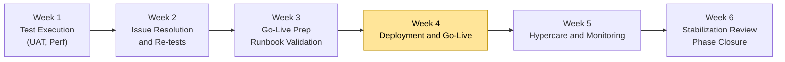

# Phase 4 Playbook: Testing, Release & Transition

**Document ID:** MPG-002-P4-RELEASE · **Version:** 1.0 · **Effective Date:** 2025-11-07  
**Owner:** Project Management Office (PMO)  
**Applies To:** All projects executing Phase 4 under MPG-002 (Testing, Release, Transition)

---

## Purpose & Scope

Phase 4 validates solution readiness through formal testing (UAT, performance, security), executes controlled releases, and transitions ownership to operations and end users. This playbook expands `Standards.md` by prescribing the activities, deliverables, governance checkpoints, and evidence required to move from release candidate to production go-live while safeguarding quality, compliance, and adoption.

Phase 4 concludes when:

- All planned test cycles (UAT, performance, security, data validation) are complete with exit criteria met or risk-accepted.
- Release is executed in production (or target environment) following approved runbooks with monitoring and support in place.
- Support handoff, training, and knowledge transfer deliverables are accepted by operations and business stakeholders.
- Post-release verification and stabilization metrics meet agreed thresholds.
- Phase 4 gate review authorizes closure or transition to Phase 5 (Operations & Continuous Improvement).

---

## Outcome Summary

| Dimension                         | Target Outcome                                                                                                       |
| --------------------------------- | -------------------------------------------------------------------------------------------------------------------- |
| **Test Completion**               | UAT, performance, security, regression tests completed with exit criteria satisfied or authorized risk acceptance.   |
| **Release Readiness**             | Production environments, deployment scripts, and rollback plans validated and approved by operations and governance. |
| **Operational Transition**        | Support teams trained; runbooks, monitoring, and incident response aligned with live operations.                     |
| **Stakeholder Adoption & Change** | End-user communications, training, and readiness activities executed; feedback collected and issues tracked.         |
| **Post-Go-Live Assurance**        | Post-release monitoring, defect triage, and stabilization metrics tracked with governance oversight.                 |

---

## Phase 4 Timeline Overview

Typical duration: **3–6 weeks**, depending on test complexity and release waves.

_Figure 1. Representative Phase 4 timeline from formal testing through stabilization._

Adjust timeline for phased rollouts or multiple release trains. Ensure buffer time exists for remediation and re-testing.

---

## Detailed Workflow & Procedures

### 1. Test Cycle Planning & Readiness Confirmation

**Objective:** Ensure all prerequisites for formal testing are in place.

**Steps:**

1. Review Phase 3 outputs (release candidate, test strategy) and confirm entry criteria for each test phase (UAT, performance, security).
2. Finalize test schedule, resource assignments, environment availability, and data setup.
3. Conduct test readiness review (TRR) with QA Lead, Product Owner, Technical Lead, Security, and Operations.
4. Update RTM with planned test coverage; link each requirement to test cases and acceptance criteria.
5. Document defect management workflow, severity codes, SLAs, and escalation paths.

**Evidence Requirements:** TRR minutes, environment readiness checklist, RTM coverage report, defect workflow documentation.

### 2. UAT Execution & Business Validation

**Objective:** Validate solution meets business needs with end-user participation.

**Steps:**

1. Facilitate UAT kick-off with business stakeholders; review scope, test scenarios, reporting process, and exit criteria.
2. Provide UAT test scripts, data sets, and instructions; ensure participants have access to environments and support contacts.
3. Track execution progress daily; log defects/enhancement requests in defect tool with severity and business impact.
4. Coordinate triage meetings to prioritize fixes; ensure resolution or workaround recorded before UAT closure.
5. Obtain formal UAT sign-off from business owners, capturing outstanding issues and risk acceptances.

**Evidence Requirements:** UAT plan, execution status reports, defect logs, UAT sign-off form, outstanding issue list.

### 3. Non-Functional Testing (Performance, Security, DR)

**Objective:** Validate system performance, scalability, security posture, and disaster recovery readiness.

**Steps:**

1. Execute performance/load/stress tests per Phase 2 strategy; document throughput, response times, resource utilization.
2. Perform security testing (DAST, penetration testing, vulnerability scanning), addressing findings within SLA or documenting risk acceptance.
3. Verify disaster recovery procedures (backup/restore, failover) if in scope; ensure RTO/RPO targets met.
4. Evaluate results against acceptance thresholds; escalate deviations to Steering Committee and Security/Compliance leads.
5. Store test evidence, approvals, and mitigation plans in compliance repository.

**Evidence Requirements:** Performance test report, security test results, DR validation logs, risk acceptance letters, updated compliance checklist.

### 4. Defect & Issue Management

**Objective:** Resolve testing findings and ensure production readiness.

**Steps:**

1. Operate daily defect triage with PM, QA, Technical Lead, Product Owner to prioritize and assign issues.
2. Track resolution progress; verify fixes through re-testing and regression suites.
3. Maintain dashboards showing defect aging, severity distribution, and burn-down to monitor readiness.
4. Document go/no-go criteria adjustments based on residual defects or accepted risks.
5. Update change/control boards on scope or timeline impacts triggered by defect remediation.

**Evidence Requirements:** Defect triage notes, resolution logs, dashboards, change board decisions, go/no-go criteria update.

### 5. Release Planning & Go-Live Preparation

**Objective:** Prepare deployment strategy, runbooks, and communications for go-live.

**Steps:**

1. Confirm production deployment window, blackout periods, and approvals from operations/governance.
2. Conduct release readiness review (RRR) covering runbook, rollback plan, monitoring, and staffing.
3. Execute deployment dry run or rehearsal in staging/pre-prod; document outcomes and adjustments.
4. Finalize release checklist (Appendix F) with sign-off from DevOps, QA, Security, Product Owner, and Sponsor.
5. Publish release communications (user notices, training reminders, support contact info).

**Evidence Requirements:** RRR minutes, updated runbook/deployment plan, dry-run report, signed release checklist, communications artifacts.

### 6. Training, Change Management & Communications

**Objective:** Ensure stakeholders are prepared for new capabilities and process changes.

**Steps:**

1. Execute training plan (Appendix K) including schedule, audience, materials, delivery method.
2. Conduct training sessions, record attendance, collect feedback, and track completion metrics.
3. Provide quick reference guides, FAQs, and knowledge base updates for end users and support staff.
4. Coordinate change management campaigns (emails, town halls, intranet updates) aligned with go-live timeline.
5. Monitor readiness KPIs (training completion, survey scores) and address gaps prior to go-live.

**Evidence Requirements:** Training materials, attendance logs, feedback surveys, change communication calendar, readiness KPIs.

### 7. Deployment Execution & Verification

**Objective:** Deploy release to production with controlled execution and verification steps.

**Steps:**

1. Initiate deployment according to runbook; maintain command center/war room with cross-functional leads.
2. Capture execution logs, automated deployment outputs, and manual verification steps.
3. Perform smoke tests / sanity checks immediately post-deployment; ensure monitoring/alerts active.
4. Communicate go-live status to stakeholders (executives, business users, support teams).
5. Document issues encountered, resolutions, and rollback decisions (if invoked).

**Evidence Requirements:** Deployment log, verification checklist, smoke test results, communication updates, issue/resolution tracker.

### 8. Hypercare & Post-Release Support

**Objective:** Provide heightened support following go-live to ensure stabilization.

**Steps:**

1. Define hypercare period (e.g., 2–4 weeks) with staffing schedule, escalation paths, and SLA expectations.
2. Track incidents/requests via service desk; categorize as defects, enhancements, training issues.
3. Review daily or twice-daily hypercare standups; monitor KPIs (incident volume, time to resolution, user satisfaction).
4. Update knowledge base and runbooks with lessons learned during hypercare.
5. Transition to steady-state operations once incident volume and performance metrics meet targets.

**Evidence Requirements:** Hypercare plan, incident logs, daily standup notes, KPI dashboard, transition acceptance memo.

### 9. Risk, Compliance & Change Governance

**Objective:** Maintain governance visibility over outstanding risks, compliance obligations, and change approvals.

**Steps:**

1. Update risk register with post-test, post-release risks; flag regulatory exposure and mitigation status.
2. Ensure compliance obligations (audit trails, regulatory filings) are satisfied with supporting evidence.
3. Review change log for all release-related approvals, including emergency changes executed during deployment.
4. Provide Steering Committee with summary of risk posture, compliance status, and required decisions/investments.
5. Archive evidence for audits (SOX, GDPR, HIPAA) in designated repository with retention tags.

**Evidence Requirements:** Risk register updates, compliance checklist, change log entries, Steering Committee briefing deck, audit evidence folder.

### 10. Phase 4 Gate Preparation & Closure

**Objective:** Secure governance approval to transition to operations and close project delivery.

**Steps:**

1. Complete Phase 4 exit checklist (see "Checklists & Gate Reviews").
2. Assemble closure packet including release metrics, incident summary, outstanding actions, lessons learned.
3. Conduct post-implementation review (PIR) with Sponsor, business owners, PMO, QA, Operations.
4. Facilitate Phase 4 gate review to approve transition to Phase 5 or project closure.
5. Update decision log, close open change requests, archive documentation, and initiate project closure tasks (if applicable).

**Evidence Requirements:** Exit checklist, PIR report, gate review minutes, final status report, archived documents list.

---

## Deliverable Specifications

| Deliverable                                 | Purpose                                | Required Contents                                                                                     | Format & Naming                                                      | Approval                                                               |
| ------------------------------------------- | -------------------------------------- | ----------------------------------------------------------------------------------------------------- | -------------------------------------------------------------------- | ---------------------------------------------------------------------- |
| **Test Readiness Review (TRR) Package**     | Confirm readiness for formal testing.  | Entry criteria status, environment readiness, resource plan, risk/issue list.                         | `.pptx`/`.pdf`. Naming: `ProjectName_TRR_vYYYYMMDD.pptx`.            | Prepared: QA Lead; Approved: Sponsor & QA Director; Reviewed: PMO.     |
| **UAT Results & Sign-off**                  | Evidence of business validation.       | Test execution summary, defect log, sign-off form, outstanding issues.                                | `.pdf`/`.xlsx`. Naming: `ProjectName_UATResults_vYYYYMMDD.pdf`.      | Prepared: BA/Product Owner; Approved: Business Owner; Reviewed: PM.    |
| **Performance/Security Test Reports**       | Demonstrate non-functional compliance. | Test approach, results, comparison to targets, remediation notes, approvals.                          | `.pdf`. Naming: `ProjectName_PerfSecurityReport_vYYYYMMDD.pdf`.      | Prepared: QA/Security Leads; Approved: CISO/QA Director; Reviewed: PM. |
| **Release Runbook & Checklist**             | Guide deployment execution.            | Deployment steps, rollback, prerequisites, validations, contact matrix.                               | `.docx`/`.md`. Naming: `ProjectName_Runbook_vYYYYMMDD.docx`.         | Prepared: DevOps Lead; Approved: Operations Manager; Reviewed: PM.     |
| **Release Notes & Communications Plan**     | Communicate change to stakeholders.    | Feature list, fixes, impacts, known issues, communication schedule, training summary.                 | `.pdf`/`.md`. Naming: `ProjectName_ReleaseNotes_vYYYYMMDD.pdf`.      | Prepared: Product Owner; Approved: Sponsor; Reviewed: PMO Comms.       |
| **Training Materials & Attendance Records** | Track change adoption.                 | Slide decks, videos, handouts, attendance logs, survey summaries.                                     | `.pptx`/`.pdf`. Naming: `ProjectName_TrainingPacket_vYYYYMMDD.zip`.  | Prepared: Change Mgmt Lead; Approved: Business Owner; Reviewed: PMO.   |
| **Deployment Log & Smoke Test Results**     | Evidence of deployment execution.      | Timestamps, responsible roles, steps executed, smoke test outcomes.                                   | `.xlsx`/`.log`. Naming: `ProjectName_DeploymentLog_vYYYYMMDD.xlsx`.  | Prepared: DevOps Lead; Approved: Operations Manager; Reviewed: PM.     |
| **Hypercare Plan & Incident Dashboard**     | Manage post-go-live support.           | Support schedule, escalation paths, incident metrics dashboard, closure criteria.                     | `.docx`/`.xlsx`. Naming: `ProjectName_HypercarePlan_vYYYYMMDD.docx`. | Prepared: PM/Support Lead; Approved: Sponsor; Reviewed: PMO.           |
| **Post-Implementation Review (PIR) Report** | Capture lessons and closure decisions. | Summary of outcomes, metrics, lessons learned, follow-up actions, benefits realization snapshot.      | `.pptx`/`.pdf`. Naming: `ProjectName_PIR_vYYYYMMDD.pdf`.             | Prepared: PM; Approved: Sponsor & Steering Committee.                  |
| **Phase 4 Gate Packet**                     | Request approval to close/transition.  | Executive summary, test completion status, deployment metrics, incident summary, readiness checklist. | `.pptx`. Naming: `ProjectName_Phase4GatePacket_vYYYYMMDD.pptx`.      | Prepared: PM; Approved: Sponsor & Steering Committee.                  |

**Document Control Notes:**

- Store Phase 4 artifacts under `/docs/phase-4/` with folders (`testing/`, `release/`, `training/`, `operations/`, `gate-review/`).
- Approval evidence placed in `/docs/approvals/phase-4/` referencing artifact IDs.
- Update Phase 4 README with artifact status table (Appendix H) after major milestones (UAT, go-live, hypercare).

### Artifact Completion Tracker

| Artifact                       | Owner | Status (Draft / In Review / Approved) | Repository Path | Version | Approval Evidence Stored? | Next Action / Due Date |
| ------------------------------ | ----- | ------------------------------------- | --------------- | ------- | ------------------------- | ---------------------- |
| TRR Package                    |       |                                       |                 |         |                           |                        |
| UAT Results & Sign-off         |       |                                       |                 |         |                           |                        |
| Performance/Security Reports   |       |                                       |                 |         |                           |                        |
| Release Runbook & Checklist    |       |                                       |                 |         |                           |                        |
| Release Notes & Communications |       |                                       |                 |         |                           |                        |
| Training Materials             |       |                                       |                 |         |                           |                        |
| Deployment Log & Smoke Tests   |       |                                       |                 |         |                           |                        |
| Hypercare Plan                 |       |                                       |                 |         |                           |                        |
| PIR Report                     |       |                                       |                 |         |                           |                        |
| Phase 4 Gate Packet            |       |                                       |                 |         |                           |                        |

Update after each major milestone (TRR, UAT completion, go-live, hypercare close).

### Approval Evidence Requirements

- **Sign-offs:** Store signed PDFs/emails for UAT approval, release readiness, risk acceptances.
- **Audit Trails:** Export test management and deployment logs with timestamps.
- **Meeting Minutes:** Save TRR, RRR, go/no-go, hypercare, and PIR minutes for traceability.
- **Monitoring Screenshots:** Capture key dashboards (performance, error rate) during hypercare for closure evidence.

### Execution Checklist by Workstream

| Workstream     | Activity                                                       | Evidence Location                       | Responsible Role    | Status |
| -------------- | -------------------------------------------------------------- | --------------------------------------- | ------------------- | ------ |
| Testing        | TRR completed; environments ready.                             | `/docs/phase-4/testing/`                | QA Lead             |        |
| Testing        | UAT executed, defects resolved, sign-off obtained.             | `/docs/phase-4/testing/UAT/`            | Product Owner       |        |
| Testing        | Performance & security tests meet thresholds or risk accepted. | `/docs/phase-4/testing/non-functional/` | QA & Security Leads |        |
| Release        | Runbook validated via dry run; release checklist signed.       | `/docs/phase-4/release/`                | DevOps Lead         |        |
| Change Mgmt    | Training sessions delivered; attendance logged.                | `/docs/phase-4/training/`               | Change Mgmt Lead    |        |
| Communications | Release communications issued per plan.                        | `/docs/communications/`                 | PMO Comms           |        |
| Operations     | Hypercare staffing schedule confirmed.                         | `/docs/phase-4/operations/`             | Support Manager     |        |
| Governance     | Risk/compliance updates reviewed with Steering Committee.      | `/docs/risk-management/`                | PM                  |        |
| Metrics        | Post-release dashboards tracking KPIs.                         | Monitoring tool export                  | DevOps/PMO          |        |
| Gate Prep      | Phase 4 gate packet reviewed with PMO.                         | `/docs/phase-4/gate-review/`            | PM                  |        |

Escalate overdue items to Sponsor during weekly status/governance meetings.

### Deliverable Deep-Dive Guides

**TRR Package**

- Include entry criteria checklist (requirements, design, build tasks complete), environment health, data readiness, resource plan.
- Highlight top risks and mitigation steps prior to test start.

**UAT Execution**

- Provide guidance on capturing user feedback, severity definitions, and how to submit enhancement requests separate from defects.
- Track business approvals per requirement or capability; ensure partial sign-offs flagged with conditions.

**Performance & Security Testing**

- Document test tools, scenarios, load profiles, and baseline comparisons (e.g., prior release metrics).
- Include remediation plan with owners and due dates for any findings.

**Release Runbook**

- Structure with sections for pre-deployment checks, deployment steps, post-deployment validation, rollback, and communication triggers.
- Version control runbook updates; ensure operations reviews prior to RRR.

**Hypercare Plan**

- Define duration, support hours, contact tiers, and escalation thresholds.
- Include metrics/SLAs (incident response, resolution time) and transition criteria to steady-state support.

**PIR Report**

- Capture business outcome realization (benefits metrics, KPIs) and compare to original objectives.
- Document lessons learned with actionable owners; feed into continuous improvement backlog.

### Compliance Framework Alignment

- **SOC/SOC 2 Controls:** Map test evidence, release approvals, and monitoring outputs to SOC/SOC 2 trust service criteria (security, availability, confidentiality). Store control evidence (test scripts, approvals, deployment logs) in `/docs/phase-4/compliance/` with control IDs for audit retrieval.
- **Naming & Evidence Integrity:** Ensure all release artifacts follow naming standards (`ProjectIdentifier_Artifact_vYYYYMMDD.ext`) so auditors can correlate files. Version control communications, runbooks, and checklists to demonstrate change management discipline.
- **Change Freeze & Segregation:** Document change freeze windows and enforcement to satisfy compliance expectations. Use CAB/go-no-go minutes to prove segregation of duties between developers, QA, and operations.
- **Logging & Monitoring:** Capture deployment and post-release monitoring logs with timestamps; archive in SIEM/log repository to support SOC/SOC 2 logging requirements.
- **Control Attestations:** Secure sign-offs from Security, Compliance, and Sponsor confirming control adherence before and after go-live; archive attestation forms with gate packet evidence.
- **Accessibility & Privacy Validation:** Include WCAG 2.1 AA verification, localization checks, and privacy impact assessments in UAT/performance testing. Document test cases and results, and log remediation tasks for any accessibility/privacy issues discovered.

### Release Calendar & Emergency Change Policy

- **Release Calendar:** Maintain a forward-looking schedule showing release windows, freeze periods, blackout dates, and stakeholder sign-off deadlines. Store the calendar (`ProjectIdentifier_ReleaseCalendar_vYYYYMM.xlsx`) in `/docs/phase-4/release/` and update after each go/no-go decision.
- **Emergency Changes:** Define criteria, approval chain, and post-implementation review requirements for emergency fixes. Record emergency change tickets with timestamps, justifications, and retrospective outcomes; present summary in gate review and compliance evidence packs.
- **Segregation of Duties Enforcement:** Document roles for code promotion, approvals, and production access within the release calendar and change policy to satisfy audit expectations. Include automated controls (e.g., pipeline approvals) and manual sign-offs where necessary.

---

## Roles, Responsibilities & RACI (Phase 4 Focus)

| Activity                           | Executive Sponsor | Steering Committee | Project Manager | Product Owner / BA | QA Lead | Technical Lead | DevOps / Operations | Security / Compliance | Change Mgmt Lead | Support Manager | PMO Representative |
| ---------------------------------- | ----------------- | ------------------ | --------------- | ------------------ | ------- | -------------- | ------------------- | --------------------- | ---------------- | --------------- | ------------------ |
| Approve TRR & Test start           | **A**             | C                  | R               | C                  | **R/A** | C              | I                   | C                     | I                | I               | C                  |
| Execute UAT                        | I                 | I                  | C               | **R/A**            | C       | C              | I                   | I                     | C                | I               | C                  |
| Approve UAT sign-off               | **A**             | C                  | R               | **R**              | C       | C              | I                   | I                     | C                | I               | C                  |
| Conduct performance/security tests | I                 | I                  | C               | C                  | **R**   | C              | C                   | **R/A**               | I                | I               | C                  |
| Manage defect triage               | I                 | C                  | **R**           | **R**              | **R**   | **R**          | C                   | C                     | I                | I               | C                  |
| Release readiness review           | **A**             | C                  | **R**           | **R**              | C       | C              | **R/A**             | C                     | C                | C               | C                  |
| Execute deployment                 | I                 | I                  | C               | I                  | C       | C              | **R/A**             | C                     | I                | C               | C                  |
| Hypercare management               | **A**             | C                  | **R**           | C                  | C       | C              | **R**               | C                     | C                | **R**           | C                  |
| Risk/compliance reporting          | **A**             | **R**              | **R**           | C                  | C       | C              | C                   | **R**                 | C                | C               | C                  |
| PIR & closure                      | **A**             | **R**              | **R**           | **R**              | C       | C              | C                   | C                     | C                | C               | C                  |

Key: R = Responsible, A = Accountable, C = Consulted, I = Informed.

---

## Meeting & Collaboration Cadence (Phase 4)

| Meeting                          | Purpose                                                                     | Participants                                                           | Frequency                   | Inputs                                       | Outputs                            |
| -------------------------------- | --------------------------------------------------------------------------- | ---------------------------------------------------------------------- | --------------------------- | -------------------------------------------- | ---------------------------------- |
| Test Readiness Review (TRR)      | Confirm readiness to begin formal testing.                                  | PM, QA Lead, Product Owner, Technical Lead, Security, Operations, PMO  | Once (start of Phase 4)     | Entry criteria checklist, environment status | TRR approval, action items         |
| Daily Test Standup               | Coordinate UAT/non-functional testing and defect triage.                    | QA Lead, Product Owner, Dev Lead, Security, PM                         | Daily during test cycles    | Test status, defect log                      | Updated defect status, priorities  |
| UAT Business Checkpoint          | Review progress, decisions, and sign-off status with business stakeholders. | Product Owner, Business Leads, PM, QA                                  | Twice weekly (or as needed) | UAT status report                            | Decision log entries, approvals    |
| Defect Triage Meeting            | Prioritize and assign defects/enhancements.                                 | PM, QA, Technical Lead, Dev Lead, Product Owner                        | Daily/bi-daily              | Defect dashboard                             | Resolution actions, escalations    |
| Release Readiness Review (RRR)   | Validate go-live preparedness.                                              | Sponsor, Steering Committee reps, PM, DevOps, QA, Security, Operations | Once before go-live         | Runbook, checklist, risk log                 | Go/no-go recommendation            |
| Go-Live Command Center           | Manage deployment execution.                                                | DevOps, Technical Lead, QA, Operations, PM, Security                   | Deployment window           | Runbook, deployment log                      | Real-time decisions, issue log     |
| Hypercare Standup                | Monitor post-release incidents and stabilization.                           | Support Manager, DevOps, QA, Product Owner, PM                         | Daily during hypercare      | Incident log, KPIs                           | Action items, updates              |
| Post-Implementation Review (PIR) | Evaluate outcomes and lessons.                                              | Sponsor, Business Owners, PM, QA, Operations, PMO                      | After hypercare             | PIR template, metrics                        | Lessons learned, closure decisions |

---

## Risk & Control Considerations

**Common Phase 4 Risks**

1. **Test Coverage Gaps:** Mitigate by enforcing RTM updates and test audits; escalate missing coverage before go-live.
2. **Late Defects:** Implement freeze deadlines for non-critical changes; require Sponsor approval for late changes.
3. **Environment Instability:** Validate environments daily; coordinate changes through DevOps change control.
4. **User Readiness Shortfalls:** Track training completion and readiness surveys; schedule remedial sessions as needed.
5. **Deployment Failures:** Run rehearsals, maintain rollback plans, and keep support teams on standby.
6. **Post-Go-Live Incident Surge:** Establish hypercare, monitor KPIs closely, and maintain rapid escalation channels.

**Control Activities**

- PMO weekly audits verifying test evidence, approvals, and risk management.
- Mandatory TRR and RRR sign-offs before testing/go-live.
- Change freeze period enforced prior to deployment (except emergency fixes approved by CCB).
- Security risk acceptance documented for unresolved vulnerabilities.
- Post-release metrics tracked with thresholds triggering escalations (e.g., incident SLA breaches).

---

## Tooling & Configuration Requirements

| Tool / Platform                                              | Configuration Action                                                                | Owner                | Evidence                               |
| ------------------------------------------------------------ | ----------------------------------------------------------------------------------- | -------------------- | -------------------------------------- |
| Test Management (TestRail, qTest, Zephyr)                    | Configure UAT cycle, test runs, and reporting dashboards for business stakeholders. | QA Lead              | Test run screenshots, report exports.  |
| Performance Testing (LoadRunner, JMeter)                     | Set load profiles, scripts, and monitoring integrations; store results centrally.   | Performance Engineer | Test scripts, result archive.          |
| Security Testing Tools (Burp, OWASP ZAP, Snyk)               | Schedule scans, define severity thresholds, integrate with ticketing.               | Security Lead        | Scan configurations, reports.          |
| Deployment Automation (Ansible, Octopus, Jenkins)            | Parameterize release scripts, implement approvals, capture logs.                    | DevOps               | Script repository, pipeline logs.      |
| Monitoring & Alerting (Datadog, Splunk, New Relic)           | Configure dashboards/alerts for go-live metrics (availability, errors, latency).    | DevOps               | Dashboard links, alert configurations. |
| Service Desk / ITSM (ServiceNow, Jira Service Management)    | Setup hypercare queue, categorization, SLA monitoring.                              | Support Manager      | ITSM configuration export, SLA report. |
| Communications Platforms (Email automation, Intranet, Teams) | Prepare release communications templates and scheduling.                            | Change Mgmt Lead     | Published communications, analytics.   |

---

## Checklists & Gate Reviews

### A. Test Readiness Checklist

- [ ] Test strategy and plan approved; entry criteria met.
- [ ] Test environments provisioned, data loaded, and validated.
- [ ] Test cases/scripts reviewed; RTM updated.
- [ ] Defect management process defined; tools configured.
- [ ] Resources (business testers, QA, security) confirmed and briefed.
- [ ] Risk register updated with test-related risks.

### B. Go-Live Readiness Checklist

- [ ] UAT sign-off obtained; critical defects resolved or risk accepted.
- [ ] Performance and security tests passed or risk accepted with approvals.
- [ ] Release runbook, rollback plan, monitoring setup approved.
- [ ] Deployment rehearsal completed; issues resolved.
- [ ] Communications, training, and support readiness confirmed.
- [ ] Go/no-go decision recorded with Sponsor approval.

### C. Post-Implementation Review Checklist

- [ ] Hypercare period completed; incidents within acceptable thresholds.
- [ ] Outstanding defects/enhancements prioritized and assigned.
- [ ] Benefits realization metrics reviewed; deviations noted.
- [ ] Lessons learned captured; improvement actions assigned.
- [ ] Documentation (runbooks, architecture updates, user guides) finalized and archived.
- [ ] Phase 4 gate decision recorded; project closure tasks initiated.

---

## Templates & Samples

### Appendix A: TRR Agenda Template

| Section               | Content                                                      |
| --------------------- | ------------------------------------------------------------ |
| Objectives            | Confirm readiness, review entry criteria, align on schedule. |
| Status Review         | Requirements, design, build completion checklist.            |
| Environment Readiness | Environment health, data setup, access validation.           |
| Risk & Issues         | Open risks/issues, mitigations, escalation needs.            |
| Decision              | Approve/hold testing start, action items.                    |

### Appendix B: UAT Script Template

| Field                | Description                            |
| -------------------- | -------------------------------------- |
| Scenario ID          | `UAT-###`.                             |
| Scenario Description | Business process/use case description. |
| Preconditions        | Data/state required.                   |
| Steps                | Ordered steps testers must execute.    |
| Expected Result      | Outcome expected per requirement.      |
| Actual Result        | Result captured during execution.      |
| Pass/Fail            | Outcome status.                        |
| Defect Reference     | Link to defect ticket if failed.       |

### Appendix C: Defect Severity Definitions

| Severity | Description                                                                      | Example                                  |
| -------- | -------------------------------------------------------------------------------- | ---------------------------------------- |
| Critical | Blocking functionality; no workaround; impacts go-live.                          | System down, data corruption.            |
| High     | Major functionality impaired; workaround exists but unacceptable for production. | Payment failure, security vulnerability. |
| Medium   | Partial functionality issue; workaround acceptable short-term.                   | UI defect, localized performance issue.  |
| Low      | Cosmetic or minor issue; no impact on functionality.                             | Typos, minor layout issues.              |

### Appendix D: Release Checklist Template

| Step                      | Description                                        | Owner          | Status | Timestamp |
| ------------------------- | -------------------------------------------------- | -------------- | ------ | --------- |
| Pre-deployment backup     | Trigger backups according to policy.               | DevOps         |        |           |
| Freeze communications     | Notify stakeholders of release start.              | PM             |        |           |
| Execute deployment script | Run automated deployment.                          | DevOps         |        |           |
| Verify services           | Run smoke tests, check monitoring dashboards.      | QA             |        |           |
| Update status page        | Announce availability to users.                    | Comms Lead     |        |           |
| Post-deployment checks    | Verify data, integrations, performance thresholds. | Technical Lead |        |           |
| Close deployment          | Confirm completion, update runbook logs.           | PM             |        |           |

### Appendix E: Hypercare Dashboard Metrics

| Metric               | Definition                       | Target                                        |
| -------------------- | -------------------------------- | --------------------------------------------- |
| Incident Volume      | # of incidents per day           | Trending downward; ≤ baseline by Day 10       |
| Mean Time to Resolve | Average incident resolution time | Within SLA (e.g., <4 hours for high severity) |
| User Satisfaction    | Survey rating post-support       | ≥4/5                                          |
| System Availability  | Uptime during hypercare          | ≥99.5%                                        |

### Appendix F: Post-Implementation Review Outline

1. Executive Summary
2. Objectives vs. Outcomes
3. Benefits Realization Snapshot
4. Incident & Defect Summary
5. Stakeholder Feedback & User Adoption Metrics
6. Lessons Learned & Action Plan
7. Outstanding Risks/Issues and Owners
8. Closure Decision & Next Steps

### Appendix G: Communications Calendar Sample

| Date       | Audience      | Message                           | Channel            | Owner           | Status    |
| ---------- | ------------- | --------------------------------- | ------------------ | --------------- | --------- |
| 2025-11-15 | All Users     | Release announcement & schedule   | Email / Intranet   | PMO Comms       | Scheduled |
| 2025-11-17 | Support Staff | Hypercare expectations & contacts | Teams Meeting      | Support Manager | Completed |
| 2025-11-20 | Executives    | Go-live readiness summary         | Executive Briefing | PM              | Pending   |

### Appendix H: Phase 4 Artifact Status Table (Embed in README)

| Artifact           | Owner           | Location                                                 | Version   | Approval Status | Last Updated |
| ------------------ | --------------- | -------------------------------------------------------- | --------- | --------------- | ------------ |
| TRR Package        | QA Lead         | `/docs/phase-4/testing/TRR_v20251112.pptx`               | v20251112 | Approved        | 2025-11-12   |
| UAT Sign-off       | Product Owner   | `/docs/phase-4/testing/UAT_signoff_20251120.pdf`         | v20251120 | Approved        | 2025-11-20   |
| Performance Report | QA Lead         | `/docs/phase-4/testing/perf_report_20251118.pdf`         | v20251118 | Approved        | 2025-11-18   |
| Release Runbook    | DevOps Lead     | `/docs/phase-4/release/runbook_v20251124.docx`           | v20251124 | Approved        | 2025-11-24   |
| Hypercare Plan     | Support Manager | `/docs/phase-4/operations/hypercare_plan_v20251125.docx` | v20251125 | In Progress     | 2025-11-25   |
| PIR Report         | PM              | `/docs/phase-4/gate-review/pir_v20251205.pdf`            | v20251205 | Draft           | 2025-12-05   |

### Appendix I: Go/No-Go Decision Log Template

| Criteria       | Indicator                           | Threshold                    | Status | Notes |
| -------------- | ----------------------------------- | ---------------------------- | ------ | ----- |
| UAT Completion | Defects outstanding (Critical/High) | 0 critical; ≤2 high accepted |        |       |
| Performance    | Peak response time under load       | < 2s average                 |        |       |
| Security       | Open high vulnerabilities           | 0 outstanding                |        |       |
| Operations     | Runbook approved                    | Yes                          |        |       |
| Communications | Training completion                 | ≥95% target audience         |        |       |

### Appendix J: Status Report Template (Testing & Release)

| Section                   | Description                                           |
| ------------------------- | ----------------------------------------------------- |
| Summary                   | Stage overview, upcoming milestones, overall status.  |
| Testing Progress          | UAT, performance, security status; pass/fail counts.  |
| Defects                   | Open defects by severity, trend, blockers.            |
| Release Readiness         | Runbook status, checklist completion, go/no-go risks. |
| Training & Communications | Completion rates, upcoming events.                    |
| Risks & Issues            | Escalations, mitigation actions, owners.              |
| Decisions Needed          | Approvals or resource adjustments required.           |
| Post-Go-Live Metrics      | Hypercare KPIs (if applicable).                       |

### Appendix K: Training Plan Template

| Component           | Description                                     |
| ------------------- | ----------------------------------------------- |
| Audience Segments   | End users, support staff, executives, partners. |
| Learning Objectives | Key knowledge/skills required post-release.     |
| Delivery Method     | Instructor-led, eLearning, job aids, webinars.  |
| Schedule            | Dates, times, locations (virtual/physical).     |
| Materials           | Slides, recordings, job aids, FAQs.             |
| Assessment          | Quizzes, surveys, certification checklists.     |
| Completion Tracking | Approach to capture attendance and completion.  |

### Appendix L: Lessons Learned Log

| Date | Category | Description | Impact | Action | Owner | Due Date | Status |
| ---- | -------- | ----------- | ------ | ------ | ----- | -------- | ------ |

### Appendix M: Release Calendar Template

| Week   | Release Window   | Freeze Period | CAB Review Date | Go/No-Go Meeting | Responsible Roles        | Notes |
| ------ | ---------------- | ------------- | --------------- | ---------------- | ------------------------ | ----- |
| Week 1 | Date/time window | Start–End     | Date/time       | Date/time        | PM, DevOps, QA, Security |       |
| Week 2 |                  |               |                 |                  |                          |       |
| Week 3 |                  |               |                 |                  |                          |       |
| Week 4 |                  |               |                 |                  |                          |       |

Maintain this calendar each quarter under `/docs/phase-4/release/release_calendar_vYYYYQ#.xlsx` and update after CAB/go-no-go decisions.

### Appendix N: Emergency Change Request Form

| Field                      | Description                                          |
| -------------------------- | ---------------------------------------------------- |
| Request ID                 | `ECR-YYYY-###`.                                      |
| Date/Time Submitted        | Timestamp (UTC).                                     |
| Requested By               | Name, role, contact.                                 |
| Description                | Summary of issue and proposed change.                |
| Business Impact            | Service impact, severity, compliance considerations. |
| Risk Assessment            | Technical risk, rollback feasibility, dependencies.  |
| Approval Chain             | Required approvers (Sponsor, PM, DevOps, Security).  |
| Execution Window           | Start/end time, environment.                         |
| Rollback Plan              | Steps to revert change.                              |
| Post-Implementation Review | Link to retrospective/RCA; due date.                 |

Store completed forms in `/docs/phase-4/release/emergency_changes/` and review outcomes during CAB and compliance meetings.

---

## Glossary of Phase 4 Terms

- **TRR (Test Readiness Review):** Meeting confirming prerequisites for formal testing.
- **RRR (Release Readiness Review):** Governance checkpoint verifying go-live preparedness.
- **Go/No-Go Meeting:** Decision forum to approve or delay deployment.
- **Hypercare:** Intensified support period following go-live.
- **PIR (Post-Implementation Review):** Assessment of release outcomes and lessons learned.
- **Roll-back Plan:** Procedure to revert to previous state if deployment fails.
- **SLA (Service Level Agreement):** Agreed response/resolution times for incidents.
- **Risk Acceptance:** Formal approval to proceed despite identified risks.
- **Change Freeze:** Period restricting non-critical changes prior to release.
- **Benefits Realization:** Measurement of actual value delivered versus planned objectives.

## Acronyms and Abbreviations

- **ADR:** Architecture Decision Record - Document capturing design choices and rationale
- **BA:** Business Analyst - Role responsible for requirements gathering and analysis
- **CAB:** Change Advisory Board - Governance body approving significant changes
- **CCB:** Change Control Board - Group responsible for approving/rejecting change requests
- **CHANGE-115:** Training & Adoption Handbook document identifier
- **CI/CD:** Continuous Integration/Continuous Delivery - Automated pipeline for build, test, and deployment
- **CM-410:** Change Management Framework document identifier
- **CISO:** Chief Information Security Officer - Executive responsible for information security
- **DAST:** Dynamic Application Security Testing - Security testing performed on running applications
- **DR:** Disaster Recovery - Process for restoring IT systems after a disaster
- **GDPR:** General Data Protection Regulation - European Union data protection and privacy regulation
- **HIPAA:** Health Insurance Portability and Accountability Act - U.S. healthcare data protection regulation
- **ITSM:** IT Service Management - Framework for managing IT services
- **KPI:** Key Performance Indicator - Measurable value demonstrating effectiveness
- **MPG-002:** Master Project Governance standard document identifier
- **NIST CSF:** National Institute of Standards and Technology Cybersecurity Framework - U.S. cybersecurity framework
- **OWASP:** Open Web Application Security Project - Non-profit organization focused on web application security
- **PCI DSS:** Payment Card Industry Data Security Standard - Security standard for payment card data
- **PIR:** Post-Implementation Review - Assessment of release outcomes and lessons learned
- **PM:** Project Manager - Role responsible for project coordination and delivery
- **PMO:** Project Management Office - Organizational unit ensuring adherence to standards and methodologies
- **QA:** Quality Assurance - Process ensuring products meet quality standards
- **QMP-004:** Quality Management Policy document identifier
- **RCA:** Root Cause Analysis - Process for identifying underlying causes of problems
- **REL-200:** Release Management Guidelines document identifier
- **RPO:** Recovery Point Objective - Maximum acceptable data loss measured in time
- **RTO:** Recovery Time Objective - Maximum acceptable downtime after a disaster
- **RTM:** Requirements Traceability Matrix - Document linking requirements to design, tests, and deployment
- **RRR:** Release Readiness Review - Governance checkpoint verifying go-live preparedness
- **SAST/DAST:** Static Application Security Testing / Dynamic Application Security Testing - Security testing methodologies
- **SDLC:** Software Development Life Cycle - Process for planning, creating, testing, and deploying software
- **SEC-020:** Security & Privacy Assessment Procedures document identifier
- **SIEM:** Security Information and Event Management - Technology for security monitoring
- **SLA:** Service Level Agreement - Contractual commitment to service performance levels
- **SLO:** Service Level Objective - Target metric for service performance
- **SOC/SOC 2:** System and Organization Controls - Framework for security, availability, and confidentiality controls
- **SOX 404:** Sarbanes-Oxley Act Section 404 - U.S. financial reporting and internal controls regulation
- **TRR:** Test Readiness Review - Meeting confirming prerequisites for formal testing
- **UAT:** User Acceptance Testing - Testing performed by end users to validate business requirements
- **WCAG 2.1:** Web Content Accessibility Guidelines 2.1 - International standard for web accessibility

---

## References

1. MPG-002 Standard (`Standards.md`) – Master Project Governance & SDLC.
2. Quality Management Policy (QMP-004).
3. Release Management Guidelines (REL-200).
4. Change Management Framework (CM-410).
5. Security & Privacy Assessment Procedures (SEC-020).
6. Training & Adoption Handbook (CHANGE-115).

---

**Document History**

| Version | Date       | Author                 | Reviewer     | Approver          | Notes                                 |
| ------- | ---------- | ---------------------- | ------------ | ----------------- | ------------------------------------- |
| 1.0     | 2025-11-07 | PMO Documentation Lead | PMO Director | Executive Sponsor | Initial release for Phase 4 guidance. |
