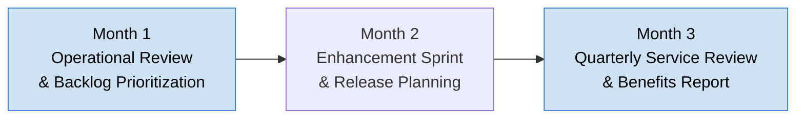

# Phase 5 Playbook: Operations & Continuous Improvement

**Document ID:** MPG-002-P5-OPERATE · **Version:** 1.0 · **Effective Date:** 2025-11-07  
**Owner:** Project Management Office (PMO) / Service Management Office  
**Applies To:** All solutions transitioning to steady-state operations under MPG-002

---

## Purpose & Scope

Phase 5 ensures solutions delivered in earlier phases remain stable, performant, compliant, and continue delivering business value through iterative enhancements. This playbook defines the activities, governance structures, and artifacts required to manage production operations, continuous improvement backlogs, and lifecycle management while aligning with organizational standards (`Standards.md`).

Phase 5 is considered ongoing and cyclical. Annual/quarterly reviews act as “mini-gates” to validate continued alignment and funding. A solution may exit Phase 5 when decommissioned or replaced.

---

## Outcome Summary

| Dimension                  | Target Outcome                                                                                                                                |
| -------------------------- | --------------------------------------------------------------------------------------------------------------------------------------------- |
| **Operational Stability**  | Service Level Objectives (SLOs) and Service Level Agreements (SLAs) consistently met with proactive monitoring and rapid incident resolution. |
| **Performance & Capacity** | Systems scale to meet demand; capacity plans updated; performance trends analyzed with corrective actions implemented.                        |
| **Security & Compliance**  | Controls maintained, audits passed, vulnerabilities remediated, and regulatory reporting up to date.                                          |
| **Value Realization**      | Benefits tracked against business cases; continuous improvement backlog prioritized based on ROI and user feedback.                           |
| **Lifecycle Governance**   | Release management, change control, and technical debt processes institutionalized with transparent dashboards and reviews.                   |

---

## Phase 5 Operating Rhythm

While Phase 5 is continuous, a representative quarterly cadence is shown below.

_Figure 1. Example quarterly rhythm: operate, improve, and review._

---

## Detailed Workflow & Procedures

### 1. Operational Handoff & Acceptance (Initial Phase 5 Entry)

**Objective:** Ensure operations formally accepts ownership with all documentation and access in place.

**Steps:**

1. Verify completion of Phase 4 exit checklist; review runbooks, monitoring, and support materials.
2. Conduct Operational Readiness Assessment (ORA) covering process alignment, tooling, staffing, and escalation pathways.
3. Obtain formal sign-off from Operations Manager and Support Manager acknowledging service ownership.
4. Update Configuration Management Database (CMDB) and service catalog entries.
5. Schedule initial post-transition review (30/60/90 days) to assess stabilization.

**Evidence Requirements:** ORA report, operations sign-off, CMDB update confirmation, 30/60/90 review plan.

### 2. Service Operations Management

**Objective:** Execute day-to-day operations adhering to ITSM practices.

**Steps:**

1. Manage incidents through ITSM platform with defined SLAs; ensure prioritization and escalations handled within governance.
2. Track service requests, changes, and releases; integrate with change advisory board (CAB) cycles.
3. Maintain knowledge articles; ensure updates after each incident/problem resolution.
4. Monitor service KPIs (availability, response time, ticket volumes) and publish dashboards.
5. Conduct weekly operations standups reviewing open incidents, problems, and maintenance windows.

**Evidence Requirements:** Incident reports, SLA performance dashboards, CAB minutes, knowledge base revisions.

### 3. Monitoring, Observability & Alerting

**Objective:** Proactively detect and resolve issues using observability tools.

**Steps:**

1. Maintain monitoring dashboards covering infrastructure, application, security, and business metrics.
2. Configure alert thresholds aligned with SLAs/SLOs; review noise vs. actionable alerts monthly.
3. Implement automated remediation scripts where feasible; document in runbooks.
4. Capture telemetry data in centralized logging/metrics platforms; enforce retention policies.
5. Review observability gaps quarterly; prioritize enhancements in continuous improvement backlog.

**Evidence Requirements:** Monitoring configuration exports, alert tuning logs, automated remediation scripts, quarterly observability review notes.

### 4. Incident, Problem & Change Management

**Objective:** Ensure structured response, root cause analysis, and controlled changes.

**Steps:**

1. Follow incident response playbooks; record timelines, mitigation steps, and communications.
2. Conduct root cause analysis (RCA) for major incidents; document corrective and preventive actions (CAPA).
3. Maintain problem records for recurring issues; track eradication plans.
4. Use CAB to approve planned changes; maintain emergency change process with retrospective review.
5. Update risk register with incident trends and unresolved problems.

**Evidence Requirements:** Incident postmortems, RCA reports, problem records, CAB decisions, updated risk register entries.

### 5. Capacity, Performance & Cost Optimization

**Objective:** Align resource utilization with demand and cost targets.

**Steps:**

1. Analyze capacity reports (compute, storage, network) monthly; forecast demand using historical data and business projections.
2. Execute scaling/cost optimization initiatives (reserved instances, autoscaling, archiving) with documented ROI.
3. Validate performance against SLIs; tune configurations or code as required.
4. Maintain architectural runway/backlog for technical improvements supporting performance goals.
5. Present quarterly capacity and cost review to Finance and Steering Committee.

**Evidence Requirements:** Capacity forecasts, optimization logs, SLI dashboards, cost reports, improvement backlog updates.

### 6. Continuous Improvement Backlog Management

**Objective:** Prioritize and deliver enhancements, technical debt, and user-driven improvements.

**Steps:**

1. Gather feedback from users, stakeholders, and support teams; log items in product/CI backlog.
2. Rank backlog using value, risk, effort, and compliance drivers; align with product roadmap.
3. Execute enhancement sprints or releases; integrate with change control and release calendar.
4. Track improvement metrics (cycle time, customer satisfaction, adoption rates).
5. Communicate enhancement outcomes via release notes and stakeholder forums.

**Evidence Requirements:** Backlog prioritization matrix, sprint plans, release notes, improvement metrics dashboards.

### 7. Benefits Realization & Reporting

**Objective:** Track expected benefits and inform leadership of value delivered.

**Steps:**

1. Define KPI dashboard aligned with original business case (revenue, cost savings, customer satisfaction, compliance).
2. Measure benefits at agreed intervals (monthly/quarterly); validate with Finance/business owners.
3. Document variances and root causes; adjust improvement roadmap accordingly.
4. Report to Steering Committee and PMO; highlight success stories and required interventions.
5. Update benefits realization register and archive evidence for audits.

**Evidence Requirements:** Benefits dashboards, finance validation emails, variance analysis reports, Steering Committee decks.

### 8. Security, Compliance & Audit Readiness

**Objective:** Maintain ongoing compliance with security policies and regulations.

**Steps:**

1. Schedule periodic vulnerability scans, penetration tests, and policy reviews; remediate findings per SLA.
2. Ensure access management reviews (user recertification) executed quarterly.
3. Maintain audit trail documentation for changes, incidents, and approvals.
4. Coordinate with compliance teams for regulatory reporting (SOX, GDPR, HIPAA, etc.).
5. Update compliance matrix and risk register with status of controls and remediation actions.

**Evidence Requirements:** Security reports, access review sign-offs, audit logs, compliance matrix updates, regulatory filing confirmations.

### 9. Knowledge Management & Training

**Objective:** Keep documentation current and teams skilled to operate the solution.

**Steps:**

1. Review runbooks, SOPs, and knowledge base articles after each incident or enhancement.
2. Conduct periodic training/refresher sessions for operations and support teams.
3. Maintain onboarding materials for new team members (roles, tools, access instructions).
4. Track training completion and effectiveness (assessments, surveys).
5. Encourage communities of practice to share lessons learned and optimization ideas.

**Evidence Requirements:** Updated documentation versions, training attendance logs, survey results, onboarding material repository.

### 10. Governance Reviews & Lifecycle Planning

**Objective:** Provide transparency to leadership and plan for future direction (scale, enhance, retire).

**Steps:**

1. Hold quarterly Service Review Board (SRB) meetings covering performance, risk, roadmap, and financials.
2. Maintain lifecycle roadmap including upcoming upgrades, sunset decisions, and investment proposals.
3. Align with portfolio management to secure funding for strategic enhancements or modernization initiatives.
4. Conduct annual strategic review assessing alignment with organizational objectives and technology standards.
5. Document outcomes, decisions, and action items in decision log and service strategy plan.

**Evidence Requirements:** SRB minutes, lifecycle roadmap, funding proposals, annual review report, decision log updates.

---

## Deliverable Specifications

| Deliverable                                | Purpose                                       | Required Contents                                                           | Format & Naming                                                                    | Approval                                                                          |
| ------------------------------------------ | --------------------------------------------- | --------------------------------------------------------------------------- | ---------------------------------------------------------------------------------- | --------------------------------------------------------------------------------- |
| **Operational Readiness Assessment (ORA)** | Document acceptance into operations.          | Checklist results, gaps, remediation plan, sign-offs.                       | `.pptx`/`.pdf`. Naming: `ProjectName_ORA_vYYYYMMDD.pdf`.                           | Prepared: PM; Approved: Operations Manager & Sponsor; Reviewed: PMO.              |
| **Service Catalog / CMDB Update**          | Maintain accurate service inventory.          | Service description, owners, dependencies, SLAs, CI relationships.          | ITSM export or `.xlsx`. Naming: `ProjectName_ServiceRecord_vYYYYMMDD.xlsx`.        | Prepared: Support Manager; Approved: Service Management Office.                   |
| **Operational Performance Dashboard**      | Provide visibility into SLAs/SLOs.            | Availability, incidents, response time, capacity trends, KPIs.              | BI dashboard (image/PDF export). Naming: `ProjectName_OpsDashboard_vYYYYMMDD.pdf`. | Prepared: Operations Analyst; Reviewed: PMO & Steering Committee.                 |
| **Incident & Problem Management Logs**     | Track issues and root causes.                 | Incident summaries, RCA reports, action items, status.                      | `.xlsx` or ITSM export. Naming: `ProjectName_IncidentLog_vYYYYMMDD.xlsx`.          | Prepared: Support Manager; Reviewed: QA Lead & PM.                                |
| **Continuous Improvement Backlog**         | Prioritize enhancements.                      | Item description, value, priority, status, owner, target release.           | `.xlsx` or backlog tool export. Naming: `ProjectName_CIBacklog_vYYYYMMDD.xlsx`.    | Prepared: Product Owner; Approved: Sponsor; Reviewed: PMO.                        |
| **Benefits Realization Report**            | Track business value.                         | KPI metrics, benefits narrative, variance analysis, actions.                | `.pptx`/`.pdf`. Naming: `ProjectName_BenefitsReport_Q#YYYY.pdf`.                   | Prepared: PM; Approved: Sponsor; Reviewed: Finance & PMO.                         |
| **Security & Compliance Evidence Pack**    | Prove adherence to controls.                  | Scan results, access reviews, audit logs, risk acceptances.                 | `.pdf` bundle. Naming: `ProjectName_SecurityCompliance_vYYYYMMDD.pdf`.             | Prepared: Security Lead; Approved: CISO/Compliance; Reviewed: PM.                 |
| **Service Review Board (SRB) Deck**        | Present quarterly performance and roadmap.    | KPI summary, risk/issue review, CI backlog status, decisions needed.        | `.pptx`. Naming: `ProjectName_SRB_Q#YYYY.pptx`.                                    | Prepared: PM/Operations Manager; Approved: Sponsor; Reviewed: Steering Committee. |
| **Annual Lifecycle Strategy Plan**         | Outline modernization and investment roadmap. | Architecture roadmap, upgrade plans, retirement timeline, investment needs. | `.pptx`/`.pdf`. Naming: `ProjectName_LifecyclePlan_FYYYYY.pdf`.                    | Prepared: Technical Lead & PM; Approved: Sponsor & Architecture Board.            |

**Document Control Notes:**

- Store Phase 5 artifacts under `/docs/phase-5/` with subfolders (`operations/`, `monitoring/`, `backlog/`, `governance/`, `compliance/`).
- Approval evidence archived in `/docs/approvals/phase-5/` referencing artifact IDs.
- Update the service README (Appendix H example) quarterly with artifact status, KPIs, and next review dates.

### Artifact Completion Tracker

| Artifact                       | Owner | Status (Draft / In Review / Approved) | Repository Path | Version | Approval Evidence Stored? | Next Review Date |
| ------------------------------ | ----- | ------------------------------------- | --------------- | ------- | ------------------------- | ---------------- |
| ORA & Operations Sign-off      |       |                                       |                 |         |                           |                  |
| Operational Dashboard          |       |                                       |                 |         |                           |                  |
| Incident/Problem Logs          |       |                                       |                 |         |                           |                  |
| Continuous Improvement Backlog |       |                                       |                 |         |                           |                  |
| Benefits Realization Report    |       |                                       |                 |         |                           |                  |
| Security & Compliance Evidence |       |                                       |                 |         |                           |                  |
| SRB Deck                       |       |                                       |                 |         |                           |                  |
| Lifecycle Strategy Plan        |       |                                       |                 |         |                           |                  |

Update tracker after each major review (monthly operations, quarterly SRB, annual lifecycle plan).

### Approval Evidence Requirements

- **Sign-offs:** Capture signed ORA, SRB approvals, and risk acceptances.
- **Meeting Minutes:** Save minutes for SRB, CAB, incident RCAs, and annual reviews.
- **Monitoring Screenshots:** Archive key dashboard snapshots monthly.
- **Audit Artifacts:** Store compliance evidence with retention tags per policy.

### Operations Checklist by Workstream

| Workstream             | Activity                                                       | Evidence Location           | Responsible Role           | Status |
| ---------------------- | -------------------------------------------------------------- | --------------------------- | -------------------------- | ------ |
| Service Operations     | Weekly incident/problem review completed.                      | `/docs/phase-5/operations/` | Support Manager            |        |
| Monitoring             | Alert tuning review and observability gap log updated monthly. | `/docs/phase-5/monitoring/` | DevOps Lead                |        |
| Continuous Improvement | Backlog prioritized and sprint/release plan published.         | `/docs/phase-5/backlog/`    | Product Owner              |        |
| Benefits Reporting     | Quarterly benefits report delivered to Steering Committee.     | `/docs/phase-5/governance/` | PM                         |        |
| Security & Compliance  | Vulnerability scan/patch cycle completed; evidence stored.     | `/docs/phase-5/compliance/` | Security Lead              |        |
| Training & Knowledge   | Knowledge base updated post-incident; training log current.    | `/docs/phase-5/knowledge/`  | Operations Enablement Lead |        |
| Lifecycle Planning     | Roadmap updated; modernization initiatives logged.             | `/docs/phase-5/governance/` | Technical Lead             |        |
| Financial Alignment    | Capacity/cost report reviewed with Finance.                    | `/docs/phase-5/finance/`    | PM & Finance Partner       |        |

Escalate overdue items at SRB and Steering Committee meetings.

### Continuous Improvement Guides

**Operational Dashboard**

- Include real-time and historical views; track SLA adherence, ticket backlog, mean time to detect (MTTD)/resolve (MTTR), and customer satisfaction (CSAT).
- Automate distribution to stakeholders (daily or weekly) with annotations for anomalies.

**Incident & RCA Documentation**

- Use standardized template capturing timeline, impact, root cause, corrective/preventive actions, lessons learned, and follow-up tasks.
- Share RCA with broader teams to prevent recurrence; integrate actions into backlog.

**Continuous Improvement Backlog**

- Categorize items (Enhancement, Technical Debt, Compliance, Optimization).
- Evaluate ROI and risk reduction; align with strategic themes.
- Maintain Kanban board for in-progress CI work; track cycle time.

**Benefits Management**

- Align metrics with SMART goals (Specific, Measurable, Achievable, Relevant, Time-bound).
- Use baseline vs. actual charts; highlight cumulative value realized and forecast.

**Lifecycle Strategy**

- Include technology currency (patch levels, support dates), vendor roadmaps, and emerging organizational standards.
- Evaluate retire/replace decisions with cost-benefit and risk analysis.

### Compliance & Naming Governance

- **SOC/SOC 2 Operational Controls:** Align monitoring, incident response, and change management with SOC/SOC 2 (or applicable frameworks). Document control owners and evidence (incident logs, change approvals, access reviews) in `/docs/phase-5/compliance/` using control identifiers for audit readiness.
- **Naming Harmony:** Continue using standardized naming conventions for dashboards, reports, and knowledge articles (e.g., `ProjectIdentifier_Report_vYYYYMMDD.pdf`). Embed naming checks into SRB agendas and PMO audits to keep repositories consistent.
- **Evidence Catalog:** Maintain an index mapping SOC/SOC 2 controls to Phase 5 artifacts (dashboards, RCA reports, access reviews) so audits are streamlined and gaps surfaced quickly.
- **Continuous Training:** Include compliance refresher training for operations/support teams in the training log; tie completion to governance reviews.
- **Documentation Review Cadence:** Schedule quarterly knowledge-base and runbook reviews to confirm procedures reflect current reality, naming standards, and compliance requirements. Record review results and action items in `/docs/phase-5/knowledge/review_log.xlsx`.

### SRE Metrics & Incident Practices

- **Error Budgets:** Define allowable downtime/incident budget aligned with SLOs (e.g., 99.9% availability = 43.2 min/month). Track consumption in the operational dashboard and pause feature releases when the budget is exhausted.
- **Toil Reduction Goals:** Measure toil (manual, repetitive, automatable work) percentage for operations teams; aim for ≤50% manual toil. Capture remediation tasks in the CI backlog.
- **Incident Severity Classification:** Use standardized SEV levels (SEV-1 critical outage, SEV-2 major degradation, etc.) with documented response timelines. Include severity and response time in incident logs.
- **Postmortem Standards:** All SEV-1/SEV-2 incidents require blameless postmortems within 5 business days, using the RCA template in Appendix B. Track action item closure with due dates and owners.
- **Observability KPIs:** Monitor mean time to detect (MTTD) and mean time to resolve (MTTR), alert false-positive rate, and on-call load (alerts per engineer per week). Surface metrics in SRB meetings and adjust alert tuning accordingly.

---

## Roles, Responsibilities & RACI (Phase 5 Focus)

| Activity                       | Executive Sponsor | Steering Committee | Service Owner (Operations Manager) | Project Manager (or Service Delivery Manager) | Product Owner | Technical Lead | QA Lead | Security Lead | Support Manager | Finance Partner | PMO Representative |
| ------------------------------ | ----------------- | ------------------ | ---------------------------------- | --------------------------------------------- | ------------- | -------------- | ------- | ------------- | --------------- | --------------- | ------------------ |
| Approve ORA & service handoff  | **A**             | C                  | **R**                              | **R**                                         | C             | C              | C       | C             | C               | I               | C                  |
| Manage incidents/problems      | I                 | I                  | **R/A**                            | C                                             | I             | C              | C       | C             | **R**           | I               | I                  |
| Maintain monitoring & alerts   | I                 | I                  | **R**                              | C                                             | I             | **R**          | I       | C             | C               | I               | I                  |
| Prioritize CI backlog          | C                 | C                  | C                                  | **R**                                         | **R/A**       | C              | C       | I             | I               | C               | C                  |
| Deliver benefits report        | **A**             | **R**              | C                                  | **R**                                         | C             | C              | C       | C             | C               | **R**           | **R**              |
| Security/compliance reviews    | C                 | C                  | C                                  | C                                             | I             | C              | C       | **R/A**       | I               | I               | C                  |
| Quarterly SRB review           | **A**             | **R**              | **R**                              | **R**                                         | C             | C              | C       | C             | C               | C               | **R**              |
| Lifecycle roadmap updates      | **A**             | **R**              | C                                  | **R**                                         | C             | **R**          | C       | C             | C               | C               | C                  |
| Change control (CAB) decisions | C                 | **R**              | **R**                              | C                                             | C             | C              | C       | C             | C               | I               | C                  |
| Annual strategic review        | **A**             | **R**              | C                                  | **R**                                         | C             | **R**          | C       | C             | C               | C               | **R**              |

Key: R = Responsible, A = Accountable, C = Consulted, I = Informed.

---

## Meeting & Collaboration Cadence (Phase 5)

| Meeting                               | Purpose                                                 | Participants                                                                  | Frequency                               | Inputs                                              | Outputs                                  |
| ------------------------------------- | ------------------------------------------------------- | ----------------------------------------------------------------------------- | --------------------------------------- | --------------------------------------------------- | ---------------------------------------- |
| Operations Standup                    | Review incidents, changes, maintenance plans.           | Operations Manager, Support Leads, DevOps, PM                                 | Weekly (or daily for critical services) | Incident/problem reports, change schedule           | Action items, mitigations, reminders     |
| CAB (Change Advisory Board)           | Approve/review changes and releases.                    | Change Manager, Operations, Dev, QA, Security                                 | Weekly/Biweekly                         | Change tickets, risk assessments                    | Approvals, deferrals, actions            |
| Continuous Improvement Prioritization | Evaluate backlog and select work for upcoming cycle.    | Product Owner, PM, Technical Lead, QA, Security                               | Monthly                                 | Backlog, benefits metrics, capacity                 | Prioritized backlog, sprint plan         |
| Monitoring & Observability Review     | Assess alerting effectiveness and gaps.                 | DevOps, Technical Lead, Operations, Security                                  | Monthly                                 | Dashboard metrics, alert logs                       | Tuning actions, observability backlog    |
| Quarterly Service Review Board (SRB)  | Present operational performance, risks, roadmap.        | Sponsor, Steering Committee, PM, Operations, Product Owner, Security, Finance | Quarterly                               | KPI dashboard, benefits report, risk log            | Decisions, funding approvals, directives |
| Benefits Realization Review           | Validate value delivery with business/finance.          | Sponsor, Business Owners, PM, Finance Partner                                 | Quarterly                               | Benefits report, variance analysis                  | Agreed action items, adjustments         |
| Annual Strategic Review               | Confirm alignment, plan modernization, budget requests. | Sponsor, Portfolio Management, PMO, Operations, Product Owner, Technical Lead | Annually                                | Lifecycle plan, market trends, investment proposals | Roadmap approval, investment decisions   |

---

## Risk & Control Considerations

**Common Phase 5 Risks**

1. **Operational Drift:** Procedures not updated, leading to inconsistent support. Mitigate through regular audits and documentation reviews.
2. **Technical Debt Accumulation:** Deferred maintenance causing outages. Maintain visible debt backlog with governance oversight.
3. **SLA Breaches:** Understaffed support or monitoring gaps. Track capacity, enforce on-call rotations, escalate to leadership early.
4. **Security Compliance Lapses:** Missed patches or access reviews. Automate reminders, integrate with security governance.
5. **Benefits Erosion:** Value not realized due to process or adoption gaps. Monitor metrics, invest in change management.
6. **Funding Constraints:** CI backlog stalled due to budget. Provide ROI analysis and align with portfolio planning.

**Control Activities**

- Quarterly audits of runbooks, monitoring configurations, and knowledge base.
- SLA/SLO thresholds with automated alerts to leadership when breached.
- Security patching calendar with compliance sign-off.
- Continuous improvement metrics (cycle time, adoption) tracked in dashboards.
- PMO oversight ensuring SRB meetings occur and actions closed.
- Finance partnership to validate cost optimization and budget adherence.

---

## Tooling & Configuration Requirements

| Tool / Platform                                        | Configuration Action                                               | Owner                     | Evidence                                              |
| ------------------------------------------------------ | ------------------------------------------------------------------ | ------------------------- | ----------------------------------------------------- |
| ITSM Platform (ServiceNow, Jira Service Management)    | Configure incident/problem/change workflows, SLAs, knowledge base. | Service Management Office | Workflow diagrams, SLA reports, knowledge base index. |
| Monitoring/Observability (Datadog, New Relic, Grafana) | Maintain dashboards, alerts, synthetic tests, capacity reports.    | DevOps Lead               | Dashboard exports, alert configuration snapshots.     |
| Log Management (Splunk, ELK)                           | Configure log ingestion, retention policies, correlation searches. | DevOps/Security           | Configuration files, retention policy documentation.  |
| APM/Tracing Tools (AppDynamics, OpenTelemetry)         | Instrument applications for tracing and root cause analysis.       | Technical Lead            | Instrumentation plan, sample trace reports.           |
| Automation/Runbook Tools (Ansible, Rundeck)            | Maintain scripts for deployment, remediation, maintenance.         | DevOps Lead               | Script repository, execution logs.                    |
| Analytics/BI Platforms (Power BI, Tableau)             | Publish operational KPIs and benefits dashboards.                  | Operations Analyst        | Dashboard link, refresh schedule.                     |
| Collaboration Tools (Confluence, SharePoint, Teams)    | Host runbooks, RCAs, training materials, decision logs.            | PM                        | Site structure, permissions report.                   |

---

## Checklists & Reviews

### A. Monthly Operations Checklist

- [ ] Incident SLA compliance ≥ target; breaches analyzed with RCA.
- [ ] Problem records updated; outstanding actions assigned.
- [ ] Monitoring alerts reviewed/tuned; false positives documented.
- [ ] Runbooks/knowledge articles updated for recent changes.
- [ ] Continuous improvement backlog prioritized; next sprint planned.
- [ ] Security patches applied; vulnerability scans reviewed.
- [ ] Benefits metrics captured; exceptions escalated.
- [ ] Financial/capacity report shared with Finance.

### B. Quarterly Service Review Checklist

- [ ] Operational KPIs vs. targets reviewed with Sponsor/Steering Committee.
- [ ] Major incidents & RCAs summarized; improvements tracked.
- [ ] CI backlog outcomes reported; next quarter roadmap approved.
- [ ] Compliance/audit status updated; upcoming obligations flagged.
- [ ] Budget/cost optimization progress reviewed.
- [ ] Customer satisfaction/feedback analyzed; actions assigned.
- [ ] Risk register refreshed; mitigation status validated.
- [ ] Decision log updated with approvals and strategic direction.

### C. Annual Strategic Review Checklist

- [ ] Lifecycle roadmap validated (upgrades, vendor end-of-support, retirements).
- [ ] Benefits realization compared to original business case; new targets set.
- [ ] Technology alignment with enterprise architecture confirmed.
- [ ] Funding requests for modernization/innovation approved.
- [ ] KPI targets adjusted for next fiscal year.
- [ ] Skills/training gaps identified and plans established.
- [ ] Data retention, security, and compliance policies reviewed.
- [ ] Decommissioning strategy evaluated if applicable.

---

## Templates & Samples

### Appendix A: Operational Readiness Assessment (ORA) Checklist (Excerpt)

| Domain         | Key Checks                                                                              |
| -------------- | --------------------------------------------------------------------------------------- |
| Documentation  | Runbooks complete, knowledge base articles published, architecture diagrams current.    |
| Monitoring     | Dashboards configured, alerts tuned, synthetic tests operational.                       |
| Access         | Support accounts provisioned, least privilege enforced, MFA enabled.                    |
| Support Model  | On-call schedule confirmed, escalation matrix defined, comms channels documented.       |
| Change Control | Release calendar integrated, CAB representation assigned, emergency process documented. |
| Training       | Support team trained, handoff workshop completed, competency gaps addressed.            |

### Appendix B: Incident RCA Template

| Section            | Description                                                   |
| ------------------ | ------------------------------------------------------------- |
| Summary            | Incident ID, impact, duration, business effect.               |
| Timeline           | Chronological events with timestamps and responsible parties. |
| Root Cause         | Technical/process root cause analysis.                        |
| Corrective Actions | Immediate fix applied.                                        |
| Preventive Actions | Long-term improvements with owners/dates.                     |
| Lessons Learned    | Key insights to share.                                        |
| Verification       | Evidence that actions completed and validated.                |

### Appendix C: Continuous Improvement Backlog Fields

| Field           | Description                                                     |
| --------------- | --------------------------------------------------------------- |
| Item ID         | `CI-YYYY-###`.                                                  |
| Title           | Short description of improvement/enhancement.                   |
| Category        | Enhancement, Technical Debt, Optimization, Compliance.          |
| Value Metric    | Expected benefit (e.g., cost savings, revenue, risk reduction). |
| Effort Estimate | Story points or effort hours.                                   |
| Priority        | Rank or scoring model output.                                   |
| Status          | Pipeline stage (Proposed, Approved, In Progress, Done).         |
| Target Release  | Planned release window/sprint.                                  |

### Appendix D: Benefits Realization Dashboard Metrics

| Metric            | Definition                                 | Source                     | Target               |
| ----------------- | ------------------------------------------ | -------------------------- | -------------------- |
| Revenue Impact    | Additional revenue attributed to solution. | Finance systems            | As per business case |
| Cost Savings      | Operational cost reduction.                | Finance/Operations         | As per business case |
| Productivity Gain | Time saved per user/task.                  | User surveys, time studies | % improvement target |
| User Satisfaction | CSAT/NPS for solution.                     | Surveys                    | ≥ target score       |
| Compliance Score  | % of controls passing audits.              | Compliance audits          | ≥ target             |

### Appendix E: SRB Agenda Template

| Section                         | Content                                       |
| ------------------------------- | --------------------------------------------- |
| Operational KPI Summary         | SLAs, SLOs, incident statistics.              |
| Major Incident Review           | RCAs, status of corrective actions.           |
| Continuous Improvement Outcomes | Enhancements delivered, backlog status.       |
| Upcoming Roadmap                | Next quarter initiatives, release schedule.   |
| Risks & Compliance              | Open risks, audit findings, mitigation plans. |
| Financial & Capacity            | Costs vs. budget, capacity forecasts.         |
| Decisions & Approvals Needed    | Funding, priority changes, policy updates.    |

### Appendix F: Phase 5 Artifact Status Table (Embed in README)

| Artifact                        | Owner              | Location                                              | Version   | Approval Status | Last Updated |
| ------------------------------- | ------------------ | ----------------------------------------------------- | --------- | --------------- | ------------ |
| Operational Dashboard (Current) | Operations Analyst | `/docs/phase-5/operations/dashboard_20251231.pdf`     | v20251231 | Approved        | 2025-12-31   |
| Incident Log                    | Support Manager    | `/docs/phase-5/operations/incident_log.xlsx`          | v20251230 | In Progress     | 2025-12-30   |
| CI Backlog                      | Product Owner      | `/docs/phase-5/backlog/ci_backlog.xlsx`               | v20250105 | Approved        | 2025-01-05   |
| Benefits Report                 | PM                 | `/docs/phase-5/governance/benefits_Q42025.pdf`        | v20250110 | Approved        | 2025-01-10   |
| Security Evidence Pack          | Security Lead      | `/docs/phase-5/compliance/security_pack_20250115.pdf` | v20250115 | Approved        | 2025-01-15   |
| Lifecycle Strategy Plan         | Technical Lead     | `/docs/phase-5/governance/lifecycle_plan_FY2026.pdf`  | v20250201 | Draft           | 2025-02-01   |

### Appendix G: Lifecycle Compliance Matrix

| Control Area              | Framework References                   | Phase 1                               | Phase 2                                 | Phase 3                                 | Phase 4                             | Phase 5                                   | Phase 6                                      | Notes                                            |
| ------------------------- | -------------------------------------- | ------------------------------------- | --------------------------------------- | --------------------------------------- | ----------------------------------- | ----------------------------------------- | -------------------------------------------- | ------------------------------------------------ |
| Governance & Leadership   | SOC/SOC 2 CC1, ISO 27001 A.5           | RACI, charter, escalation SLAs        | Requirements governance, review cadence | Sprint reviews, ADR approvals           | Go/No-Go approvals, segregation     | SRB oversight, scorecards                 | Retirement approvals                         | Maintain decision log links                      |
| Change Management         | ITIL Change, ISO 20000, SOC/SOC 2 CC8  | Governance plan, change policy        | Impact/CI backlog alignment             | Branching rules, code reviews           | Release calendar, emergency changes | CAB cycle, change KPIs                    | Decommission change tickets                  | Evidence stored under `/docs/*/compliance/`      |
| Secure Development        | SOC/SOC 2 CC7, OWASP Top 10, ISO 27034 | N/A                                   | Privacy & accessibility requirements    | DRY, SOLID, static/dynamic scans        | Security/penetration results        | Vulnerability management, access reviews  | Data destruction & revocation                | Update control IDs quarterly                     |
| Data Protection & Privacy | GDPR, HIPAA, SOC/SOC 2 P               | Data classification, consent strategy | Privacy-by-design traceability          | Encryption practices, data minimization | Masking in UAT, privacy testing     | Retention enforcement, audits             | Disposition certificates, archive validation | Coordinate with Data Governance lead             |
| Operations & Monitoring   | SOC/SOC 2 A, ITIL Ops, SRE             | Escalation SLAs defined               | Monitoring requirements captured        | CI logging, telemetry instrumentation   | Post-release monitoring/hypercare   | SLO dashboard, incident/problem mgmt      | Post-retirement monitoring                   | Review during SRB and annual audits              |
| Documentation & Naming    | Internal policy, ISO 9001              | Naming rubric, onboarding packs       | Documentation style guide               | Coding/document naming checks           | Release artifact naming             | Quarterly knowledge review, naming audits | Archive naming compliance                    | Scorecard tracked in `/docs/phase-5/governance/` |

Update the matrix after each major release, audit, or annual review to ensure evidence is current. Highlight gaps and assign remediation actions in the SRB minutes.

---

## Glossary of Phase 5 Terms

- **Service Owner:** Role accountable for overall performance and improvement of the live service.
- **Operational Readiness Assessment (ORA):** Evaluation confirming operations can support the solution.
- **SLA/SLO/SLI:** Agreement, objective, and indicator for service performance.
- **CAB (Change Advisory Board):** Governance body approving significant changes.
- **MTTD/MTTR:** Mean time to detect/resolve incidents.
- **CI (Continuous Improvement) Backlog:** Prioritized list of enhancements and optimizations.
- **SRB (Service Review Board):** Quarterly governance meeting overseeing operations.
- **RCA:** Root cause analysis for major incidents.
- **Technical Debt:** Accumulated suboptimal design/code increasing maintenance cost.
- **Lifecycle Roadmap:** Plan for upgrades, modernization, and eventual decommissioning.

## Acronyms and Abbreviations

- **ADR:** Architecture Decision Record - Document capturing design choices and rationale
- **APM:** Application Performance Monitoring - Technology for monitoring application performance
- **BA:** Business Analyst - Role responsible for requirements gathering and analysis
- **BRF-020:** Benefits Realization Framework document identifier
- **CAB:** Change Advisory Board - Governance body approving significant changes
- **CAPA:** Corrective and Preventive Actions - Process for addressing non-conformities
- **CI:** Continuous Improvement - Ongoing effort to improve products, services, or processes
- **CI/CD:** Continuous Integration/Continuous Delivery - Automated pipeline for build, test, and deployment
- **CMDB:** Configuration Management Database - Repository of IT assets and their relationships
- **CSAT:** Customer Satisfaction - Metric measuring customer satisfaction levels
- **DAST:** Dynamic Application Security Testing - Security testing performed on running applications
- **GDPR:** General Data Protection Regulation - European Union data protection and privacy regulation
- **HIPAA:** Health Insurance Portability and Accountability Act - U.S. healthcare data protection regulation
- **IAM:** Identity and Access Management - Framework for managing user identities and access
- **ISO 20000:** International standard for IT service management
- **ISO 27001:** International standard for information security management systems
- **ITSM:** IT Service Management - Framework for managing IT services
- **ITSM-001:** IT Service Management Policy document identifier
- **ITSM-INC-005:** Incident & Problem Management Procedures document identifier
- **KPI:** Key Performance Indicator - Measurable value demonstrating effectiveness
- **MPG-002:** Master Project Governance standard document identifier
- **MTTD:** Mean Time to Detect - Average time to identify an incident
- **MTTR:** Mean Time to Resolve - Average time to resolve an incident
- **NIST CSF:** National Institute of Standards and Technology Cybersecurity Framework - U.S. cybersecurity framework
- **NPS:** Net Promoter Score - Metric measuring customer loyalty and satisfaction
- **OBS-010:** Observability & Monitoring Standards document identifier
- **ORA:** Operational Readiness Assessment - Evaluation confirming operations can support the solution
- **OWASP:** Open Web Application Security Project - Non-profit organization focused on web application security
- **PCI DSS:** Payment Card Industry Data Security Standard - Security standard for payment card data
- **PM:** Project Manager - Role responsible for project coordination and delivery
- **PMO:** Project Management Office - Organizational unit ensuring adherence to standards and methodologies
- **QA:** Quality Assurance - Process ensuring products meet quality standards
- **RCA:** Root Cause Analysis - Process for identifying underlying causes of problems
- **ROI:** Return on Investment - Measure of profitability or efficiency
- **SAST/DAST:** Static Application Security Testing / Dynamic Application Security Testing - Security testing methodologies
- **SDLC:** Software Development Life Cycle - Process for planning, creating, testing, and deploying software
- **SEC-030:** Security Operations Handbook document identifier
- **SEV:** Severity - Classification level for incidents (e.g., SEV-1 critical, SEV-2 major)
- **SIEM:** Security Information and Event Management - Technology for security monitoring
- **SLA:** Service Level Agreement - Contractual commitment to service performance levels
- **SLI:** Service Level Indicator - Specific metric used to measure service performance
- **SLO:** Service Level Objective - Target metric for service performance
- **SOC/SOC 2:** System and Organization Controls - Framework for security, availability, and confidentiality controls
- **SOX 404:** Sarbanes-Oxley Act Section 404 - U.S. financial reporting and internal controls regulation
- **SRB:** Service Review Board - Quarterly governance meeting overseeing operations
- **SRE:** Site Reliability Engineering - Discipline combining software engineering and operations
- **UAT:** User Acceptance Testing - Testing performed by end users to validate business requirements
- **WCAG 2.1:** Web Content Accessibility Guidelines 2.1 - International standard for web accessibility

---

## References

1. MPG-002 Standard (`Standards.md`) – Master Project Governance & SDLC.
2. IT Service Management Policy (ITSM-001).
3. Incident & Problem Management Procedures (ITSM-INC-005).
4. Observability & Monitoring Standards (OBS-010).
5. Security Operations Handbook (SEC-030).
6. Benefits Realization Framework (BRF-020).

---

**Document History**

| Version | Date       | Author                 | Reviewer     | Approver          | Notes                                 |
| ------- | ---------- | ---------------------- | ------------ | ----------------- | ------------------------------------- |
| 1.0     | 2025-11-07 | PMO Documentation Lead | PMO Director | Executive Sponsor | Initial release for Phase 5 guidance. |
