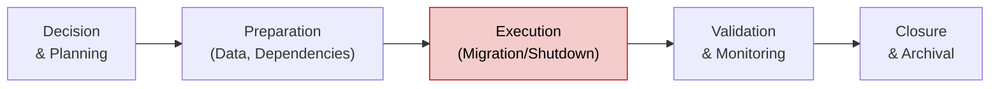

# Phase 6 Playbook: Retirement & Decommissioning

**Document ID:** MPG-002-P6-RETIRE · **Version:** 1.0 · **Effective Date:** 2025-11-07  
**Owner:** Project Management Office (PMO) / Enterprise Architecture  
**Applies To:** All solutions entering retirement under MPG-002

---

## Purpose & Scope

Phase 6 governs the orderly retirement, decommissioning, and archival of systems/processes that have reached end-of-life or are being replaced. The playbook ensures data retention, regulatory compliance, cost optimization, and knowledge capture while minimizing disruption to dependent services. This phase concludes the solution lifecycle defined in `Standards.md` and transitions responsibilities to portfolio/archive management.

A project enters Phase 6 when a retirement decision is approved by governance (Steering Committee, Portfolio Board, or Architecture Board). The phase ends once all decommission activities, data archiving, and contractual obligations are fulfilled.

---

## Outcome Summary

| Dimension                     | Target Outcome                                                                                                                           |
| ----------------------------- | ---------------------------------------------------------------------------------------------------------------------------------------- |
| **Retirement Authorization**  | Formal approval with documented rationale, customer impact assessment, and funding for decommission activities.                          |
| **Data & Compliance**         | Data retained, migrated, or destroyed in accordance with legal, regulatory, and corporate policies; audit evidence available.            |
| **Operational Transition**    | Dependent services updated; support teams notified; users guided to replacement processes or alternatives.                               |
| **Technical Decommissioning** | Infrastructure deprovisioned, integrations removed, monitoring disabled, and costs eliminated with no unintended downstream effects.     |
| **Knowledge Preservation**    | Lessons learned captured; documentation archived; metrics reported on cost savings, risk reduction, and benefits realized by retirement. |

---

## Phase 6 Timeline Overview

Most retirements run **6–12 weeks**, though legacy migrations may take longer. Stages:

_Figure 1. Typical retirement phases from decision through archival._

---

## Detailed Workflow & Procedures

### 1. Retirement Initiation & Planning

**Objective:** Secure approvals and establish retirement plan.

**Steps:**

1. Prepare Retirement Business Case covering drivers (cost, risk, redundancy), stakeholders, replacement solution, and timeline.
2. Submit to Steering Committee/Portfolio Board for approval; capture decision in decision log.
3. Establish decommission team (PM, Product Owner, Technical Lead, Security, Legal, Finance, Operations).
4. Develop Retirement Plan detailing scope, dependencies, data disposition, communication strategy, budget.
5. Create risk register specific to retirement and align with organizational risk appetite.

**Evidence Requirements:** Approved retirement business case, governance minutes, retirement plan, retirement risk register.

### 2. Impact & Dependency Analysis

**Objective:** Identify systems, data flows, contracts, and users impacted.

**Steps:**

1. Review architecture diagrams, CMDB, integration catalogs to map dependencies (upstream/downstream, APIs, data feeds).
2. Engage stakeholders to validate usage (business processes, reports, integrations, partners).
3. Identify contractual obligations (vendor, customer SLAs) requiring notifications or amendments.
4. Document replacement solutions or alternative processes; create gap mitigation plan.
5. Update dependency register and include in communications/training plans.

**Evidence Requirements:** Dependency analysis report, stakeholder mapping, updated CMDB, contractual notification log.

### 3. Data Retention, Migration & Disposal Planning

**Objective:** Ensure data is handled per policy.

**Steps:**

1. Classify data (sensitive, personal, regulated) and map to retention/destruction policies.
2. Determine migration targets (data warehouse, replacement system) or archival storage.
3. Document data migration scripts, test plans, validation criteria, and disposal procedures.
4. Obtain approvals from Legal, Compliance, and Data Governance for retention/disposal approach.
5. Schedule migration/disposal activities with clear rollback contingencies.

**Evidence Requirements:** Data disposition plan, migration scripts/tests, approvals from Legal/Compliance, audit-ready logs.

### 4. Technical Decommissioning Execution

**Objective:** Shut down infrastructure and services safely.

**Steps:**

1. Create decommission checklist covering infrastructure (servers, VMs, containers), network (DNS, firewalls), storage, monitoring, backups.
2. Implement change tickets with CAB approval; coordinate windows to minimize business disruption.
3. Execute steps (disable access, stop services, remove integrations, deprovision resources, update documentation).
4. Validate success via monitoring (no traffic/errors), automated checks, or manual verification.
5. Release or repurpose assets; update cost center budgets.

**Evidence Requirements:** Decommission checklist, change tickets, execution logs, verification results, cost savings report.

### 5. Communications & Change Management

**Objective:** Keep users, partners, and support teams informed.

**Steps:**

1. Develop communications plan specifying audiences, messages, channels, cadence, and support contacts.
2. Provide retirement notices, instructions for alternative processes, and timelines.
3. Update training materials, FAQs, knowledge base entries to reflect replacement solutions.
4. Monitor feedback channels/hypercare to address concerns.
5. Confirm completion of communications with evidence (email delivery reports, intranet analytics).

**Evidence Requirements:** Communications plan, sample communications, knowledge updates, feedback log.

### 6. Security, Compliance & Legal Sign-off

**Objective:** Confirm security posture and regulatory requirements are met post-retirement.

**Steps:**

1. Perform final vulnerability scans (ensuring no residual exposure) before shutdown.
2. Remove system accounts, API keys, certificates; revoke access in IAM systems.
3. Capture evidence of data destruction or archival (certificates of destruction, storage references).
4. Update compliance matrix and audit logs; coordinate final reports to regulators if required.
5. Obtain formal sign-off from Security, Legal, and Compliance leads.

**Evidence Requirements:** Final scan reports, access revocation logs, destruction certificates, compliance sign-off forms.

### 7. Financial & Contractual Closure

**Objective:** Realize cost savings and terminate obligations.

**Steps:**

1. Identify contracts/licensing/subscriptions to terminate or downsize; coordinate with Procurement.
2. Update budgets, cost center allocations, and chargeback models with decommission savings.
3. Ensure invoices, penalties, or termination fees handled and documented.
4. Produce cost-benefit report summarizing savings vs. retirement investment.
5. Archive financial records in accordance with accounting retention policies.

**Evidence Requirements:** Contract termination confirmations, financial adjustments, savings report, procurement approvals.

### 8. Validation, Monitoring & Hypercare (Post-Retirement)

**Objective:** Confirm retired system remains inactive and no regressions occur.

**Steps:**

1. Monitor dependent systems to detect unexpected failures or data gaps.
2. Maintain short hypercare period (e.g., 2 weeks) with on-call contacts for fallback support.
3. Validate data archive accessibility and integrity tests.
4. Conduct user feedback surveys to ensure smooth transition.
5. Close hypercare when KPIs stable and no incidents occur for defined period.

**Evidence Requirements:** Monitoring reports, hypercare incident log, archive validation results, survey feedback.

### 9. Lessons Learned & Knowledge Archive

**Objective:** Preserve institutional knowledge for future retirements.

**Steps:**

1. Conduct post-retirement review capturing successes, issues, recommendations.
2. Update retirement playbooks/templates based on lessons learned.
3. Archive project documentation (charter, requirements, design, deployment, retirement) in records management system.
4. Tag archived artifacts with metadata (solution name, retirement date, data retention schedule).
5. Provide summary to PMO and Architecture for portfolio knowledge base.

**Evidence Requirements:** Lessons learned report, updated templates, archive inventory list, PMO acknowledgement.

### 10. Closure & Portfolio Update

**Objective:** Finalize lifecycle records and update enterprise dashboards.

**Steps:**

1. Update portfolio inventory marking system status as Retired (with effective date).
2. Remove retired system from operational dashboards, monitoring, and support runbooks.
3. Submit closure report including KPIs, financial outcomes, and compliance evidence to Steering Committee.
4. Notify Finance, Security, and PMO that retirement activities are complete.
5. Transition ownership of archived assets to Records Management or Knowledge Management teams.

**Evidence Requirements:** Portfolio update confirmation, closure report, final approvals, archival hand-off documentation.

---

## Deliverable Specifications

| Deliverable                                     | Purpose                                          | Required Contents                                                                          | Format & Naming                                                            | Approval                                                                       |
| ----------------------------------------------- | ------------------------------------------------ | ------------------------------------------------------------------------------------------ | -------------------------------------------------------------------------- | ------------------------------------------------------------------------------ |
| **Retirement Plan & Business Case**             | Formalize decision and roadmap.                  | Drivers, scope, dependencies, timeline, budget, risk analysis, approval signatures.        | `.pptx`/`.pdf`. Naming: `ProjectName_RetirementPlan_vYYYYMMDD.pdf`.        | Prepared: PM; Approved: Sponsor & Steering Committee; Reviewed: PMO.           |
| **Dependency & Impact Assessment**              | Document system/process impacts.                 | Data flows, integrations, stakeholders, replacements, mitigation actions.                  | `.xlsx`/`.pdf`. Naming: `ProjectName_DependencyAssessment_vYYYYMMDD.xlsx`. | Prepared: Technical Lead; Approved: Architecture Board; Reviewed: PM.          |
| **Data Disposition Plan**                       | Define migration/archival/destruction approach.  | Data inventory, retention requirements, migration targets, destruction methods, approvals. | `.docx`. Naming: `ProjectName_DataDisposition_vYYYYMMDD.docx`.             | Prepared: Data Governance Lead; Approved: Legal/Compliance; Reviewed: PM.      |
| **Decommission Checklist & Execution Logs**     | Track technical shutdown tasks.                  | Checklist items, owners, timestamps, verification evidence.                                | `.xlsx`. Naming: `ProjectName_DecomChecklist_vYYYYMMDD.xlsx`.              | Prepared: DevOps Lead; Approved: Operations Manager; Reviewed: PM.             |
| **Communications & Training Packet**            | Inform stakeholders and guide transitions.       | Communication plan, FAQs, training materials, notification records.                        | `.pdf`/`.zip`. Naming: `ProjectName_RetirementComms_vYYYYMMDD.zip`.        | Prepared: Change Mgmt Lead; Approved: Sponsor; Reviewed: PMO Comms.            |
| **Security/Compliance Closure Pack**            | Provide audit evidence.                          | Access revocation logs, destruction certificates, compliance matrix updates, sign-offs.    | `.pdf`. Naming: `ProjectName_ComplianceClosure_vYYYYMMDD.pdf`.             | Prepared: Security Lead; Approved: CISO/Legal; Reviewed: PM.                   |
| **Financial Closure Report**                    | Document cost savings and contract terminations. | Contract status, cost changes, savings vs. plan, financial approvals.                      | `.pdf`. Naming: `ProjectName_FinancialClosure_vYYYYMMDD.pdf`.              | Prepared: PM/Finance Partner; Approved: Sponsor; Reviewed: Finance Controller. |
| **Retirement Closure & Lessons Learned Report** | Capture final outcomes and knowledge.            | Summary of activities, KPIs, issues, lessons, recommendations, next steps.                 | `.pptx`/`.pdf`. Naming: `ProjectName_RetirementClosure_vYYYYMMDD.pdf`.     | Prepared: PM; Approved: Sponsor & Architecture Board; Reviewed: PMO.           |

**Document Control Notes:**

- Store Phase 6 artifacts under `/docs/phase-6/` with subfolders (`planning/`, `data/`, `decommission/`, `communications/`, `compliance/`, `closure/`).
- Approvals and evidence go in `/docs/approvals/phase-6/` linked via README.
- After closure, archive documentation per records retention policy (typically 7–10 years, depending on regulation).

### Artifact Completion Tracker

| Artifact                        | Owner | Status (Draft / In Review / Approved) | Repository Path | Version | Approval Evidence Stored? | Planned Completion |
| ------------------------------- | ----- | ------------------------------------- | --------------- | ------- | ------------------------- | ------------------ |
| Retirement Plan & Business Case |       |                                       |                 |         |                           |                    |
| Dependency Assessment           |       |                                       |                 |         |                           |                    |
| Data Disposition Plan           |       |                                       |                 |         |                           |                    |
| Decommission Checklist/Logs     |       |                                       |                 |         |                           |                    |
| Communications Packet           |       |                                       |                 |         |                           |                    |
| Compliance Closure Pack         |       |                                       |                 |         |                           |                    |
| Financial Closure Report        |       |                                       |                 |         |                           |                    |
| Retirement Closure Report       |       |                                       |                 |         |                           |                    |

Update tracker at each governance checkpoint (plan approval, execution start, closure).

### Approval Evidence Requirements

- **Decision Log Entries:** Retirement approvals, change freezes, risk acceptances.
- **Signed Certificates:** Data destruction, contract termination confirmations.
- **Change Tickets:** Completed decommission change tickets with CAB approval.
- **Audit Trail:** Timestamped logs for data migration, system shutdown, access removal.

### Decommissioning Checklist by Workstream

| Workstream     | Activity                                             | Evidence Location               | Responsible Role       | Status |
| -------------- | ---------------------------------------------------- | ------------------------------- | ---------------------- | ------ |
| Planning       | Retirement plan approved; budget secured.            | `/docs/phase-6/planning/`       | PM                     |        |
| Dependencies   | Impact analysis validated by stakeholders.           | `/docs/phase-6/planning/`       | Technical Lead         |        |
| Data           | Migration/disposition executed; validation complete. | `/docs/phase-6/data/`           | Data Governance Lead   |        |
| Technical      | Infrastructure decommissioned; integrations removed. | `/docs/phase-6/decommission/`   | DevOps Lead            |        |
| Communications | Notifications delivered; knowledge base updated.     | `/docs/phase-6/communications/` | Change Mgmt Lead       |        |
| Compliance     | Security checks complete; legal sign-off obtained.   | `/docs/phase-6/compliance/`     | Security & Legal Leads |        |
| Finance        | Contracts closed; savings report approved.           | `/docs/phase-6/finance/`        | Finance Partner        |        |
| Closure        | Lessons learned captured; portfolio updated.         | `/docs/phase-6/closure/`        | PMO                    |        |

---

## Roles, Responsibilities & RACI (Phase 6 Focus)

| Activity                       | Executive Sponsor | Steering Committee / Portfolio Board | Project Manager | Product Owner | Technical Lead | Data Governance Lead | Security Lead | Legal/Compliance | DevOps Lead | Operations Manager | Finance Partner | PMO Representative |
| ------------------------------ | ----------------- | ------------------------------------ | --------------- | ------------- | -------------- | -------------------- | ------------- | ---------------- | ----------- | ------------------ | --------------- | ------------------ |
| Approve retirement plan        | **A**             | **R**                                | **R**           | C             | C              | C                    | C             | C                | C           | C                  | C               | **R**              |
| Conduct dependency analysis    | C                 | C                                    | **R**           | C             | **R**          | C                    | C             | C                | C           | C                  | I               | C                  |
| Execute data disposition       | I                 | I                                    | C               | C             | C              | **R/A**              | C             | **R**            | C           | C                  | I               | C                  |
| Perform technical decommission | I                 | I                                    | C               | C             | **R**          | I                    | C             | I                | **R/A**     | **R**              | I               | C                  |
| Manage communications          | **A**             | C                                    | **R**           | **R**         | C              | C                    | C             | C                | C           | **R**              | I               | C                  |
| Security/compliance sign-off   | **A**             | C                                    | **R**           | C             | C              | C                    | **R/A**       | **R/A**          | C           | C                  | I               | C                  |
| Financial closure              | **A**             | C                                    | **R**           | C             | C              | I                    | I             | I                | C           | C                  | **R/A**         | C                  |
| Lessons learned & closure      | **A**             | **R**                                | **R**           | **R**         | C              | C                    | C             | C                | C           | C                  | C               | **R**              |

Key: R = Responsible, A = Accountable, C = Consulted, I = Informed.

---

## Meeting & Collaboration Cadence (Phase 6)

| Meeting                          | Purpose                                    | Participants                                                               | Frequency               | Inputs                                | Outputs                                |
| -------------------------------- | ------------------------------------------ | -------------------------------------------------------------------------- | ----------------------- | ------------------------------------- | -------------------------------------- |
| Retirement Kick-off              | Align stakeholders on plan and roles.      | Sponsor, PM, Product Owner, Technical Lead, Data, Security, Legal, Finance | Once at initiation      | Retirement plan draft                 | Action items, confirmed timeline       |
| Dependency Review Workshop       | Validate integration and process impacts.  | Technical, Product, Operations, Architects                                 | Once (early)            | Dependency matrix                     | Updated dependency log                 |
| Decommission Change Review (CAB) | Approve infrastructure changes/shutdown.   | CAB members, PM, DevOps, Security                                          | Weekly during execution | Change tickets, risk assessments      | Approved/rejected changes              |
| Data Migration Validation        | Confirm migration/disposal results.        | Data Governance, QA, Security                                              | As needed               | Migration reports, validation scripts | Sign-offs, defect list                 |
| Communications Checkpoint        | Review messaging, user readiness.          | Change Mgmt, Product Owner, PM, Operations                                 | Biweekly                | Comms plan, feedback log              | Updates to plan, next actions          |
| Compliance & Audit Review        | Ensure regulatory requirements met.        | Security, Legal, Compliance, PM                                            | Biweekly                | Compliance matrix, evidence           | Sign-offs, remediation actions         |
| Closure Review                   | Present results, lessons, final approvals. | Sponsor, Steering Committee, PMO, Teams                                    | Once (end)              | Closure report, evidence pack         | Closure decision, archive instructions |

---

## Risk & Control Considerations

**Common Phase 6 Risks**

1. **Hidden Dependencies:** Unidentified integrations causing failures. Mitigate with thorough discovery and stakeholder validation.
2. **Data Loss/Unauthorized Exposure:** Mishandled data disposal. Enforce approved methods, logging, and dual controls.
3. **Regulatory Non-Compliance:** Failure to retain/destroy data as required. Engage Legal/Data Governance early.
4. **Cost Overruns:** Unexpected migration or decommission costs. Budget with contingency, track expenditures closely.
5. **User Disruption:** Inadequate communication leading to business process gaps. Plan communications/training early and monitor feedback.
6. **Security Gaps Post-Shutdown:** Residual accounts or configs left active. Execute access revocation checklists and re-scan environment.

**Control Activities**

- Dual authorization for data destruction and system shutdown steps.
- CAB approvals for all decommission changes.
- Compliance sign-offs before final closure (Legal, Security, Finance).
- Post-implementation review to capture lessons and confirm success metrics.
- PMO audit of documentation, evidence, and approvals before archiving.

---

## Tooling & Configuration Requirements

| Tool / Platform                                 | Configuration Action                                              | Owner                     | Evidence                               |
| ----------------------------------------------- | ----------------------------------------------------------------- | ------------------------- | -------------------------------------- |
| CMDB / Service Catalog                          | Update status to "Retired", remove active dependencies.           | Service Management Office | CMDB export, change log.               |
| ITSM Tool                                       | Track retirement change tickets, incidents, communications tasks. | PM / Change Manager       | Ticket reports, CAB approvals.         |
| Data Migration Tooling (ETL, SQL scripts)       | Execute migration/disposal with logging and validation.           | Data Governance Lead      | Migration logs, validation reports.    |
| Security Tools (SIEM, IAM)                      | Remove accounts, disable monitoring alerts, confirm zero traffic. | Security Lead             | Access logs, SIEM reports.             |
| Financial Systems                               | Update budgets, cost centers, depreciation schedules.             | Finance Partner           | Financial adjustment reports.          |
| Knowledge Repositories (SharePoint, Confluence) | Archive documentation, tag with retention metadata.               | PM / PMO                  | Archive index, retention confirmation. |

---

## Checklists & Reviews

### A. Retirement Plan Approval Checklist

- [ ] Business case approved; replacement solution identified.
- [ ] Budget/funding secured; resource plan in place.
- [ ] Risk register created with owners.
- [ ] Dependency analysis completed and validated.
- [ ] Communications strategy drafted.
- [ ] Legal, Security, Data Governance consulted.

### B. Data Disposition Checklist

- [ ] Data inventory validated; classification confirmed.
- [ ] Migration scripts tested and signed off.
- [ ] Archival storage reviewed and approved.
- [ ] Destruction schedule documented with responsible parties.
- [ ] Legal/Compliance approval recorded.
- [ ] Post-migration validation executed; results archived.

### C. Technical Decommission Checklist

- [ ] Change tickets submitted and CAB-approved.
- [ ] Access revoked for users, service accounts, and integrations.
- [ ] Infrastructure components shut down and removed.
- [ ] Monitoring/alerts disabled or reconfigured.
- [ ] Backup/DR procedures updated or retired.
- [ ] Verification results documented (no residual traffic/errors).

### D. Closure Checklist

- [ ] Hypercare period completed without incidents.
- [ ] All documentation archived with retention tags.
- [ ] Financial savings report delivered and approved.
- [ ] Security/compliance sign-offs stored with evidence.
- [ ] Portfolio inventory updated to "Retired" status.
- [ ] Lessons learned session held; actions assigned.

---

## Templates & Samples

### Appendix A: Retirement Plan Outline

1. Executive Summary (rationale, objectives, timeline).
2. Stakeholder & Dependency Overview.
3. Data Disposition Strategy.
4. Technical Decommission Approach.
5. Communications & Change Management.
6. Risk & Mitigation Plan.
7. Budget & Resource Plan.
8. Approval Signatures.

### Appendix B: Decommission Checklist (Excerpt)

| Step                          | Description                                           | Owner                  | Status | Timestamp |
| ----------------------------- | ----------------------------------------------------- | ---------------------- | ------ | --------- |
| Disable user access           | Remove user roles and API keys.                       | IAM Admin              |        |           |
| Shut down application servers | Power off VMs/containers, remove auto-scaling groups. | DevOps Lead            |        |           |
| Remove DNS entries            | Delete DNS records, update load balancers.            | Network Engineer       |        |           |
| Stop data feeds               | Terminate ETL jobs, API integrations.                 | Data Engineer          |        |           |
| Update monitoring             | Disable dashboards/alerts, confirm zero traffic.      | Observability Engineer |        |           |
| Archive documentation         | Move docs to records repository with tags.            | PM                     |        |           |

### Appendix C: Data Disposition Log Fields

| Field               | Description                                                    |
| ------------------- | -------------------------------------------------------------- |
| Dataset ID          | Unique identifier for dataset.                                 |
| Classification      | Sensitivity level (Public, Internal, Confidential, Regulated). |
| Disposition Type    | Migration, Archival, Destruction.                              |
| Target Location     | Destination system or storage.                                 |
| Approval Reference  | Legal/Compliance approval ID.                                  |
| Execution Date      | Date disposition completed.                                    |
| Verification Result | Pass/Fail with notes.                                          |

### Appendix D: Communications Matrix

| Audience         | Message                                   | Channel            | Timing    | Owner           | Status      |
| ---------------- | ----------------------------------------- | ------------------ | --------- | --------------- | ----------- |
| All Users        | Retirement announcement & timeline.       | Email/Intranet     | T-60 days | PMO Comms       | Scheduled   |
| Key Stakeholders | Alternative process instructions.         | Workshops/Meetings | T-45 days | Product Owner   | Scheduled   |
| Support Teams    | Support process changes, runbook updates. | Training session   | T-30 days | Support Manager | In Progress |
| Executives       | Benefits & savings update.                | Executive briefing | T-10 days | PM              | Planned     |

### Appendix E: Retirement Closure Report Outline

1. Background & Objectives.
2. Activities Completed (data, technical, communications).
3. Metrics (cost savings, risk reduction, incidents).
4. Compliance & Audit Evidence summary.
5. Lessons Learned & Recommendations.
6. Final Approvals.

### Appendix F: Artifact Status Table (Embed in README)

| Artifact                 | Owner                | Location                                               | Version   | Approval Status | Last Updated |
| ------------------------ | -------------------- | ------------------------------------------------------ | --------- | --------------- | ------------ |
| Retirement Plan          | PM                   | `/docs/phase-6/planning/retirement_plan_v20251110.pdf` | v20251110 | Approved        | 2025-11-10   |
| Data Disposition Plan    | Data Governance Lead | `/docs/phase-6/data/disposition_plan_v20251115.docx`   | v20251115 | Approved        | 2025-11-15   |
| Decommission Checklist   | DevOps Lead          | `/docs/phase-6/decommission/decom_checklist.xlsx`      | v20251120 | In Progress     | 2025-11-22   |
| Compliance Closure Pack  | Security Lead        | `/docs/phase-6/compliance/closure_pack_v20251201.pdf`  | v20251201 | Draft           | 2025-12-01   |
| Financial Closure Report | Finance Partner      | `/docs/phase-6/finance/closure_report_v20251205.pdf`   | v20251205 | Approved        | 2025-12-05   |
| Lessons Learned Report   | PM                   | `/docs/phase-6/closure/lessons_v20251210.pdf`          | v20251210 | Draft           | 2025-12-10   |

### Appendix G: Data Destruction Certificate Template

| Field               | Description                                               |
| ------------------- | --------------------------------------------------------- |
| Certificate ID      | `DDC-YYYY-###`.                                           |
| System / Dataset    | Name of system, table, or dataset destroyed.              |
| Data Classification | Public / Internal / Confidential / Regulated.             |
| Destruction Method  | e.g., NIST 800-88 wipe, cryptographic erasure, shredding. |
| Location            | Physical or cloud location where destruction occurred.    |
| Date & Time         | Timestamp (UTC).                                          |
| Authorized By       | Legal/Compliance approver.                                |
| Performed By        | Technician/operator executing destruction.                |
| Verification        | Validation method (hash comparison, audit log).           |
| Witnesses           | Optional witness names/roles.                             |
| Comments            | Notes, ticket numbers, evidence references.               |

Store completed certificates in `/docs/phase-6/compliance/data_destruction/` and reference them in the compliance closure pack.

---

### Compliance & Naming Expectations

- **SOC/SOC 2 Coverage:** Link retirement controls (change approvals, access revocations, destruction certificates) to SOC/SOC 2, ISO 27001, or other regulatory frameworks. Maintain a control matrix in `/docs/phase-6/compliance/` that references evidence files for audit readiness.
- **Consistent Naming:** All retirement artifacts, scripts, and archive manifests must follow the naming pattern `ProjectIdentifier_Artifact_vYYYYMMDD.ext`. Apply the same conventions to raw logs (e.g., `ProjectIdentifier_DecomLog_20251201.csv`) to ease traceability.
- **Immutable Audit Trail:** Store key retirement logs (data migration outputs, shutdown timestamps, access removal reports) in append-only or write-once storage when policy requires tamper resistance.
- **Verification Records:** Capture post-shutdown monitoring snapshots and audit confirmations immediately after execution and archive with control IDs.

## Glossary of Phase 6 Terms

- **Decommission:** Process of safely shutting down and removing systems/infrastructure.
- **Data Disposition:** Migration, archival, or destruction of data per policy.
- **Retirement Plan:** Document detailing scope and approach for decommissioning.
- **Hypercare (Retirement):** Short period after shutdown to monitor stability and support stakeholders.
- **Certificate of Destruction:** Documentation proving data/system deletion.
- **Portfolio Inventory:** Central record of active/retired solutions.
- **Records Management:** Corporate function managing archival of documentation and data per retention rules.

## Acronyms and Abbreviations

- **ADR:** Architecture Decision Record - Document capturing design choices and rationale
- **API:** Application Programming Interface - Set of protocols for building software applications
- **BA:** Business Analyst - Role responsible for requirements gathering and analysis
- **CAB:** Change Advisory Board - Governance body approving significant changes
- **CCB:** Change Control Board - Group responsible for approving/rejecting change requests
- **CI/CD:** Continuous Integration/Continuous Delivery - Automated pipeline for build, test, and deployment
- **CISO:** Chief Information Security Officer - Executive responsible for information security
- **CM-410:** Change Management Framework document identifier
- **CMDB:** Configuration Management Database - Repository of IT assets and their relationships
- **DATA-015:** Data Retention & Destruction Policy document identifier
- **DNS:** Domain Name System - System translating domain names to IP addresses
- **DR:** Disaster Recovery - Process for restoring IT systems after a disaster
- **ETL:** Extract, Transform, Load - Process for moving data between systems
- **GDPR:** General Data Protection Regulation - European Union data protection and privacy regulation
- **HIPAA:** Health Insurance Portability and Accountability Act - U.S. healthcare data protection regulation
- **IAM:** Identity and Access Management - Framework for managing user identities and access
- **ISO 27001:** International standard for information security management systems
- **ITSM:** IT Service Management - Framework for managing IT services
- **KPI:** Key Performance Indicator - Measurable value demonstrating effectiveness
- **MPG-002:** Master Project Governance standard document identifier
- **NIST 800-88:** NIST Special Publication 800-88 - Guidelines for media sanitization
- **NIST CSF:** National Institute of Standards and Technology Cybersecurity Framework - U.S. cybersecurity framework
- **OWASP:** Open Web Application Security Project - Non-profit organization focused on web application security
- **PCI DSS:** Payment Card Industry Data Security Standard - Security standard for payment card data
- **PIG-200:** Portfolio & Investment Governance Guidelines document identifier
- **PM:** Project Manager - Role responsible for project coordination and delivery
- **PMO:** Project Management Office - Organizational unit ensuring adherence to standards and methodologies
- **QA:** Quality Assurance - Process ensuring products meet quality standards
- **RCA:** Root Cause Analysis - Process for identifying underlying causes of problems
- **RM-100:** Records Management & Archival Policy document identifier
- **RPO:** Recovery Point Objective - Maximum acceptable data loss measured in time
- **RTO:** Recovery Time Objective - Maximum acceptable downtime after a disaster
- **SAST/DAST:** Static Application Security Testing / Dynamic Application Security Testing - Security testing methodologies
- **SDLC:** Software Development Life Cycle - Process for planning, creating, testing, and deploying software
- **SEC-045:** Security Decommissioning Checklist document identifier
- **SIEM:** Security Information and Event Management - Technology for security monitoring
- **SLA:** Service Level Agreement - Contractual commitment to service performance levels
- **SLO:** Service Level Objective - Target metric for service performance
- **SOC/SOC 2:** System and Organization Controls - Framework for security, availability, and confidentiality controls
- **SOX 404:** Sarbanes-Oxley Act Section 404 - U.S. financial reporting and internal controls regulation
- **VM:** Virtual Machine - Software emulation of a physical computer
- **WCAG 2.1:** Web Content Accessibility Guidelines 2.1 - International standard for web accessibility

---

## References

1. MPG-002 Standard (`Standards.md`) – Master Project Governance & SDLC.
2. Data Retention & Destruction Policy (DATA-015).
3. Change Management Framework (CM-410).
4. Security Decommissioning Checklist (SEC-045).
5. Records Management & Archival Policy (RM-100).
6. Portfolio & Investment Governance Guidelines (PIG-200).

---

**Document History**

| Version | Date       | Author                 | Reviewer     | Approver          | Notes                                 |
| ------- | ---------- | ---------------------- | ------------ | ----------------- | ------------------------------------- |
| 1.0     | 2025-11-07 | PMO Documentation Lead | PMO Director | Executive Sponsor | Initial release for Phase 6 guidance. |
